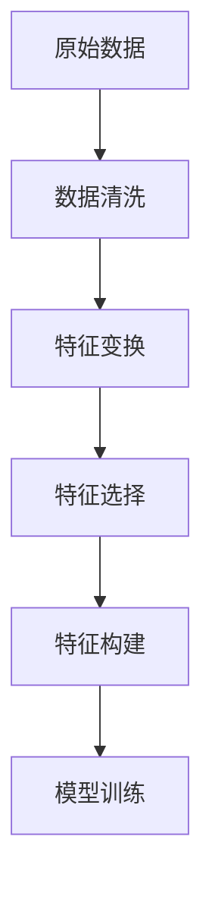
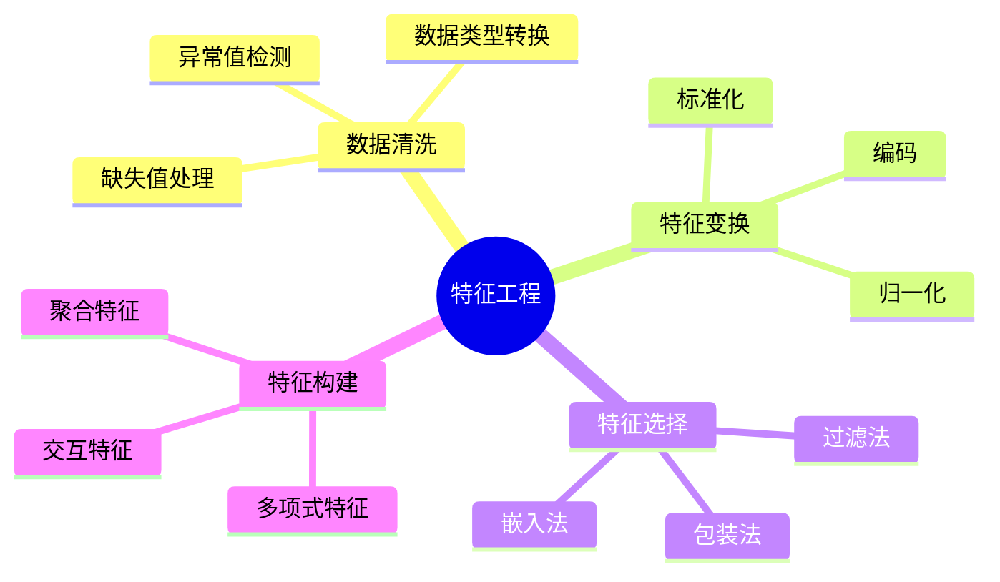

## 概述

特征工程是机器学习成功的关键，本文系统介绍特征工程的各种技术与代码实现。

## 特征工程流程



## 特征预处理

### 数值特征处理

```python
from sklearn.preprocessing import StandardScaler, MinMaxScaler, RobustScaler

class NumericalFeatureProcessor:
    """数值特征处理器"""
    
    def standard_scaling(self, X_train, X_test):
        """标准化"""
        scaler = StandardScaler()
        X_train_scaled = scaler.fit_transform(X_train)
        X_test_scaled = scaler.transform(X_test)
        return X_train_scaled, X_test_scaled
    
    def minmax_scaling(self, X_train, X_test):
        """归一化"""
        scaler = MinMaxScaler()
        return scaler.fit_transform(X_train), scaler.transform(X_test)
    
    def robust_scaling(self, X_train, X_test):
        """鲁棒缩放，处理异常值"""
        scaler = RobustScaler()
        return scaler.fit_transform(X_train), scaler.transform(X_test)
```

### 类别特征编码

```python
from sklearn.preprocessing import LabelEncoder, OneHotEncoder, TargetEncoder

class CategoricalFeatureProcessor:
    """类别特征处理器"""
    
    def label_encoding(self, categories):
        """标签编码"""
        le = LabelEncoder()
        return le.fit_transform(categories)
    
    def onehot_encoding(self, X_train, X_test):
        """独热编码"""
        ohe = OneHotEncoder(sparse=False, handle_unknown='ignore')
        return ohe.fit_transform(X_train), ohe.transform(X_test)
    
    def target_encoding(self, X_train, y_train, X_test, smoothing=10):
        """目标编码"""
        global_mean = y_train.mean()
        agg = X_train.groupby(X_train.columns[0])[y_train.name].agg(['mean', 'count'])
        smooth = (agg['count'] * agg['mean'] + smoothing * global_mean) / (agg['count'] + smoothing)
        return smooth
```

## 特征选择

### 方法对比

| 方法 | 优点 | 缺点 | 适用场景 |
|------|------|------|----------|
| 方差阈值 | 简单快速 | 可能丢失信息 | 初步筛选 |
| 相关系数 | 直观可解释 | 只处理线性 | 线性模型 |
| RFECV | 效果好 | 计算量大 | 通用 |
| L1正则化 | 可处理高维 | 可能过度稀疏 | 高维数据 |

## 总结



好的特征工程是机器学习成功的关键，需要根据具体问题灵活运用各种技术。
