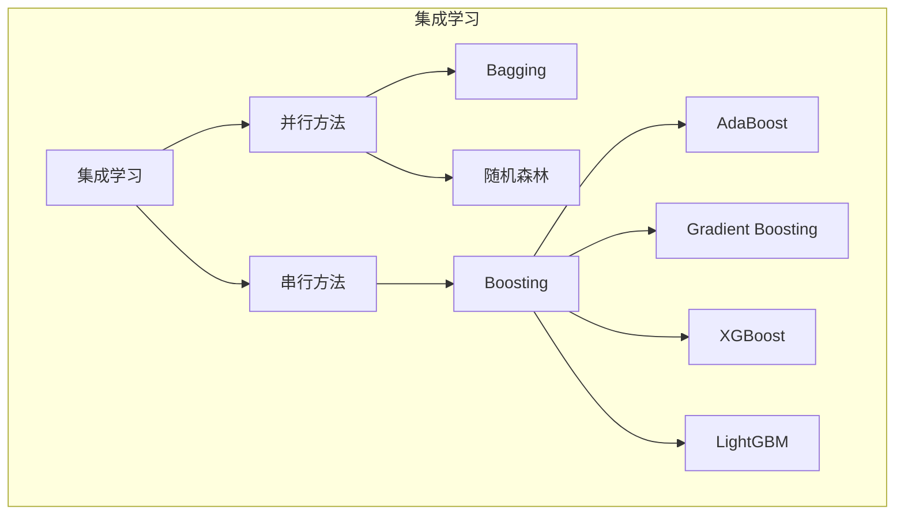
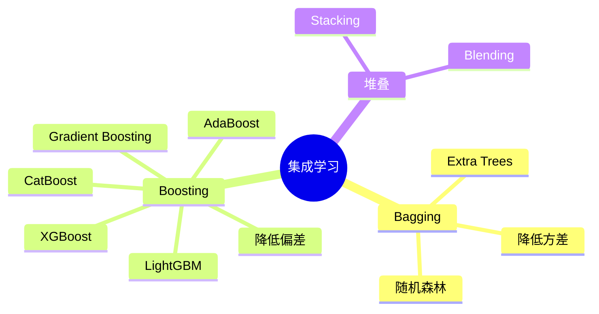

## 概述

集成学习通过组合多个模型来提升性能，是 Kaggle 竞赛的必杀技。本文系统介绍从 Bagging 到 Boosting 的各种集成方法。

## 集成学习方法



## Bagging vs Boosting

### 核心区别

| 特性 | Bagging | Boosting |
|------|---------|----------|
| 训练方式 | 并行 | 串行 |
| 关注点 | 降低方差 | 降低偏差 |
| 样本权重 | 独立同分布 | 动态调整 |
| 预测方式 | 平均/投票 | 加权累计 |
| 典型算法 | 随机森林 | XGBoost |

### 代码实现

```python
from sklearn.ensemble import RandomForestClassifier, GradientBoostingClassifier
import xgboost as xgb
import lightgbm as lgb

class EnsembleMethods:
    """集成学习方法"""
    
    def random_forest(self, X_train, y_train, n_estimators=100):
        """随机森林"""
        rf = RandomForestClassifier(
            n_estimators=n_estimators,
            max_depth=10,
            min_samples_split=5,
            random_state=42
        )
        rf.fit(X_train, y_train)
        return rf
    
    def xgboost_model(self, X_train, y_train):
        """XGBoost"""
        model = xgb.XGBClassifier(
            n_estimators=100,
            max_depth=6,
            learning_rate=0.1,
            subsample=0.8,
            colsample_bytree=0.8
        )
        model.fit(X_train, y_train)
        return model
    
    def lightgbm_model(self, X_train, y_train):
        """LightGBM"""
        model = lgb.LGBMClassifier(
            n_estimators=100,
            max_depth=6,
            learning_rate=0.1,
            num_leaves=31
        )
        model.fit(X_train, y_train)
        return model
```

## 总结



集成学习是提升模型性能的有效手段，选择合适的方法需要根据具体问题和数据特点来决定。
