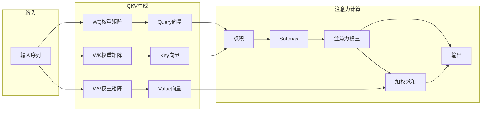
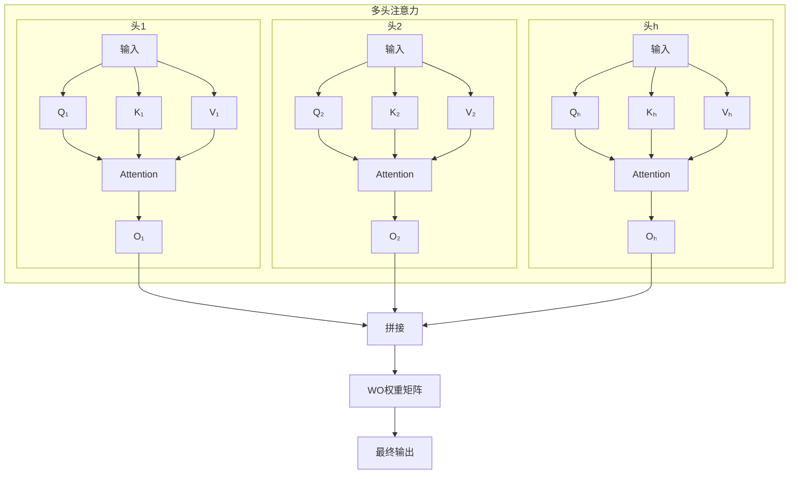
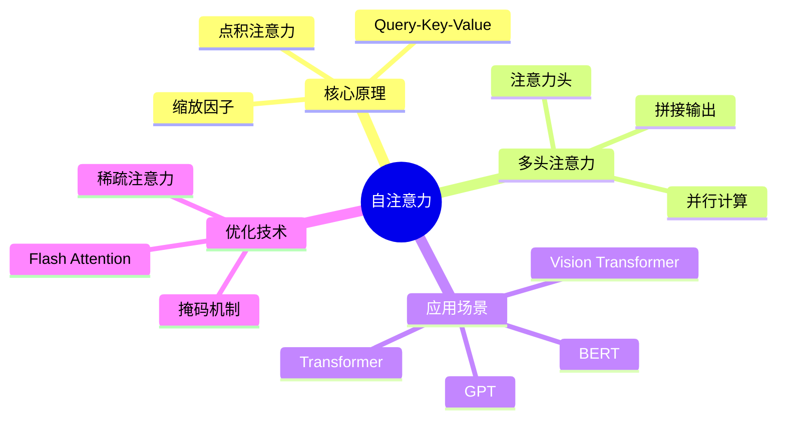

## 概述

自注意力机制（Self-Attention）是Transformer架构的核心组件，它允许序列中的每个位置关注序列中的所有其他位置。本文将深入解析自注意力的数学原理，并通过PyTorch实现来加深理解。

## 自注意力机制原理

### 核心思想

自注意力机制的核心思想是：**通过Query、Key、Value三个向量来计算序列内部元素之间的关联程度**。



### 数学公式

自注意力的计算过程：

$$
\text{Attention}(Q, K, V) = \text{softmax}\left(\frac{QK^T}{\sqrt{d_k}}\right)V
$$

其中 $\sqrt{d_k}$ 是缩放因子，用于防止点积过大导致梯度消失。

### 缩放点积注意力详解

```mermaid
sequenceDiagram
    participant Q as Query
    participant K as Key
    participant V as Value
    participant Out as Output
    
    Note over Q,K,V: 1. 计算点积
    Q->>K: Q · K^T
    Note over Q,K: 缩放因子: ÷ √d_k
    
    Note over K: 2. Softmax归一化
    K->>K: softmax(QK^T/√d_k)
    
    Note over K: 3. 加权求和
    K->>Out: Attention × V
```

## PyTorch实现

### 基础自注意力层

```python
import torch
import torch.nn as nn
import torch.nn.functional as F
import math

class SelfAttention(nn.Module):
    """缩放点积注意力实现"""
    
    def __init__(self, embed_dim, dropout=0.1):
        super().__init__()
        self.embed_dim = embed_dim
        self.dropout = nn.Dropout(dropout)
        
        # QKV投影矩阵
        self.q_proj = nn.Linear(embed_dim, embed_dim)
        self.k_proj = nn.Linear(embed_dim, embed_dim)
        self.v_proj = nn.Linear(embed_dim, embed_dim)
        self.out_proj = nn.Linear(embed_dim, embed_dim)
    
    def forward(self, x, mask=None):
        """
        Args:
            x: [batch_size, seq_len, embed_dim]
            mask: [batch_size, 1, seq_len, seq_len] 可选掩码
        Returns:
            output: [batch_size, seq_len, embed_dim]
            attention_weights: [batch_size, num_heads, seq_len, seq_len]
        """
        batch_size, seq_len, _ = x.shape
        
        # 生成QKV
        Q = self.q_proj(x)  # [B, L, D]
        K = self.k_proj(x)
        V = self.v_proj(x)
        
        # 计算注意力分数
        scores = torch.matmul(Q, K.transpose(-2, -1)) / math.sqrt(self.embed_dim)
        
        # 应用掩码（如果提供）
        if mask is not None:
            scores = scores.masked_fill(mask == 0, float('-inf'))
        
        # Softmax归一化
        attention_weights = F.softmax(scores, dim=-1)
        attention_weights = self.dropout(attention_weights)
        
        # 加权求和
        output = torch.matmul(attention_weights, V)
        output = self.out_proj(output)
        
        return output, attention_weights
```

### 多头注意力机制



### 多头注意力实现

```python
class MultiHeadAttention(nn.Module):
    """多头注意力机制"""
    
    def __init__(self, embed_dim, num_heads, dropout=0.1):
        super().__init__()
        assert embed_dim % num_heads == 0, "embed_dim必须能被num_heads整除"
        
        self.embed_dim = embed_dim
        self.num_heads = num_heads
        self.head_dim = embed_dim // num_heads
        
        self.q_proj = nn.Linear(embed_dim, embed_dim)
        self.k_proj = nn.Linear(embed_dim, embed_dim)
        self.v_proj = nn.Linear(embed_dim, embed_dim)
        self.out_proj = nn.Linear(embed_dim, embed_dim)
        self.dropout = nn.Dropout(dropout)
    
    def forward(self, x, mask=None):
        batch_size, seq_len, _ = x.shape
        
        # QKV投影
        Q = self.q_proj(x).view(batch_size, seq_len, self.num_heads, self.head_dim).transpose(1, 2)
        K = self.k_proj(x).view(batch_size, seq_len, self.num_heads, self.head_dim).transpose(1, 2)
        V = self.v_proj(x).view(batch_size, seq_len, self.num_heads, self.head_dim).transpose(1, 2)
        
        # 缩放点积注意力
        scores = torch.matmul(Q, K.transpose(-2, -1)) / math.sqrt(self.head_dim)
        
        if mask is not None:
            scores = scores.masked_fill(mask == 0, float('-inf'))
        
        attention_weights = F.softmax(scores, dim=-1)
        attention_weights = self.dropout(attention_weights)
        
        # 加权求和并拼接
        context = torch.matmul(attention_weights, V)
        context = context.transpose(1, 2).contiguous().view(batch_size, seq_len, self.embed_dim)
        
        output = self.out_proj(context)
        
        return output, attention_weights
```

## 性能对比

| 实现方式 | 参数量 | 计算复杂度 | 序列长度限制 |
|---------|--------|-----------|-------------|
| 标准注意力 | O(d²) | O(n²·d) | 较长序列受限 |
| 线性注意力 | O(d) | O(n·d²) | 可处理超长序列 |
| Flash Attention | O(d²) | O(n²·d) | 显存优化版本 |

## 实际应用示例

```python
# 使用示例
embed_dim = 512
num_heads = 8
batch_size = 16
seq_len = 100

model = MultiHeadAttention(embed_dim, num_heads)
x = torch.randn(batch_size, seq_len, embed_dim)

output, attn_weights = model(x)
print(f"输出形状: {output.shape}")  # [16, 100, 512]
print(f"注意力权重形状: {attn_weights.shape}")  # [16, 8, 100, 100]
```

## 总结



自注意力机制是现代深度学习的基石之一，理解其原理对于掌握Transformer架构至关重要。
