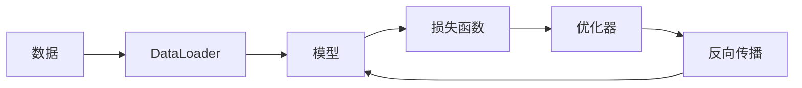

## PyTorch概述

PyTorch是由Facebook开发的深度学习框架，以其动态计算图和Pythonic的设计风格而广受欢迎。本文将带您快速入门PyTorch，掌握深度学习开发的核心技能。

## PyTorch核心概念

### 张量（Tensor）

张量是PyTorch的基本数据结构，类似于NumPy的数组，但可以在GPU上加速计算。

```python
import torch

# 创建张量
x = torch.tensor([[1, 2], [3, 4]], dtype=torch.float32)
y = torch.randn(3, 3)

# 张量运算
z = torch.matmul(x, y)
print(z.shape)  # torch.Size([2, 3])
```

### 自动微分（Autograd）

PyTorch的autograd模块自动计算梯度，是神经网络训练的基础。

```python
x = torch.tensor([1.0, 2.0], requires_grad=True)
y = x ** 2 + 3 * x + 1
y.backward()
print(x.grad)  # tensor([5., 7.])
```

### 神经网络模块（nn.Module）

所有神经网络模型都继承自nn.Module：

```python
import torch.nn as nn

class SimpleNet(nn.Module):
    def __init__(self):
        super(SimpleNet, self).__init__()
        self.fc1 = nn.Linear(784, 256)
        self.relu = nn.ReLU()
        self.fc2 = nn.Linear(256, 10)
        
    def forward(self, x):
        x = x.view(-1, 784)
        x = self.relu(self.fc1(x))
        x = self.fc2(x)
        return x
```

## 训练循环

```python
model = SimpleNet()
criterion = nn.CrossEntropyLoss()
optimizer = torch.optim.Adam(model.parameters(), lr=0.001)

for epoch in range(100):
    for batch_x, batch_y in dataloader:
        optimizer.zero_grad()
        outputs = model(batch_x)
        loss = criterion(outputs, batch_y)
        loss.backward()
        optimizer.step()
```

## GPU加速

```python
device = torch.device('cuda' if torch.cuda.is_available() else 'cpu')
model = model.to(device)
```

## 总结

PyTorch凭借其简洁的API和动态图特性，已成为深度学习研究的首选框架。


