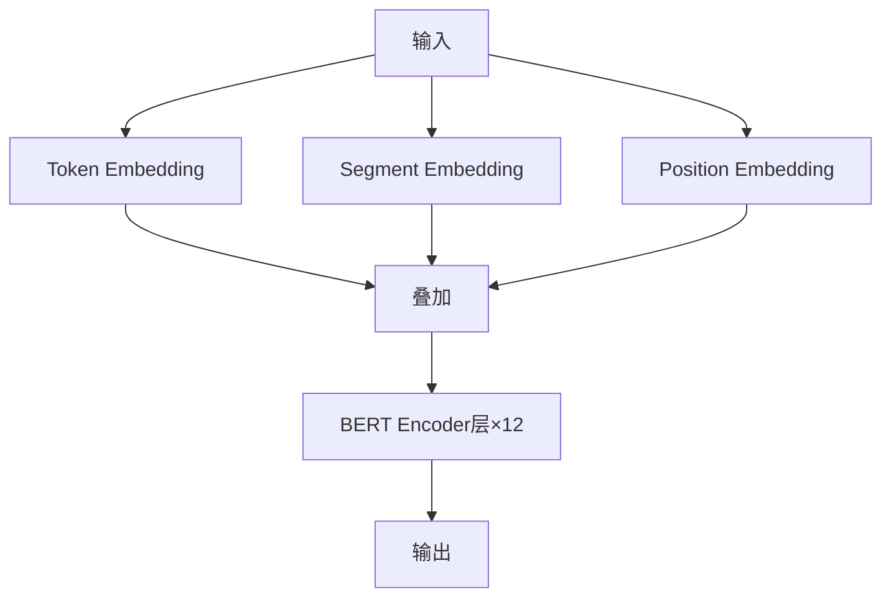

## BERT概述

BERT（Bidirectional Encoder Representations from Transformers）是NLP领域的里程碑模型。

## 模型结构



## 安装与加载

```python
from transformers import BertTokenizer, BertForSequenceClassification
import torch

tokenizer = BertTokenizer.from_pretrained('bert-base-chinese')
model = BertForSequenceClassification.from_pretrained('bert-base-chinese', num_labels=2)
```

## 文本预处理

```python
def encode_text(text):
    encoding = tokenizer(
        text,
        max_length=128,
        padding='max_length',
        truncation=True,
        return_tensors='pt'
    )
    return encoding['input_ids'], encoding['attention_mask']

input_ids, attention_mask = encode_text("这是一个正面评论")
```

## 微调训练

```python
from torch.utils.data import DataLoader

optimizer = torch.optim.AdamW(model.parameters(), lr=2e-5)

model.train()
for epoch in range(3):
    for batch in dataloader:
        optimizer.zero_grad()
        input_ids = batch['input_ids']
        attention_mask = batch['attention_mask']
        labels = batch['labels']
        
        outputs = model(input_ids, attention_mask=attention_mask, labels=labels)
        loss = outputs.loss
        loss.backward()
        optimizer.step()
```

## 推理预测

```python
def predict(text):
    input_ids, attention_mask = encode_text(text)
    model.eval()
    with torch.no_grad():
        outputs = model(input_ids, attention_mask=attention_mask)
        probs = torch.softmax(outputs.logits, dim=1)
    return probs.numpy()
```

## 总结

BERT开创了预训练+微调范式，是现代NLP的基础。


