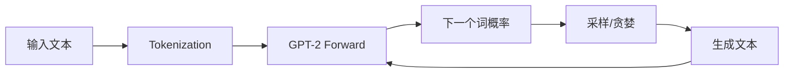

## GPT-2概述

GPT-2是OpenAI开发的大型语言模型，以其强大的文本生成能力闻名。

## 模型架构

GPT-2基于Transformer decoder：

```python
from transformers import GPT2LMHeadModel, GPT2Tokenizer

tokenizer = GPT2Tokenizer.from_pretrained('gpt2')
model = GPT2LMHeadModel.from_pretrained('gpt2')
```

## 核心原理

### 自回归生成

```python
def generate_text(prompt, max_length=100):
    input_ids = tokenizer.encode(prompt, return_tensors='pt')
    
    output = model.generate(
        input_ids,
        max_length=max_length,
        num_beams=5,
        temperature=0.8,
        top_k=50,
        top_p=0.95,
        do_sample=True
    )
    
    return tokenizer.decode(output[0], skip_special_tokens=True)
```

### 采样策略

```python
# Greedy Search
output = model.generate(input_ids, max_length=50, do_sample=False)

# Beam Search
output = model.generate(input_ids, max_length=50, num_beams=5)

# Top-K Sampling
output = model.generate(input_ids, max_length=50, do_sample=True, top_k=50)

# Nucleus Sampling
output = model.generate(input_ids, max_length=50, do_sample=True, top_p=0.95)
```

## 中文生成

```python
from transformers import GPT2LMHeadModel, AutoTokenizer

tokenizer = AutoTokenizer.from_pretrained('gpt2-medium-chinese-cluecorpussmall')
model = GPT2LMHeadModel.from_pretrained('gpt2-medium-chinese-cluecorpussmall')

def generate_chinese(prompt, length=100):
    input_ids = tokenizer.encode(prompt, return_tensors='pt')
    output = model.generate(input_ids, max_length=length, do_sample=True, top_p=0.9)
    return tokenizer.decode(output[0], skip_special_tokens=True)
```

## 训练自己的GPT-2

```python
from transformers import TextDataset, DataCollatorForLanguageModeling
from transformers import Trainer, TrainingArguments

train_dataset = TextDataset(
    tokenizer=tokenizer,
    file_path='train.txt',
    block_size=128
)

training_args = TrainingArguments(
    output_dir='./gpt2',
    num_train_epochs=3,
    per_device_train_batch_size=4,
    save_steps=500,
    save_total_limit=2,
)

trainer = Trainer(
    model=model,
    args=training_args,
    data_collator=data_collator,
    train_dataset=train_dataset,
)

trainer.train()
```

## 总结


