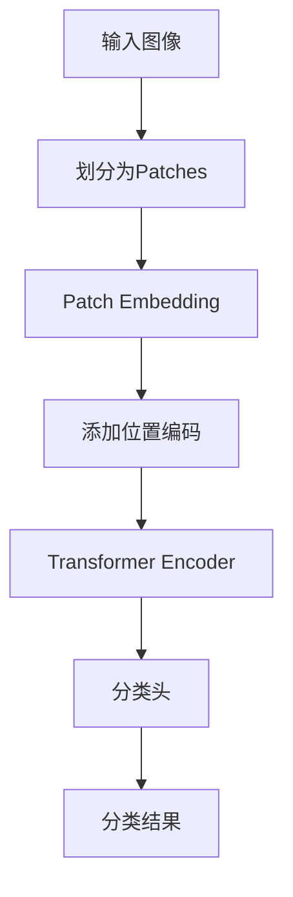

## 引言

Vision Transformer (ViT) 将Transformer架构成功应用于计算机视觉任务。

## 核心思想

将图像划分为patch，每个patch作为一个"token"输入Transformer。



## 实现代码

```python
import torch
import torch.nn as nn
from transformers import ViTFeatureExtractor, ViTForImageClassification

class VisionTransformer(nn.Module):
    def __init__(self, image_size=224, patch_size=16, num_classes=1000):
        super().__init__()
        self.num_patches = (image_size // patch_size) ** 2
        
        # Patch Embedding
        self.patch_embed = nn.Conv2d(3, 768, kernel_size=patch_size, stride=patch_size)
        
        # 分类token
        self.cls_token = nn.Parameter(torch.zeros(1, 1, 768))
        
        # 位置编码
        self.pos_embed = nn.Parameter(torch.zeros(1, self.num_patches + 1, 768))
        
        # Transformer Encoder
        self.encoder = nn.TransformerEncoderLayer(d_model=768, nhead=12)
        
        # 分类头
        self.head = nn.Linear(768, num_classes)
        
    def forward(self, x):
        B = x.shape[0]
        
        # Patch Embedding
        x = self.patch_embed(x).flatten(2).transpose(1, 2)
        
        # 添加cls token
        cls_tokens = self.cls_token.expand(B, -1, -1)
        x = torch.cat([cls_tokens, x], dim=1)
        
        # 添加位置编码
        x = x + self.pos_embed
        
        # Transformer编码
        x = self.encoder(x)
        
        # 取cls token输出
        cls_output = x[:, 0]
        
        return self.head(cls_output)
```

## 使用预训练模型

```python
from transformers import ViTForImageClassification

model = ViTForImageClassification.from_pretrained('google/vit-base-patch16-224')

# 推理
from PIL import Image
image = Image.open('cat.jpg')
inputs = feature_extractor(images=image, return_tensors="pt")
outputs = model(**inputs)
predicted_class = outputs.logits.argmax(-1)
```

## 实验结果

| 模型 | ImageNet Top-1 |
|------|----------------|
| ViT-B/16 | 77.9% |
| ViT-L/16 | 76.5% |
| ViT-H/14 | 88.6% |

## 总结

ViT证明了Transformer在CV领域的可行性，开创了视觉模型的新时代。
