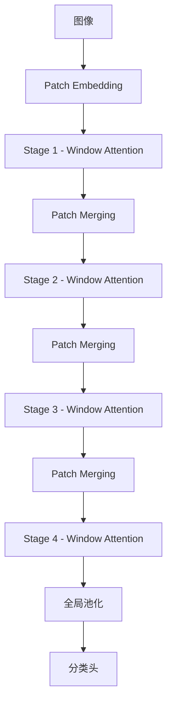

## Swin Transformer概述

Swin Transformer提出了一种层级结构，大幅提升了视觉Transformer的效率。

## 核心创新

### 1. 滑动窗口注意力机制

```python
import torch
import torch.nn as nn

class WindowAttention(nn.Module):
    def __init__(self, dim, window_size, num_heads):
        super().__init__()
        self.dim = dim
        self.window_size = window_size
        self.num_heads = num_heads
        self.scale = (dim // num_heads) ** -0.5
        
        self.qkv = nn.Linear(dim, dim * 3)
        self.proj = nn.Linear(dim, dim)
        
    def forward(self, x):
        B, N, C = x.shape
        
        # 重塑为窗口
        x = x.view(B, self.window_size, self.window_size, C)
        
        # 计算注意力
        qkv = self.qkv(x).reshape(B, -1, 3, self.num_heads, C // self.num_heads)
        q, k, v = qkv.unbind(2)
        
        attn = (q @ k.transpose(-2, -1)) * self.scale
        attn = attn.softmax(dim=-1)
        
        x = (attn @ v).transpose(1, 2).reshape(B, -1, C)
        return self.proj(x)
```

### 2. 层级结构

```python
class SwinTransformerBlock(nn.Module):
    def __init__(self, dim, num_heads, shift_size=0):
        super().__init__()
        self.norm1 = nn.LayerNorm(dim)
        self.attn = WindowAttention(dim, window_size=7, num_heads=num_heads)
        self.norm2 = nn.LayerNorm(dim)
        self.mlp = nn.Sequential(
            nn.Linear(dim, dim * 4),
            nn.GELU(),
            nn.Linear(dim * 4, dim)
        )
        
    def forward(self, x):
        x = x + self.attn(self.norm1(x))
        x = x + self.mlp(self.norm2(x))
        return x
```

## 架构图



## 在目标检测中的应用

```python
from detectron2.engine import DefaultPredictor
from detectron2.config import get_cfg

cfg = get_cfg()
cfg.merge_from_file("swin_fpn.yaml")
cfg.MODEL.WEIGHTS = "swin_trained.pth"

predictor = DefaultPredictor(cfg)
outputs = predictor(image)
```

## 性能对比

| 方法 | APbox | APmask |
|------|-------|--------|
| Swin-T | 58.0 | 51.0 |
| Swin-S | 59.4 | 52.3 |
| Swin-B | 61.3 | 53.5 |

## 总结

Swin Transformer通过滑动窗口机制高效处理图像，成为现代视觉模型的重要基石。
