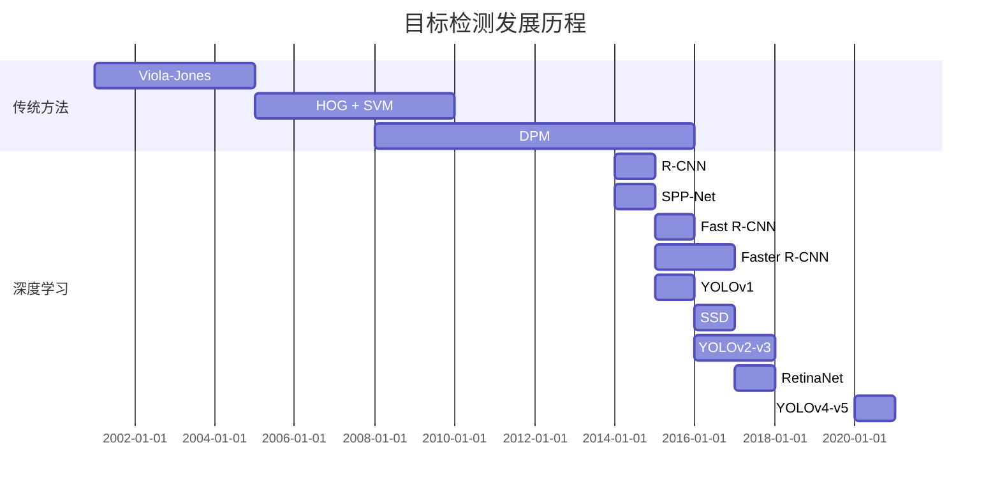
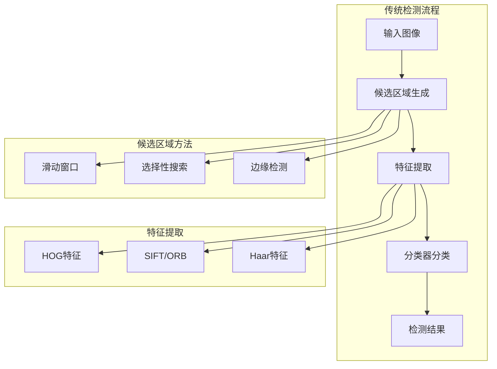
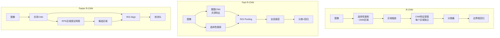
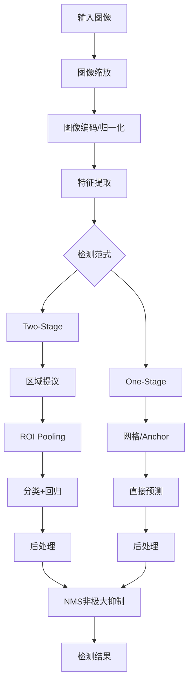
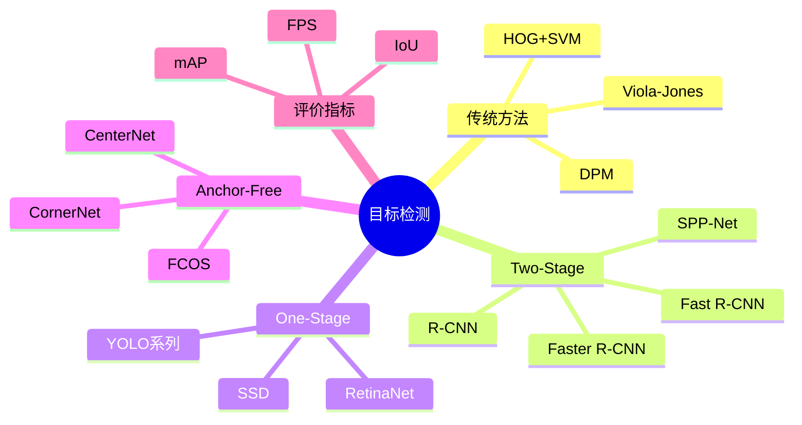

## 概述

目标检测是计算机视觉中的核心任务之一，本文系统梳理从传统方法到深度学习的目标检测发展历程。

## 目标检测发展时间线



## 传统目标检测方法

### 流程框架



### Viola-Jones检测器

```python
class ViolaJonesDetector:
    """Viola-Jones人脸检测器"""
    
    def __init__(self):
        self.classifiers = []  # 级联分类器
        self.integral_image = None
    
    def compute_integral_image(self, image):
        """计算积分图"""
        return np.cumsum(np.cumsum(image, axis=0), axis=1)
    
    def haar_features(self, image):
        """计算Haar特征"""
        features = []
        # 边缘特征
        features.append(self.edge_feature(image))
        # 线特征
        features.append(self.line_feature(image))
        # 中心环绕特征
        features.append(self.center_feature(image))
        return features
    
    def detect(self, image, scale_factor=1.1):
        """多尺度检测"""
        detections = []
        scale = 1.0
        
        while scale * image.shape[0] > 24:
            for y, x in self.sliding_window(image, (24, 24), step=2):
                window = image[y:y+24, x:x+24]
                features = self.haar_features(window)
                
                if self.classify(features):
                    detections.append((x, y, scale))
            
            image = self.pyramid_down(image, scale_factor)
            scale *= scale_factor
        
        return self.non_max_suppression(detections)
```

## Two-Stage检测器

### R-CNN系列架构



### Faster R-CNN实现

```python
class FasterRCNN(nn.Module):
    """Faster R-CNN目标检测器"""
    
    def __init__(self, num_classes=80):
        super().__init__()
        self.num_classes = num_classes
        
        # 骨干网络
        self.backbone = resnet50(pretrained=True)
        self.backbone_out_channels = 2048
        
        # RPN
        self.rpn = RegionProposalNetwork(
            in_channels=self.backbone_out_channels,
            num_anchors=9
        )
        
        # ROI Head
        self.roi_head = ROIHead(
            in_channels=self.backbone_out_channels,
            num_classes=num_classes
        )
    
    def forward(self, images, targets=None):
        # 提取特征
        features = self.backbone(images)
        
        # RPN生成候选区域
        rpn_logits, rpn_boxes, proposals = self.rpn(features, targets)
        
        # ROI分类和回归
        if self.training:
            roi_boxes, labels, bbox_targets = self.roi_head(
                features, proposals, targets
            )
            return rpn_logits, rpn_boxes, roi_boxes, labels, bbox_targets
        else:
            class_logits, box_regression = self.roi_head(features, proposals)
            return class_logits, box_regression, proposals

class RegionProposalNetwork(nn.Module):
    """区域提议网络"""
    
    def __init__(self, in_channels, num_anchors=9):
        super().__init__()
        self.conv = nn.Conv2d(in_channels, 512, 3, padding=1)
        self.cls_logits = nn.Conv2d(512, num_anchors * 2, 1)  # 前景/背景
        self.bbox_pred = nn.Conv2d(512, num_anchors * 4, 1)  # 边界框偏移
    
    def forward(self, features, targets=None):
        x = F.relu(self.conv(features))
        
        # 分类：是否包含物体
        logits = self.cls_logits(x)
        # 回归：边界框偏移
        bbox_reg = self.bbox_pred(x)
        
        # 生成proposals
        proposals = self.generate_proposals(logits, bbox_reg)
        
        return logits, bbox_reg, proposals
    
    def generate_proposals(self, logits, bbox_reg):
        """生成候选区域"""
        # 提取top-k预测
        scores = F.softmax(logits, dim=1)[:, 1]  # 前景概率
        # NMS后处理
        keep = nms(bbox_reg, scores, threshold=0.7)
        return bbox_reg[keep]
```

## One-Stage检测器

### YOLO vs SSD架构对比

```mermaid
flowchart LR
    subgraph YOLO
        YIMG[图像] --> YGRID[网格划分<br/>S×S]
        YGRID --> YFEAT[特征提取]
        YFEAT --> YPRED[直接预测<br/>B×(4+1+C)]
    end
    
    subgraph SSD
        SIMG[图像] --> SFEAT[多尺度特征图]
        SFEAT --> SCONV[卷积预测]
        SCONV --> SPRED[每层预测<br/>default boxes]
    end
```

### YOLOv3实现

```python
class YOLOv3(nn.Module):
    """YOLOv3目标检测器"""
    
    def __init__(self, num_classes=80, anchors=None):
        super().__init__()
        self.num_classes = num_classes
        self.anchors = anchors or self.default_anchors
        
        # 骨干网络 - Darknet53
        self.backbone = Darknet53()
        
        # 多尺度检测头
        self.detect_small = YOLOLayer(self.anchors[0], num_classes)  # 13×13
        self.detect_medium = YOLOLayer(self.anchors[1], num_classes)  # 26×26
        self.detect_large = YOLOLayer(self.anchors[2], num_classes)  # 52×52
    
    def forward(self, x):
        # 特征提取
        features = self.backbone(x)
        
        # 多尺度检测
        out_small = self.detect_small(features[0])
        out_medium = self.detect_medium(features[1])
        out_large = self.detect_large(features[2])
        
        if self.training:
            return out_small, out_medium, out_large
        else:
            # 合并多尺度预测
            return self.concat_outputs(out_small, out_medium, out_large)

class YOLOLayer(nn.Module):
    """YOLO检测层"""
    
    def __init__(self, anchors, num_classes):
        super().__init__()
        self.anchors = anchors
        self.num_classes = num_classes
        self.num_anchors = len(anchors)
        
        out_channels = self.num_anchors * (5 + num_classes)
        self.conv = nn.Conv2d(512, out_channels, 1)
    
    def forward(self, x):
        # x: [B, 512, S, S]
        prediction = self.conv(x)
        # 解析预测: [B, num_anchors, S, S, 5+num_classes]
        # 5 = tx, ty, tw, th, objectness
        return prediction
```

## 性能对比

| 检测器 | mAP@0.5 | FPS | 优点 | 缺点 |
|--------|----------|-----|------|------|
| R-CNN | 66.0% | 0.5 | 精度高 | 极慢 |
| Fast R-CNN | 70.0% | 2.0 | 共享特征 | 候选框慢 |
| Faster R-CNN | 78.8% | 5.0 | 端到端 | 较慢 |
| YOLOv1 | 63.4% | 45 | 极快 | 精度低 |
| YOLOv3 | 78.6% | 50 | 快而准 | 小物体差 |
| YOLOv4 | 83.0% | 40 | 实时高精度 | 略复杂 |
| RetinaNet | 80.5% | 12 | 平衡 | 较慢 |
| SSD | 76.8% | 25 | 多尺度 | 小物体差 |

## 检测流程总结



## 总结



目标检测技术从传统方法发展到深度学习，经历了从两阶段到单阶段、从Anchor-based到Anchor-free的演进过程。
