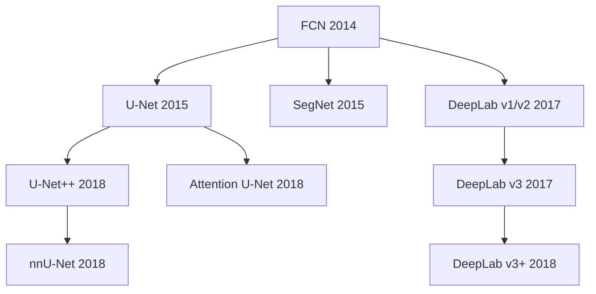
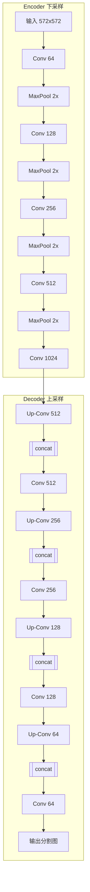
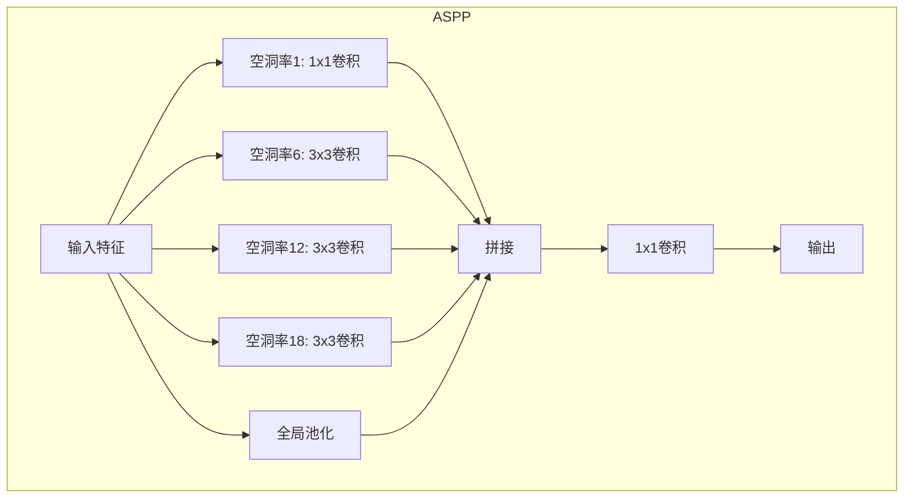
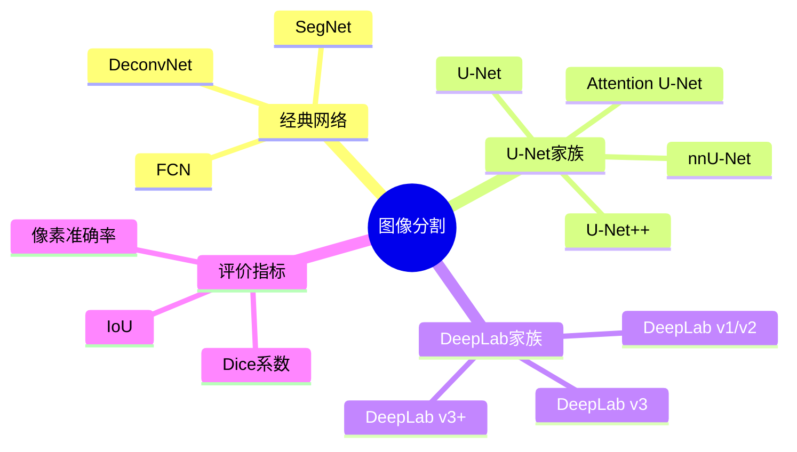

## 概述

图像分割是计算机视觉中的核心任务之一，本文系统介绍从U-Net到DeepLab系列的分割算法发展历程。

## 分割网络发展



## U-Net核心架构

### 网络结构



### PyTorch实现

```python
import torch
import torch.nn as nn
import torch.nn.functional as F

class DoubleConv(nn.Module):
    """双卷积块"""
    def __init__(self, in_channels, out_channels):
        super().__init__()
        self.conv = nn.Sequential(
            nn.Conv2d(in_channels, out_channels, 3, padding=1),
            nn.BatchNorm2d(out_channels),
            nn.ReLU(inplace=True),
            nn.Conv2d(out_channels, out_channels, 3, padding=1),
            nn.BatchNorm2d(out_channels),
            nn.ReLU(inplace=True)
        )
    
    def forward(self, x):
        return self.conv(x)

class UNet(nn.Module):
    """U-Net分割网络"""
    
    def __init__(self, in_channels=1, out_channels=2, features=[64, 128, 256, 512]):
        super().__init__()
        self.downs = nn.ModuleList()
        self.ups = nn.ModuleList()
        self.pool = nn.MaxPool2d(2, 2)
        
        # 下采样路径
        for feature in features:
            self.downs.append(DoubleConv(in_channels, feature))
            in_channels = feature
        
        # 瓶颈层
        self.bottleneck = DoubleConv(features[-1], features[-1] * 2)
        
        # 上采样路径
        for feature in reversed(features):
            self.ups.append(
                nn.ConvTranspose2d(feature * 2, feature, 2, 2)
            )
            self.ups.append(DoubleConv(feature * 2, feature))
        
        # 输出层
        self.final_conv = nn.Conv2d(features[0], out_channels, 1)
    
    def forward(self, x):
        skip_connections = []
        
        # 下采样
        for down in self.downs:
            x = down(x)
            skip_connections.append(x)
            x = self.pool(x)
        
        x = self.bottleneck(x)
        skip_connections = skip_connections[::-1]
        
        # 上采样
        for idx in range(0, len(self.ups), 2):
            x = self.ups[idx](x)
            skip = skip_connections[idx // 2]
            x = torch.cat([skip, x], dim=1)
            x = self.ups[idx + 1](x)
        
        return self.final_conv(x)
```

## 注意力U-Net

### 注意力机制

```mermaid
flowchart LR
    subgraph 门控信号g
        G[低层特征] --> GL[门控信号]
    end
    
    subgraph 注意力系数
        GL --> ATT[注意力计算]
        X[高层特征x] --> ATT
        ATT --> ALPHA[α = σ(Wx·x + Wg·g)]
    end
    
    ALPHA --> OUT[加权特征 α·x]
```

### 注意力U-Net实现

```python
class AttentionBlock(nn.Module):
    """注意力门控模块"""
    
    def __init__(self, F_g, F_l, F_int):
        super().__init__()
        self.W_g = nn.Conv2d(F_g, F_int, 1)
        self.W_x = nn.Conv2d(F_l, F_int, 1)
        self.psi = nn.Conv2d(F_int, 1, 1)
        self.relu = nn.ReLU(inplace=True)
        self.sigmoid = nn.Sigmoid()
    
    def forward(self, g, x):
        g1 = self.W_g(g)
        x1 = self.W_x(x)
        psi = self.relu(g1 + x1)
        psi = self.sigmoid(self.psi(psi))
        return x * psi

class AttentionUNet(nn.Module):
    """注意力U-Net"""
    
    def __init__(self, in_channels=3, out_channels=1):
        super().__init__()
        # ... 类似的编码器结构
        
        # 注意力门控
        self.attention_gate1 = AttentionBlock(256, 512, 256)
        self.attention_gate2 = AttentionBlock(128, 256, 128)
        self.attention_gate3 = AttentionBlock(64, 128, 64)
    
    def forward(self, x):
        # 下采样
        x1 = self.conv1(x)
        x2 = self.conv2(self.pool(x1))
        x3 = self.conv3(self.pool(x2))
        x4 = self.conv4(self.pool(x3))
        
        # 瓶颈
        x5 = self.conv5(self.pool(x4))
        
        # 上采样 + 注意力
        d4 = self.upconv4(x5)
        x4_att = self.attention_gate1(g=d4, x=x4)
        d4 = torch.cat([x4_att, d4], dim=1)
        d4 = self.conv4(d4)
        
        # ... 继续上采样
        return output
```

## DeepLab系列

### ASPP模块



### DeepLab v3+ 实现

```python
class ASPPConv(nn.Sequential):
    """ASPP卷积模块"""
    def __init__(self, in_channels, out_channels, dilation):
        super().__init__(
            nn.Conv2d(in_channels, out_channels, 3, 
                     padding=dilation, dilation=dilation),
            nn.BatchNorm2d(out_channels),
            nn.ReLU(inplace=True)
        )

class ASPPPooling(nn.Sequential):
    """ASPP池化模块"""
    def __init__(self, in_channels, out_channels):
        super().__init__(
            nn.AdaptiveAvgPool2d(1),
            nn.Conv2d(in_channels, out_channels, 1),
            nn.ReLU(inplace=True)
        )

class ASPP(nn.Module):
    """ASPP模块"""
    def __init__(self, in_channels, out_channels, atrous_rates):
        super().__init__()
        modules = [
            nn.Sequential(
                nn.Conv2d(in_channels, out_channels, 1),
                nn.BatchNorm2d(out_channels),
                nn.ReLU(inplace=True)
            )
        ]
        
        modules += [
            ASPPConv(in_channels, out_channels, rate)
            for rate in atrous_rates
        ]
        
        modules.append(ASPPPooling(in_channels, out_channels))
        
        self.convs = nn.ModuleList(modules)
        self.project = nn.Sequential(
            nn.Conv2d(len(atrous_rates) + 2, out_channels, 1),
            nn.BatchNorm2d(out_channels),
            nn.ReLU(inplace=True),
            nn.Dropout(0.5)
        )
    
    def forward(self, x):
        res = []
        for conv in self.convs:
            res.append(conv(x))
        res = torch.cat(res, dim=1)
        return self.project(res)
```

## 分割性能对比

| 方法 | IoU | FPS | 参数量 |
|------|-----|-----|--------|
| FCN-8s | 65.3% | 15 | 134M |
| SegNet | 59.1% | 46 | 29M |
| U-Net | 72.0% | 18 | 31M |
| Attention U-Net | 75.8% | 15 | 35M |
| DeepLab v3+ | 82.1% | 8 | 59M |
| nnU-Net | 86.2% | 4 | 45M |

## 总结



图像分割技术在医学影像、自动驾驶等领域发挥着重要作用，U-Net系列以其简单有效的结构成为医学图像分割的首选。
