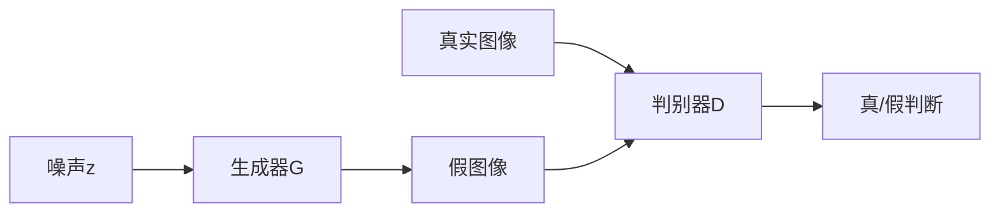

## GAN概述

生成对抗网络(GAN)由Ian Goodfellow提出，通过对抗训练生成逼真图像。

## 核心原理



## DCGAN实现

```python
import torch
import torch.nn as nn

class Generator(nn.Module):
    def __init__(self, latent_dim=100, channels=3):
        super().__init__()
        
        self.init_size = 4
        self.l1 = nn.Sequential(
            nn.Linear(latent_dim, 256 * self.init_size ** 2)
        )
        
        self.conv_blocks = nn.Sequential(
            nn.BatchNorm2d(256),
            nn.Upsample(scale_factor=2),
            nn.Conv2d(256, 256, 3, padding=1),
            nn.BatchNorm2d(256),
            nn.ReLU(inplace=True),
            nn.Upsample(scale_factor=2),
            nn.Conv2d(256, 128, 3, padding=1),
            nn.BatchNorm2d(128),
            nn.ReLU(inplace=True),
            nn.Upsample(scale_factor=2),
            nn.Conv2d(128, 64, 3, padding=1),
            nn.BatchNorm2d(64),
            nn.ReLU(inplace=True),
            nn.Upsample(scale_factor=2),
            nn.Conv2d(64, channels, 3, padding=1),
            nn.Tanh()
        )
        
    def forward(self, z):
        out = self.l1(z).view(z.size(0), 256, self.init_size, self.init_size)
        img = self.conv_blocks(out)
        return img

class Discriminator(nn.Module):
    def __init__(self, channels=3):
        super().__init__()
        
        def discriminator_block(in_filters, out_filters):
            layers = [
                nn.Conv2d(in_filters, out_filters, 3, 2, 1),
                nn.LeakyReLU(0.2, inplace=True),
                nn.Dropout2d(0.25)
            ]
            return layers
        
        self.model = nn.Sequential(
            *discriminator_block(channels, 32),
            *discriminator_block(32, 64),
            *discriminator_block(64, 128),
            *discriminator_block(128, 256),
            nn.Flatten(),
            nn.Linear(256 * 4 * 4, 1),
            nn.Sigmoid()
        )
        
    def forward(self, img):
        return self.model(img)
```

## 训练循环

```python
import torchvision.datasets as datasets

# 数据集
dataloader = torch.utils.data.DataLoader(
    datasets.CIFAR10(root='./data', train=True, transform=transform, download=True),
    batch_size=64, shuffle=True
)

# 初始化
generator = Generator().to(device)
discriminator = Discriminator().to(device)

g_optimizer = torch.optim.Adam(generator.parameters(), lr=0.0002, betas=(0.5, 0.999))
d_optimizer = torch.optim.Adam(discriminator.parameters(), lr=0.0002, betas=(0.5, 0.999))

criterion = nn.BCELoss()

# 训练
for epoch in range(num_epochs):
    for real_images, _ in dataloader:
        real_images = real_images.to(device)
        batch_size = real_images.size(0)
        
        # 真实标签和假标签
        real_labels = torch.ones(batch_size, 1).to(device)
        fake_labels = torch.zeros(batch_size, 1).to(device)
        
        # 训练判别器
        noise = torch.randn(batch_size, 100).to(device)
        fake_images = generator(noise)
        
        d_loss = criterion(discriminator(real_images), real_labels) + \
                 criterion(discriminator(fake_images.detach()), fake_labels)
        
        d_optimizer.zero_grad()
        d_loss.backward()
        d_optimizer.step()
        
        # 训练生成器
        noise = torch.randn(batch_size, 100).to(device)
        fake_images = generator(noise)
        g_loss = criterion(discriminator(fake_images), real_labels)
        
        g_optimizer.zero_grad()
        g_loss.backward()
        g_optimizer.step()
```

## 总结

GAN开创了生成模型的新时代，DCGAN是其经典实现。
