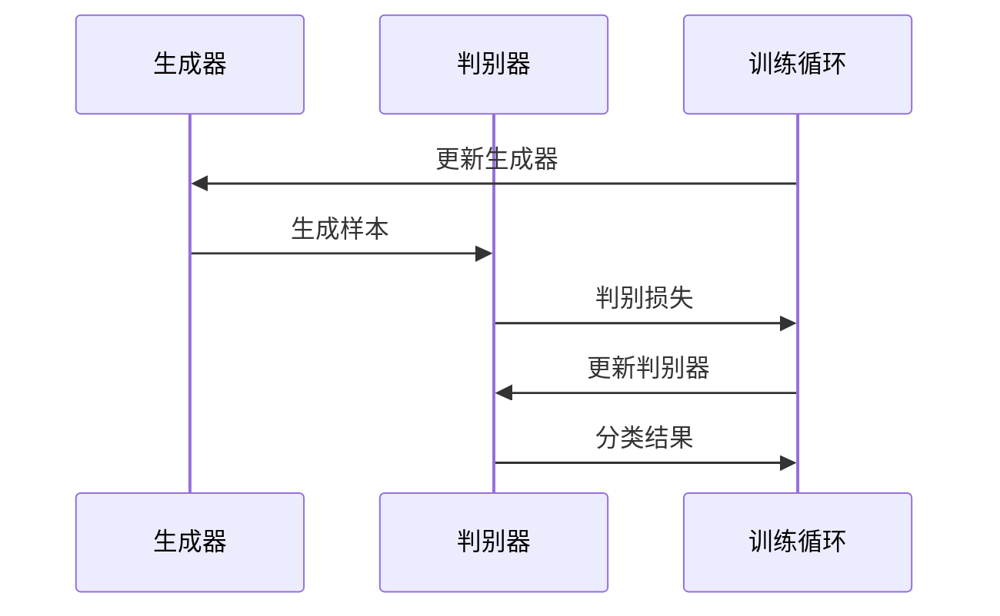
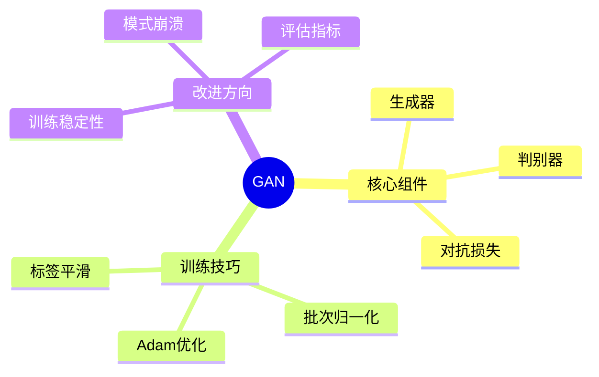

## 概述

生成对抗网络（GAN）是深度学习领域最重要的生成模型之一，本文深入解析GAN的原理并通过代码实现。

## GAN核心原理

### 对抗训练机制

```mermaid
flowchart TB
    subgraph GAN架构
        Z[随机噪声z] --> GEN[生成器G]
        GEN --> FAKE[生成样本G(z)]
        
        REAL[真实样本x] --> DISC[判别器D]
        FAKE --> DISC
        DISC --> REAL_PRED[真实?]
        DISC --> FAKE_PRED[伪造?]
    end
    
    subgraph 对抗目标
        GEN -->|试图迷惑| DISC
        DISC -->|努力分辨| GEN
    end
```

### 损失函数

```mermaid
flowchart LR
    subgraph Minimax游戏
        L[min_G max_D V(D,G)]
        L --> G_LOSS[生成器损失]
        L --> D_LOSS[判别器损失]
    end
    
    G_LOSS -->|最小化| GEN[生成器]
    D_LOSS -->|最大化| DISC[判别器]
```

## PyTorch实现

### DCGAN实现

```python
import torch
import torch.nn as nn

class Generator(nn.Module):
    """DCGAN生成器"""
    
    def __init__(self, latent_dim=100, ngf=64, img_channels=3):
        super().__init__()
        self.net = nn.Sequential(
            nn.ConvTranspose2d(latent_dim, ngf * 8, 4, 1, 0),
            nn.BatchNorm2d(ngf * 8),
            nn.ReLU(True),
            
            nn.ConvTranspose2d(ngf * 8, ngf * 4, 4, 2, 1),
            nn.BatchNorm2d(ngf * 4),
            nn.ReLU(True),
            
            nn.ConvTranspose2d(ngf * 4, ngf * 2, 4, 2, 1),
            nn.BatchNorm2d(ngf * 2),
            nn.ReLU(True),
            
            nn.ConvTranspose2d(ngf * 2, ngf, 4, 2, 1),
            nn.BatchNorm2d(ngf),
            nn.ReLU(True),
            
            nn.ConvTranspose2d(ngf, img_channels, 4, 2, 1),
            nn.Tanh()
        )
    
    def forward(self, z):
        return self.net(z.view(-1, 100, 1, 1))


class Discriminator(nn.Module):
    """DCGAN判别器"""
    
    def __init__(self, ndf=64, img_channels=3):
        super().__init__()
        self.net = nn.Sequential(
            nn.Conv2d(img_channels, ndf, 4, 2, 1),
            nn.LeakyReLU(0.2, inplace=True),
            
            nn.Conv2d(ndf, ndf * 2, 4, 2, 1),
            nn.BatchNorm2d(ndf * 2),
            nn.LeakyReLU(0.2, inplace=True),
            
            nn.Conv2d(ndf * 2, ndf * 4, 4, 2, 1),
            nn.BatchNorm2d(ndf * 4),
            nn.LeakyReLU(0.2, inplace=True),
            
            nn.Conv2d(ndf * 4, ndf * 8, 4, 2, 1),
            nn.BatchNorm2d(ndf * 8),
            nn.LeakyReLU(0.2, inplace=True),
            
            nn.Conv2d(ndf * 8, 1, 4, 1, 0),
            nn.Sigmoid()
        )
    
    def forward(self, img):
        return self.net(img).view(-1, 1).squeeze()
```

## GAN训练流程



## GAN家族

| GAN变体 | 改进点 | 适用场景 |
|---------|--------|----------|
| DCGAN | 稳定训练 | 图像生成 |
| WGAN | 改善模式崩溃 | 通用 |
| WGAN-GP | 梯度惩罚 | 训练稳定性 |
| CGAN | 条件生成 | 条件图像生成 |
| StyleGAN | 风格控制 | 人脸生成 |
| BigGAN | 大规模训练 | 高分辨率 |

## 总结



GAN开创了生成模型的新时代，是现代AI内容创作的重要工具。
