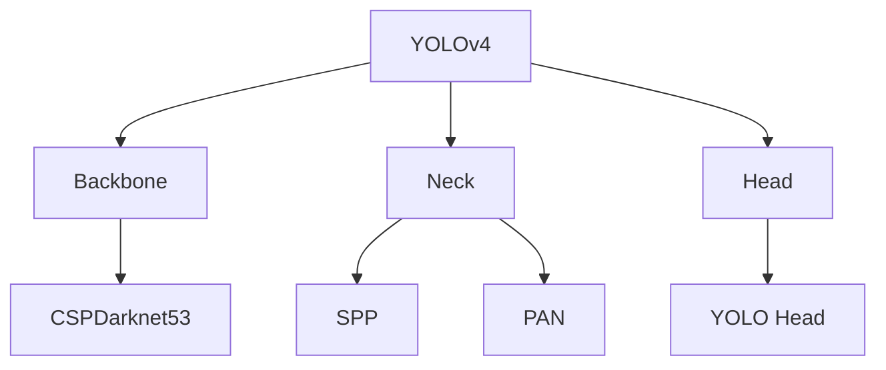

## YOLOv4概述

YOLOv4结合了大量最新tricks，在速度和精度上达到最佳平衡。

## 核心改进



## 实现代码

```python
import torch
import torch.nn as nn

class Conv(nn.Module):
    def __init__(self, in_channels, out_channels, kernel_size=1, stride=1, padding=0):
        super().__init__()
        self.conv = nn.Conv2d(in_channels, out_channels, kernel_size, stride, padding, bias=False)
        self.bn = nn.BatchNorm2d(out_channels)
        self.act = nn.LeakyReLU(0.1)
        
    def forward(self, x):
        return self.act(self.bn(self.conv(x)))

class CSPBlock(nn.Module):
    def __init__(self, in_channels, out_channels):
        super().__init__()
        hidden_channels = out_channels // 2
        
        self.conv1 = Conv(in_channels, hidden_channels, 1)
        self.conv2 = Conv(in_channels, hidden_channels, 1)
        self.conv3 = Conv(2 * hidden_channels, out_channels, 1)
        
    def forward(self, x):
        x1 = self.conv1(x)
        x2 = self.conv2(x)
        x = torch.cat([x1, x2], dim=1)
        return self.conv3(x)

class YOLOv4(nn.Module):
    def __init__(self, num_classes=80):
        super().__init__()
        self.backbone = nn.Sequential(
            Conv(3, 32, 3, 1, 1),
            Conv(32, 64, 3, 2, 1),
            CSPBlock(64, 64),
            Conv(64, 128, 3, 2, 1),
            CSPBlock(128, 128),
            Conv(128, 256, 3, 2, 1),
            CSPBlock(256, 256),
            Conv(256, 512, 3, 2, 1),
            CSPBlock(512, 512),
            Conv(512, 1024, 3, 2, 1),
            CSPBlock(1024, 1024),
        )
        
    def forward(self, x):
        return self.backbone(x)
```

## 使用预训练模型

```python
import cv2
import numpy as np

# 加载模型
net = cv2.dnn.readNetFromDarknet('yolov4.cfg', 'yolov4.weights')
net.setPreferableBackend(cv2.dnn.DNN_BACKEND_OPENCV)

# 读取图像
image = cv2.imread('image.jpg')
blob = cv2.dnn.blobFromImage(image, 1/255.0, (416, 416), swapRB=True)
net.setInput(blob)

# 获取输出层
layer_names = net.getLayerNames()
output_layers = [layer_names[i[0] - 1] for i in net.getUnconnectedOutLayers()]
outs = net.forward(output_layers)

# 解析检测结果
class_ids = []
confidences = []
boxes = []

for out in outs:
    for detection in out:
        scores = detection[5:]
        class_id = np.argmax(scores)
        confidence = scores[class_id]
        if confidence > 0.5:
            center_x, center_y, width, height = detection[:4]
            x = int(center_x - width / 2)
            y = int(center_y - height / 2)
            boxes.append([x, y, int(width), int(height)])
            confidences.append(float(confidence))
            class_ids.append(class_id)
```

## 性能对比

| 模型 | FPS | mAP |
|------|-----|-----|
| YOLOv4 | 65 | 43.5% |
| YOLOv4-Tiny | 370 | 40.2% |
| EfficientDet-D3 | 16 | 45.8% |

## 总结

YOLOv4是实时目标检测的标杆模型。
