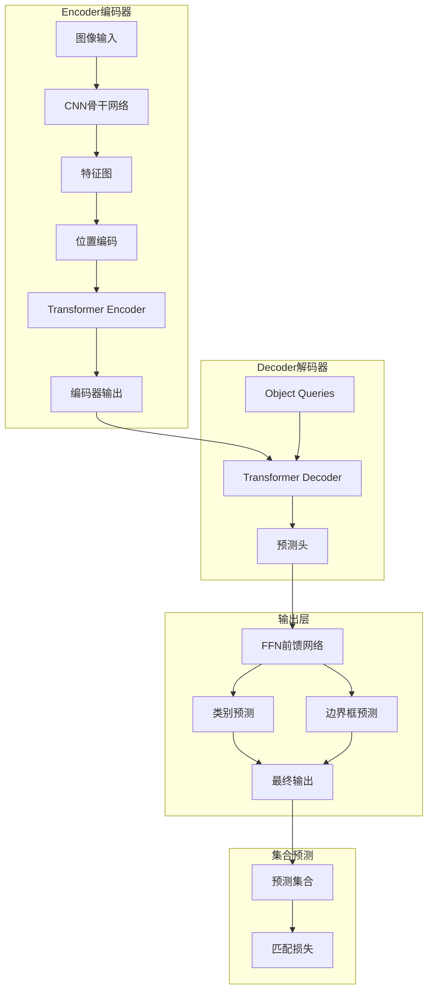
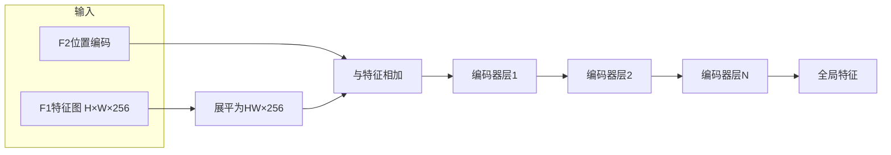
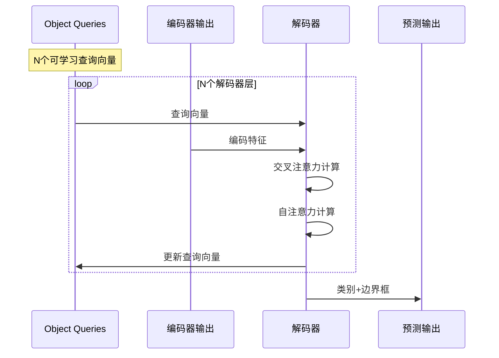
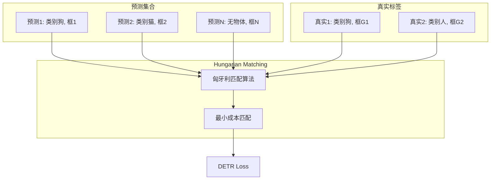
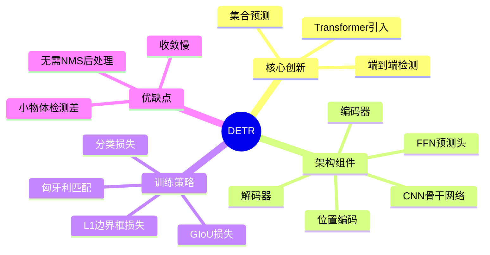

## 概述

DETR（Detection Transformer）是Facebook AI提出的端到端目标检测方法，它将Transformer引入目标检测领域，实现了真正的端到端检测流程。本文详细解析DETR的架构设计和实现细节。

## DETR核心架构

### 整体流程



### 编码器结构



### 解码器结构



## PyTorch实现

### DETR模型实现

```python
import torch
import torch.nn as nn
import torch.nn.functional as F
from torchvision.ops import box_area

class DETR(nn.Module):
    """DETR目标检测模型"""
    
    def __init__(self, num_classes=91, num_queries=100, hidden_dim=256, 
                 num_encoders=6, num_decoders=6):
        super().__init__()
        self.num_queries = num_queries
        self.hidden_dim = hidden_dim
        
        # CNN骨干网络
        self.backbone = nn.Sequential(
            nn.Conv2d(3, 64, 7, 2, 3),
            nn.BatchNorm2d(64),
            nn.ReLU(inplace=True),
            # ... 更多层
        )
        
        # 输入投影
        self.input_proj = nn.Conv2d(2048, hidden_dim, 1)
        
        # 位置编码
        self.pos_encoder = PositionalEncoding(hidden_dim, dropout=0.1)
        
        # Transformer
        self.transformer = Transformer(
            hidden_dim=hidden_dim,
            num_encoder_layers=num_encoders,
            num_decoder_layers=num_decoders,
            num_queries=num_queries
        )
        
        # 预测头
        self.class_embed = nn.Linear(hidden_dim, num_classes + 1)
        self.bbox_embed = MLP(hidden_dim, hidden_dim, 4, 3)
    
    def forward(self, images):
        # 骨干网络提取特征
        features = self.backbone(images)
        
        # 投影到隐藏维度
        src = self.input_proj(features)
        batch_size = src.shape[0]
        
        # 生成位置编码
        pos = self.pos_encoder(src)
        
        # Transformer处理
        hs = self.transformer(src, pos)
        
        # 预测
        outputs_class = self.class_embed(hs)
        outputs_coord = self.bbox_embed(hs).sigmoid()
        
        return {
            'pred_logits': outputs_class[-1],
            'pred_boxes': outputs_coord[-1]
        }
```

### Transformer编码器/解码器

```python
class Transformer(nn.Module):
    def __init__(self, hidden_dim, num_encoder_layers, num_decoder_layers, num_queries):
        super().__init__()
        
        self.encoder = nn.ModuleList([
            EncoderLayer(hidden_dim) for _ in range(num_encoder_layers)
        ])
        
        self.decoder = nn.ModuleList([
            DecoderLayer(hidden_dim) for _ in range(num_decoder_layers)
        ])
        
        # 可学习的Object Queries
        self.query_embed = nn.Embedding(num_queries, hidden_dim)
    
    def forward(self, src, pos):
        # 编码器前向传播
        memory = src
        for layer in self.encoder:
            memory = layer(memory, pos)
        
        # 解码器前向传播
        query_embed = self.query_embed.weight.unsqueeze(0).repeat(src.shape[0], 1, 1)
        hs = query_embed
        
        for layer in self.decoder:
            hs = layer(hs, memory, pos)
        
        return hs.transpose(0, 1)
```

## 匹配损失与训练



### 损失计算

```python
class DETRLoss(nn.Module):
    """DETR损失函数"""
    
    def __init__(self, num_classes, weight_dict):
        super().__init__()
        self.num_classes = num_classes
        self.weight_dict = weight_dict
        
        # 分类损失使用交叉熵
        self.class_loss = nn.CrossEntropyLoss()
        
        # 边界框损失使用L1 + GIoU
        self.bbox_loss = nn.L1Loss()
        self.giou_loss = GeneralizedBoxLoss()
    
    def forward(self, outputs, targets):
        """
        outputs: {
            'pred_logits': [B, N, C+1],
            'pred_boxes': [B, N, 4]
        }
        targets: [{'labels': [...], 'boxes': [...]}]
        """
        pred_logits = outputs['pred_logits']
        pred_boxes = outputs['pred_boxes']
        
        # 匈牙利匹配
        indices = self.hungarian_matching(pred_logits, pred_boxes, targets)
        
        # 计算分类损失
        idx = self._get_src_permutation_idx(indices)
        target_classes_o = torch.cat([t["labels"][J] for t, (_, J) in zip(targets, indices)])
        target_classes = torch.full(pred_logits.shape[:2], self.num_classes,
                                   dtype=torch.int64, device=pred_logits.device)
        target_classes_o = target_classes_o.to(device=pred_logits.device)
        target_classes[idx] = target_classes_o
        
        loss_class = F.cross_entropy(pred_logits.transpose(1, 2), target_classes)
        
        # 计算边界框损失
        loss_bbox = F.l1_loss(pred_boxes[idx], target_boxes[idx], reduction='mean')
        loss_giou = 1 - torch.diag(box_iou(
            box_cxcywh_to_xyxy(pred_boxes[idx]),
            box_cxcywh_to_xyxy(target_boxes[idx])
        )).mean()
        
        losses = {
            'loss_class': loss_class,
            'loss_bbox': loss_bbox,
            'loss_giou': loss_giou
        }
        
        return losses
```

## DETR性能对比

| 模型 | mAP | FPS | 参数量 |
|------|-----|-----|--------|
| Faster R-CNN | 42.0 | 18 | 41M |
| RetinaNet | 40.8 | 12 | 36M |
| DETR | 42.0 | 28 | 41M |
| Deformable DETR | 46.9 | 32 | 34M |

## 总结



DETR开创了Transformer目标检测的先河，虽然存在收敛慢等问题，但其端到端的设计理念对后续检测器产生了深远影响。
