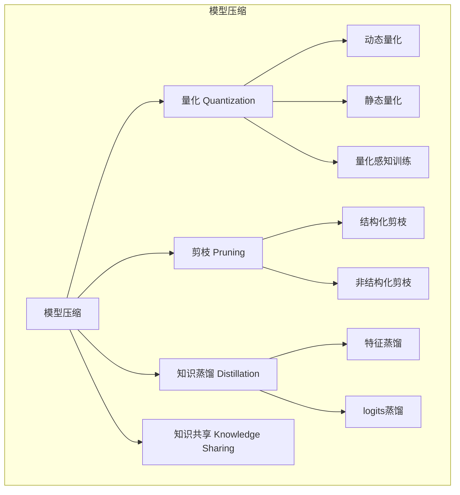
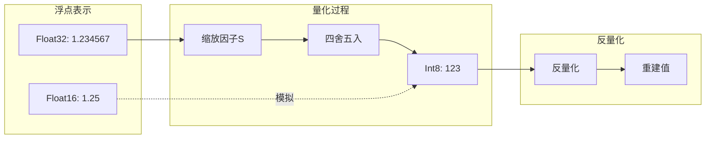
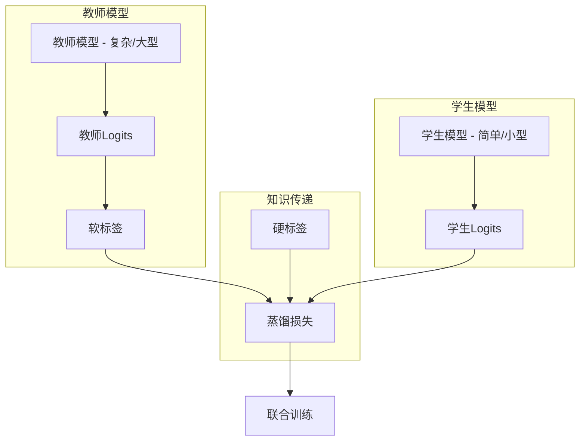
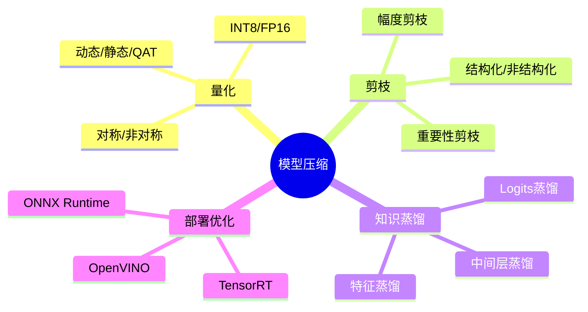

## 概述

随着深度学习模型越来越大，模型压缩与量化成为部署到边缘设备的关键技术。本文系统介绍模型压缩的各种方法，重点讲解量化技术的原理与实践。

## 模型压缩方法总览



## 量化技术详解

### 量化原理



### 量化公式

| 量化类型 | 公式 | 说明 |
|---------|------|------|
| 对称量化 | $x_{int8} = \text{round}(x_{fp32} / s)$ | 零点为0 |
| 非对称量化 | $x_{int8} = \text{round}(x_{fp32} / s + z)$ | 有零点偏移 |

### PyTorch量化实现

```python
import torch
import torch.nn as nn
import torch.quantization

class QuantizedConv2d(nn.Module):
    """支持量化的卷积层"""
    
    def __init__(self, in_channels, out_channels, kernel_size):
        super().__init__()
        self.conv = nn.Conv2d(in_channels, out_channels, kernel_size)
        self.relu = nn.ReLU()
        
        # 量化配置
        self.quant = torch.quantization.QuantStub()
        self.dequant = torch.quantization.DeQuantStub()
    
    def forward(self, x):
        x = self.quant(x)
        x = self.conv(x)
        x = self.relu(x)
        x = self.dequant(x)
        return x
```

### 动态量化示例

```python
# 动态量化 - 最简单的方式
model_dynamic = torch.quantization.quantize_dynamic(
    model,
    {nn.Linear, nn.LSTM, nn.GRU},  # 要量化的层类型
    dtype=torch.qint8  # 量化数据类型
)

# 静态量化 - 需要校准
model_static = nn.Sequential(
    nn.Conv2d(3, 64, 3),
    nn.ReLU(),
    nn.Conv2d(64, 128, 3)
)

# 融合操作
model_static = torch.quantization.fuse_model(model_static)

# 配置量化参数
model_static.qconfig = torch.quantization.get_default_qconfig('fbgemm')
torch.quantization.prepare(model_static, inplace=True)

# 校准（使用训练数据）
with torch.no_grad():
    for data, _ in calibration_loader:
        model_static(data)

# 转换为量化模型
model_quantized = torch.quantization.convert(model_static, inplace=False)
```

### 量化感知训练（QAT）

```python
class QATAwareModel(nn.Module):
    """量化感知训练模型"""
    
    def __init__(self):
        super().__init__()
        self.conv1 = nn.Conv2d(3, 64, 3, padding=1)
        self.bn1 = nn.BatchNorm2d(64)
        self.conv2 = nn.Conv2d(64, 128, 3, padding=1)
        self.bn2 = nn.BatchNorm2d(128)
        self.fc = nn.Linear(128, 10)
        
        # QAT钩子
        self.quant = torch.quantization.QuantStub()
        self.dequant = torch.quantization.DeQuantStub()
    
    def forward(self, x):
        x = self.quant(x)
        x = self.conv1(x)
        x = self.bn1(x)
        x = F.relu(x)
        x = self.conv2(x)
        x = self.bn2(x)
        x = F.relu(x)
        x = F.adaptive_avg_pool2d(x, 1)
        x = x.view(x.size(0), -1)
        x = self.dequant(x)
        x = self.fc(x)
        return x

# QAT训练流程
def train_qat(model, train_loader, epochs=10):
    model.qconfig = torch.quantization.get_default_qat_qconfig('fbgemm')
    torch.quantization.prepare_qat(model, inplace=True)
    
    optimizer = torch.optim.Adam(model.parameters())
    criterion = nn.CrossEntropyLoss()
    
    for epoch in range(epochs):
        model.train()
        for data, target in train_loader:
            optimizer.zero_grad()
            output = model(data)
            loss = criterion(output, target)
            loss.backward()
            optimizer.step()
    
    # 转换为量化模型
    model.eval()
    model = torch.quantization.convert(model, inplace=False)
    return model
```

## 剪枝技术

### 剪枝类型对比

```mermaid
flowchart TB
    subgraph 原始权重
        W1[█][█][█][█][█]
        W2[█][█][█][█][█]
        W3[█][█][█][█][█]
        W4[█][█][█][█][█]
    end
    
    subgraph 非结构化剪枝
        U1[█][ ][█][ ][█]
        U2[ ][█][ ][█][ ]
        U3[█][ ][ ][█][█]
        U4[ ][ ][█][ ][█]
    end
    
    subgraph 结构化剪枝
        S1[ ][ ][ ][ ][ ]
        S2[█][█][█][█][█]
        S3[ ][ ][ ][ ][ ]
        S4[█][█][█][█][█]
    end
```

### 剪枝实现

```python
class PruningModel:
    """模型剪枝工具类"""
    
    @staticmethod
    def magnitude_pruning(model, pruning_ratio=0.3):
        """幅度剪枝 - 移除幅度最小的权重"""
        for name, param in model.named_parameters():
            if 'weight' in name:
                # 计算剪枝阈值
                threshold = torch.quantile(torch.abs(param.data), pruning_ratio)
                # 创建掩码
                mask = torch.abs(param.data) > threshold
                param.data = param.data * mask.float()
    
    @staticmethod
    def structured_pruning(model, layer_pruning_ratio=0.3):
        """结构化剪枝 - 移除整个神经元/通道"""
        for name, module in model.named_modules():
            if isinstance(module, nn.Conv2d):
                # 基于通道重要性
                importance = torch.sum(torch.abs(module.weight.data), dim=(2, 3))
                importance = torch.sum(importance, dim=0)
                
                num_keep = int(importance.shape[0] * (1 - layer_pruning_ratio))
                keep_indices = torch.topk(importance, num_keep).indices
                
                # 更新权重
                module.weight.data = module.weight.data[keep_indices]
                module.out_channels = len(keep_indices)
```

## 知识蒸馏



### 蒸馏实现

```python
class DistillationLoss(nn.Module):
    """知识蒸馏损失"""
    
    def __init__(self, temperature=4.0, alpha=0.7):
        super().__init__()
        self.temperature = temperature
        self.alpha = alpha
    
    def forward(self, student_logits, teacher_logits, labels):
        """
        student_logits: 学生模型输出
        teacher_logits: 教师模型输出
        labels: 真实标签
        """
        # 软损失 - KL散度
        soft_loss = F.kl_div(
            F.log_softmax(student_logits / self.temperature, dim=1),
            F.softmax(teacher_logits / self.temperature, dim=1),
            reduction='batchmean'
        ) * (self.temperature ** 2)
        
        # 硬损失 - 交叉熵
        hard_loss = F.cross_entropy(student_logits, labels)
        
        # 组合损失
        total_loss = self.alpha * soft_loss + (1 - self.alpha) * hard_loss
        
        return total_loss, soft_loss, hard_loss

class DistillationTrainer:
    def __init__(self, teacher, student, train_loader, temperature=4.0, alpha=0.7):
        self.teacher = teacher
        self.student = student
        self.train_loader = train_loader
        self.criterion = DistillationLoss(temperature, alpha)
        self.optimizer = torch.optim.Adam(student.parameters())
    
    def train(self, epochs):
        for epoch in range(epochs):
            for data, labels in self.train_loader:
                # 教师前向传播
                with torch.no_grad():
                    teacher_logits = self.teacher(data)
                
                # 学生前向传播
                student_logits = self.student(data)
                
                # 计算蒸馏损失
                loss, soft_loss, hard_loss = self.criterion(
                    student_logits, teacher_logits, labels
                )
                
                # 反向传播
                self.optimizer.zero_grad()
                loss.backward()
                self.optimizer.step()
                
                print(f"Epoch {epoch}, Loss: {loss.item():.4f}")
```

## 性能对比

| 方法 | 压缩比 | 精度损失 | 推理加速 |
|------|--------|----------|----------|
| FP32基线 | 1x | 0% | 1x |
| INT8动态量化 | 4x | ~1% | 2-3x |
| INT8静态量化 | 4x | ~2% | 3-4x |
| QAT量化 | 4x | <1% | 3-4x |
| 剪枝50% | 2x | ~3% | 1.5-2x |
| 知识蒸馏 | 可调 | <2% | 取决于学生模型 |

## 总结



模型压缩是部署深度学习模型到资源受限设备的关键技术，需要根据具体场景选择合适的压缩方法。
