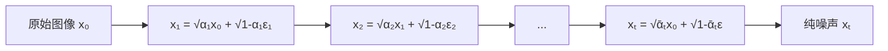
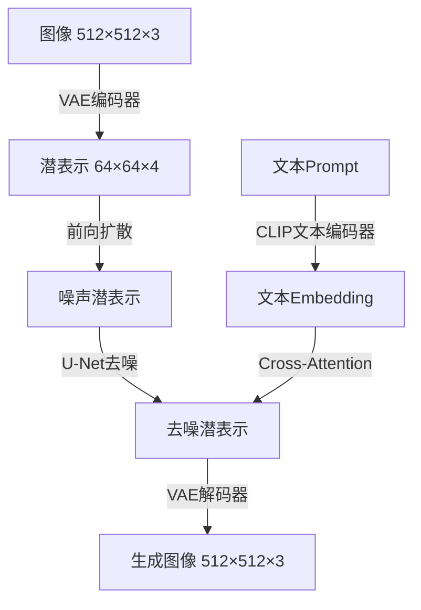
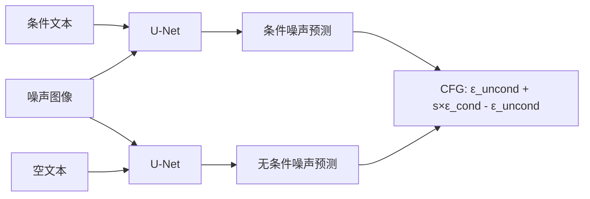

# Stable Diffusion原理深度解析

2022年8月，Stable Diffusion开源发布，彻底引爆了AIGC浪潮。与DALL-E不同，它可以在消费级GPU上运行，让每个人都能使用AI生成图像。本文将深入解析其技术原理。

## 1. 扩散模型基础

### 1.1 前向扩散过程

逐步向图像添加高斯噪声，直到变成纯噪声：



```python
class GaussianDiffusion:
    def __init__(self, num_timesteps=1000, beta_start=1e-4, beta_end=0.02):
        self.num_timesteps = num_timesteps
        
        # 线性噪声调度
        self.betas = torch.linspace(beta_start, beta_end, num_timesteps)
        self.alphas = 1.0 - self.betas
        self.alphas_cumprod = torch.cumprod(self.alphas, dim=0)
        self.sqrt_alphas_cumprod = torch.sqrt(self.alphas_cumprod)
        self.sqrt_one_minus_alphas_cumprod = torch.sqrt(1.0 - self.alphas_cumprod)
    
    def q_sample(self, x_start, t, noise=None):
        """前向扩散：在时间步t添加噪声"""
        if noise is None:
            noise = torch.randn_like(x_start)
        
        sqrt_alpha = self._extract(self.sqrt_alphas_cumprod, t, x_start.shape)
        sqrt_one_minus_alpha = self._extract(
            self.sqrt_one_minus_alphas_cumprod, t, x_start.shape
        )
        
        # 重参数化：直接从x₀采样xₜ
        return sqrt_alpha * x_start + sqrt_one_minus_alpha * noise
    
    def _extract(self, a, t, x_shape):
        """从预计算数组中提取对应时间步的值"""
        b = t.shape[0]
        out = a.gather(-1, t)
        return out.reshape(b, *((1,) * (len(x_shape) - 1)))
```

### 1.2 反向去噪过程

训练神经网络预测噪声，逐步去噪还原图像：

```python
class DiffusionUNet(nn.Module):
    """U-Net噪声预测网络"""
    def __init__(self, in_channels=4, out_channels=4, 
                 model_channels=320, num_res_blocks=2):
        super().__init__()
        
        # 时间步嵌入
        self.time_embed = nn.Sequential(
            nn.Linear(model_channels, model_channels * 4),
            nn.SiLU(),
            nn.Linear(model_channels * 4, model_channels * 4)
        )
        
        # 下采样
        self.down_blocks = nn.ModuleList([
            DownBlock(model_channels, model_channels * 2, num_res_blocks),
            DownBlock(model_channels * 2, model_channels * 4, num_res_blocks),
            DownBlock(model_channels * 4, model_channels * 8, num_res_blocks),
        ])
        
        # 中间块（含注意力）
        self.middle = MiddleBlock(model_channels * 8)
        
        # 上采样（含跳跃连接）
        self.up_blocks = nn.ModuleList([
            UpBlock(model_channels * 8 + model_channels * 4, model_channels * 4),
            UpBlock(model_channels * 4 + model_channels * 2, model_channels * 2),
            UpBlock(model_channels * 2 + model_channels, model_channels),
        ])
        
        self.out = nn.Conv2d(model_channels, out_channels, 3, padding=1)
    
    def forward(self, x, t, context=None):
        """预测噪声ε"""
        # 时间嵌入
        t_emb = self.time_embed(timestep_embedding(t, self.model_channels))
        
        # 下采样并保存跳跃连接
        skips = []
        h = x
        for block in self.down_blocks:
            h = block(h, t_emb, context)
            skips.append(h)
        
        # 中间处理
        h = self.middle(h, t_emb, context)
        
        # 上采样 + 跳跃连接
        for block, skip in zip(self.up_blocks, reversed(skips)):
            h = block(h, skip, t_emb, context)
        
        return self.out(h)
```

## 2. 潜扩散模型（Latent Diffusion）

Stable Diffusion的核心创新是在潜空间中进行扩散，大幅降低计算成本：



### 2.1 VAE编码器/解码器

```python
class VAE(nn.Module):
    """变分自编码器：图像↔潜空间"""
    def __init__(self, z_channels=4, in_channels=3):
        super().__init__()
        # 编码器：512×512×3 → 64×64×4
        self.encoder = nn.Sequential(
            nn.Conv2d(in_channels, 128, 3, 1, 1),
            ResBlock(128, 128),
            Downsample(128),
            ResBlock(128, 256),
            Downsample(256),
            ResBlock(256, 512),
            Downsample(512),
            ResBlock(512, 512),
            # 输出均值和方差
            nn.Conv2d(512, z_channels * 2, 1)
        )
        
        # 解码器：64×64×4 → 512×512×3
        self.decoder = nn.Sequential(
            nn.Conv2d(z_channels, 512, 1),
            ResBlock(512, 512),
            Upsample(512),
            ResBlock(512, 512),
            Upsample(512),
            ResBlock(512, 256),
            Upsample(256),
            ResBlock(256, 128),
            nn.Conv2d(128, in_channels, 3, 1, 1),
            nn.Tanh()
        )
    
    def encode(self, x):
        h = self.encoder(x)
        mean, logvar = h.chunk(2, dim=1)
        # 重参数化
        z = mean + torch.randn_like(mean) * torch.exp(0.5 * logvar)
        return z
    
    def decode(self, z):
        return self.decoder(z)
```

### 2.2 文本条件注入

```python
class CrossAttention(nn.Module):
    """Cross-Attention: U-Net特征关注文本特征"""
    def __init__(self, query_dim, context_dim, heads=8):
        super().__init__()
        self.heads = heads
        self.scale = (query_dim // heads) ** -0.5
        
        self.to_q = nn.Linear(query_dim, query_dim)
        self.to_k = nn.Linear(context_dim, query_dim)
        self.to_v = nn.Linear(context_dim, query_dim)
        self.to_out = nn.Linear(query_dim, query_dim)
    
    def forward(self, x, context):
        b, n, _ = x.shape
        
        q = self.to_q(x).reshape(b, n, self.heads, -1).transpose(1, 2)
        k = self.to_k(context).reshape(b, -1, self.heads, q.shape[-1]).transpose(1, 2)
        v = self.to_v(context).reshape(b, -1, self.heads, q.shape[-1]).transpose(1, 2)
        
        attn = (q @ k.transpose(-2, -1)) * self.scale
        attn = attn.softmax(dim=-1)
        
        out = (attn @ v).transpose(1, 2).reshape(b, n, -1)
        return self.to_out(out)
```

## 3. 训练与采样

### 3.1 训练循环

```python
def train_latent_diffusion(model, vae, text_encoder, dataloader, optimizer):
    for batch in dataloader:
        images, captions = batch["image"], batch["caption"]
        
        # 编码到潜空间
        with torch.no_grad():
            latents = vae.encode(images)
            text_embeddings = text_encoder(captions)
        
        # 随机时间步
        t = torch.randint(0, num_timesteps, (latents.shape[0],))
        
        # 添加噪声
        noise = torch.randn_like(latents)
        noisy_latents = diffusion.q_sample(latents, t, noise)
        
        # 预测噪声
        noise_pred = model(noisy_latents, t, text_embeddings)
        
        # 简单MSE损失
        loss = F.mse_loss(noise_pred, noise)
        
        optimizer.zero_grad()
        loss.backward()
        optimizer.step()
```

### 3.2 DDIM采样

```python
@torch.no_grad()
def ddim_sample(model, vae, text_encoder, prompt, 
                num_steps=50, eta=0.0, guidance_scale=7.5):
    """DDIM确定性采样 + Classifier-Free Guidance"""
    # 文本编码
    text_emb = text_encoder(prompt)          # 条件
    uncond_emb = text_encoder([""] * len(prompt))  # 无条件
    
    # 从纯噪声开始
    latents = torch.randn(len(prompt), 4, 64, 64)
    
    # 逐步去噪
    for i in reversed(range(num_steps)):
        t = torch.tensor([i] * len(prompt))
        
        # Classifier-Free Guidance
        noise_cond = model(latents, t, text_emb)
        noise_uncond = model(latents, t, uncond_emb)
        noise_pred = noise_uncond + guidance_scale * (noise_cond - noise_uncond)
        
        # DDIM更新
        alpha_t = alphas_cumprod[i]
        alpha_prev = alphas_cumprod[max(i - 1, 0)]
        
        # 预测x₀
        x0_pred = (latents - (1 - alpha_t).sqrt() * noise_pred) / alpha_t.sqrt()
        
        # 方向指向xₜ
        dir_xt = (1 - alpha_prev - eta**2 * (1 - alpha_t)).sqrt() * noise_pred
        
        latents = alpha_prev.sqrt() * x0_pred + dir_xt
        
        if eta > 0:
            noise = torch.randn_like(latents)
            latents += eta * (1 - alpha_prev).sqrt() * noise
    
    # 解码回图像空间
    images = vae.decode(latents)
    return images
```

## 4. Classifier-Free Guidance

CFG是Stable Diffusion高质量生成的关键：

```python
def classifier_free_guidance(noise_cond, noise_uncond, guidance_scale=7.5):
    """
    guidance_scale > 1: 增强条件影响，图像更符合文本但多样性降低
    guidance_scale = 1: 标准条件采样
    guidance_scale < 1: 降低条件影响
    """
    return noise_uncond + guidance_scale * (noise_cond - noise_uncond)
```



## 5. 本地部署Stable Diffusion

```bash
# 安装依赖
git clone https://github.com/CompVis/stable-diffusion.git
cd stable-diffusion
conda env create -f environment.yaml
conda activate ldm

# 下载模型权重
wget https://huggingface.co/CompVis/stable-diffusion-v-1-4/resolve/main/sd-v1-4.ckpt

# 生成图像
python scripts/txt2img.py \
    --prompt "a photograph of an astronaut riding a horse" \
    --plms \
    --outdir outputs \
    --ckpt sd-v1-4.ckpt \
    --n_samples 4 \
    --ddim_steps 50 \
    --cfg_scale 7.5
```

```python
# 使用diffusers库（推荐方式）
from diffusers import StableDiffusionPipeline

pipe = StableDiffusionPipeline.from_pretrained(
    "CompVis/stable-diffusion-v1-4",
    torch_dtype=torch.float16,
    revision="fp16"
).to("cuda")

image = pipe(
    "a photograph of an astronaut riding a horse, detailed, 4k",
    num_inference_steps=50,
    guidance_scale=7.5,
    width=512,
    height=512
).images[0]

image.save("astronaut_horse.png")
```

## 总结

Stable Diffusion通过潜扩散模型将扩散过程从像素空间转移到低维潜空间，使消费级GPU上的高质量图像生成成为可能。配合Classifier-Free Guidance和DDIM采样，它实现了质量与效率的平衡。其开源发布标志着AIGC民主化的里程碑。
