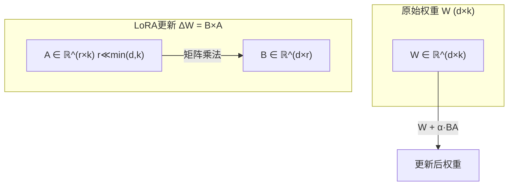

# Stable Diffusion实战与LoRA微调

Stable Diffusion开源后，社区涌现了大量微调和个性化方案。其中LoRA（Low-Rank Adaptation）因其高效性成为最流行的微调方法，仅需少量数据即可训练出个性化的图像生成模型。

## 1. LoRA原理

### 1.1 低秩分解

LoRA的核心思想：预训练权重矩阵的更新具有低秩特性，可以用两个小矩阵的乘积来近似：



```python
class LoRALinear(nn.Module):
    """LoRA线性层：冻结原始权重，仅训练低秩矩阵"""
    def __init__(self, original_linear, rank=4, alpha=1.0):
        super().__init__()
        self.original = original_linear
        self.rank = rank
        self.alpha = alpha
        
        d = original_linear.out_features
        k = original_linear.in_features
        
        # 低秩矩阵A和B
        self.lora_A = nn.Parameter(torch.zeros(rank, k))
        self.lora_B = nn.Parameter(torch.zeros(d, rank))
        
        # 冻结原始权重
        self.original.weight.requires_grad = False
        if self.original.bias is not None:
            self.original.bias.requires_grad = False
        
        # Kaiming初始化A
        nn.init.kaiming_uniform_(self.lora_A, a=5**0.5)
        # B初始化为零，确保初始时ΔW=0
        nn.init.zeros_(self.lora_B)
    
    def forward(self, x):
        # 原始变换 + LoRA调整
        original_out = self.original(x)
        lora_out = (x @ self.lora_A.T @ self.lora_B.T) * (self.alpha / self.rank)
        return original_out + lora_out
```

### 1.2 在SD中应用LoRA

```python
def apply_lora_to_unet(unet, rank=4):
    """将LoRA应用到U-Net的注意力层"""
    lora_layers = []
    
    for name, module in unet.named_modules():
        if isinstance(module, nn.Linear) and 'attention' in name:
            # 替换为LoRA层
            lora_layer = LoRALinear(module, rank=rank)
            
            # 设置属性（简化版，实际需要更复杂的路径替换）
            parts = name.split('.')
            parent = unet
            for part in parts[:-1]:
                parent = getattr(parent, part)
            setattr(parent, parts[-1], lora_layer)
            
            lora_layers.append(lora_layer)
    
    # 冻结所有非LoRA参数
    for name, param in unet.named_parameters():
        if 'lora_A' not in name and 'lora_B' not in name:
            param.requires_grad = False
    
    return unet, lora_layers
```

## 2. LoRA训练流程

### 2.1 数据准备

```python
import json
from pathlib import Path
from PIL import Image
from torch.utils.data import Dataset

class LoRADataset(Dataset):
    """LoRA微调数据集"""
    def __init__(self, data_dir, size=512, placeholder_token="<sks>"):
        self.size = size
        self.placeholder = placeholder_token
        self.data = []
        
        data_path = Path(data_dir)
        for img_file in sorted(data_path.glob("*.jpg")):
            caption_file = img_file.with_suffix(".txt")
            if caption_file.exists():
                caption = caption_file.read_text().strip()
            else:
                caption = f"a photo of {placeholder_token}"
            
            self.data.append({
                "image": str(img_file),
                "caption": caption
            })
        
        self.transform = transforms.Compose([
            transforms.Resize((size, size)),
            transforms.ToTensor(),
            transforms.Normalize([0.5], [0.5])
        ])
    
    def __len__(self):
        return len(self.data)
    
    def __getitem__(self, idx):
        item = self.data[idx]
        image = Image.open(item["image"]).convert("RGB")
        image = self.transform(image)
        return {"pixel_values": image, "caption": item["caption"]}
```

### 2.2 训练循环

```python
def train_lora(
    pretrained_model="CompVis/stable-diffusion-v1-4",
    data_dir="./training_data",
    output_dir="./lora_output",
    rank=4,
    learning_rate=1e-4,
    max_train_steps=1000,
    batch_size=1,
    gradient_accumulation_steps=4
):
    # 加载预训练模型
    pipe = StableDiffusionPipeline.from_pretrained(
        pretrained_model, torch_dtype=torch.float16
    ).to("cuda")
    
    unet = pipe.unet
    vae = pipe.vae
    text_encoder = pipe.text_encoder
    
    # 应用LoRA
    unet, lora_layers = apply_lora_to_unet(unet, rank=rank)
    
    # 只优化LoRA参数
    optimizer = torch.optim.AdamW(
        [p for layer in lora_layers for p in [layer.lora_A, layer.lora_B]],
        lr=learning_rate
    )
    
    # 噪声调度器
    noise_scheduler = DDPMScheduler.from_config(pipe.scheduler.config)
    
    # 数据集
    dataset = LoRADataset(data_dir)
    dataloader = DataLoader(dataset, batch_size=batch_size, shuffle=True)
    
    # 训练
    global_step = 0
    unet.train()
    
    while global_step < max_train_steps:
        for batch in dataloader:
            # 编码图像到潜空间
            with torch.no_grad():
                latents = vae.encode(batch["pixel_values"].to("cuda"))
                latents = latents * 0.18215
            
            # 编码文本
            with torch.no_grad():
                text_inputs = pipe.tokenizer(
                    batch["caption"], padding=True, 
                    truncation=True, return_tensors="pt"
                ).to("cuda")
                text_embeddings = text_encoder(**text_inputs)[0]
            
            # 添加噪声
            noise = torch.randn_like(latents)
            timesteps = torch.randint(
                0, noise_scheduler.num_train_timesteps, 
                (latents.shape[0],), device="cuda"
            )
            noisy_latents = noise_scheduler.add_noise(latents, noise, timesteps)
            
            # 预测噪声
            noise_pred = unet(noisy_latents, timesteps, text_embeddings).sample
            loss = F.mse_loss(noise_pred, noise)
            
            loss.backward()
            
            if (global_step + 1) % gradient_accumulation_steps == 0:
                optimizer.step()
                optimizer.zero_grad()
            
            global_step += 1
            
            if global_step % 100 == 0:
                print(f"Step {global_step}, Loss: {loss.item():.4f}")
            
            if global_step >= max_train_steps:
                break
    
    # 保存LoRA权重
    save_lora_weights(lora_layers, output_dir)
    print(f"LoRA权重已保存到 {output_dir}")
```

### 2.3 保存和加载LoRA

```python
def save_lora_weights(lora_layers, output_dir):
    """仅保存LoRA权重（通常只有几MB）"""
    state_dict = {}
    for i, layer in enumerate(lora_layers):
        state_dict[f"lora_{i}_A"] = layer.lora_A.data.cpu()
        state_dict[f"lora_{i}_B"] = layer.lora_B.data.cpu()
    
    torch.save(state_dict, f"{output_dir}/lora_weights.pt")

def load_lora_weights(pipe, lora_path, rank=4, alpha=1.0):
    """加载LoRA权重到推理管线"""
    state_dict = torch.load(lora_path)
    
    # 重新应用LoRA层
    unet, lora_layers = apply_lora_to_unet(pipe.unet, rank=rank)
    
    # 加载权重
    for i, layer in enumerate(lora_layers):
        layer.lora_A.data = state_dict[f"lora_{i}_A"].to("cuda")
        layer.lora_B.data = state_dict[f"lora_{i}_B"].to("cuda")
        layer.alpha = alpha
    
    pipe.unet = unet
    return pipe
```

## 3. 推理与生成

```python
def generate_with_lora(base_model, lora_path, prompt, **kwargs):
    """使用LoRA微调后的模型生成图像"""
    pipe = StableDiffusionPipeline.from_pretrained(
        base_model, torch_dtype=torch.float16
    ).to("cuda")
    
    # 加载LoRA
    pipe = load_lora_weights(pipe, lora_path)
    
    image = pipe(prompt, **kwargs).images[0]
    return image

# 生成示例
image = generate_with_lora(
    base_model="CompVis/stable-diffusion-v1-4",
    lora_path="./lora_output/lora_weights.pt",
    prompt="a photo of <sks> in a garden, detailed, 4k",
    num_inference_steps=50,
    guidance_scale=7.5
)
image.save("lora_output.png")
```

## 4. 常用LoRA变体

| 方法 | 特点 | 适用场景 |
|------|------|----------|
| LoRA | 经典低秩分解 | 通用微调 |
| LoHA | Hadamard积低秩 | 更高效率 |
| LoKr | Kronecker积 | 更大模型 |
| DoRA | 分解幅度和方向 | 更好性能 |
| QLoRA | 4-bit量化+LoRA | 极低显存 |

## 5. 实用技巧

### 5.1 参数建议

```
训练数据量: 15-30张高质量图片
Rank: 4-16（风格LoRA用4，人物LoRA用8-16）
学习率: 1e-4 ~ 5e-5
训练步数: 800-2000步
Alpha: 通常设为Rank值
```

### 5.2 避免过拟合

```python
# 早停策略
best_loss = float('inf')
patience = 100
patience_counter = 0

for step in range(max_train_steps):
    loss = train_step()
    
    if loss < best_loss:
        best_loss = loss
        patience_counter = 0
        save_best_model()
    else:
        patience_counter += 1
    
    if patience_counter >= patience:
        print(f"早停于步数 {step}")
        break
```

## 总结

LoRA通过低秩分解将微调参数量降低了数千倍，使得普通用户也能在消费级GPU上训练个性化的Stable Diffusion模型。这一技术不仅适用于图像生成，后来也被广泛应用于大语言模型的微调，成为2022年最重要的AI技术之一。
