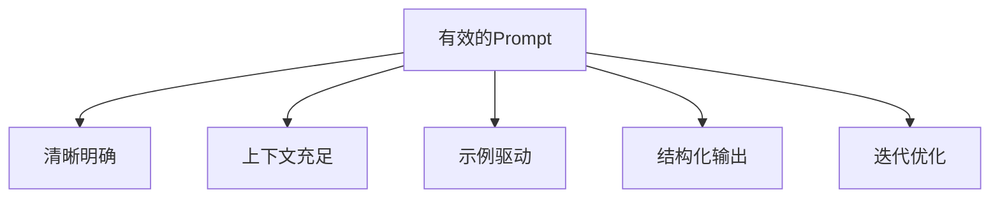
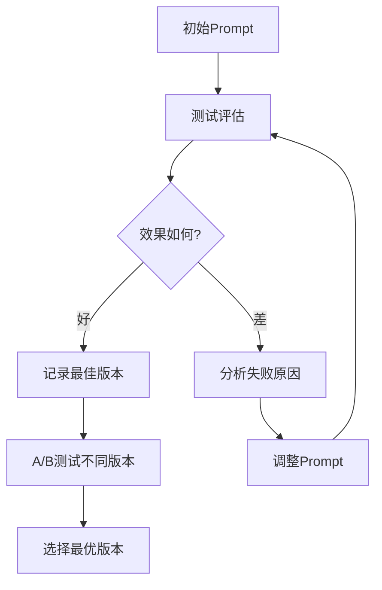

# Prompt Engineering技巧与最佳实践

随着ChatGPT等大模型的普及，Prompt Engineering成为2022年最热门的AI技能。如何编写有效的提示词来引导大模型产生高质量输出，已成为一门重要的工程学科。

## 1. Prompt Engineering的核心原则

### 1.1 基本原则



### 1.2 Prompt构成要素

一个完整的Prompt通常包含以下部分：

```
[角色设定] + [背景上下文] + [任务描述] + [输出格式] + [约束条件] + [示例]
```

```python
# 使用OpenAI API的Prompt工程示例
import openai

def structured_prompt(role, context, task, format_spec, constraints, examples=None):
    """构建结构化Prompt"""
    messages = []
    
    # 1. 角色设定
    system_msg = f"你是一个{role}。"
    messages.append({"role": "system", "content": system_msg})
    
    # 2. 构建用户消息
    user_parts = []
    user_parts.append(f"背景信息：{context}")
    user_parts.append(f"任务：{task}")
    user_parts.append(f"输出格式：{format_spec}")
    user_parts.append(f"约束条件：{constraints}")
    
    if examples:
        user_parts.append(f"参考示例：\n{examples}")
    
    messages.append({"role": "user", "content": "\n\n".join(user_parts)})
    return messages

# 示例：代码审查Prompt
messages = structured_prompt(
    role="高级Python开发工程师和代码审查专家",
    context="这是一个数据处理服务的核心模块，需要高可靠性和性能",
    task="审查以下代码，找出潜在的bug、性能问题和安全漏洞",
    format_spec="按严重程度分类：🔴严重 🟡中等 🟢建议，每项包含：问题描述、代码位置、修复建议",
    constraints="1. 重点关注并发安全问题\n2. 检查是否有资源泄漏\n3. 注意异常处理的完整性",
    examples="输入: def add(a,b): return a+b\n输出: 🟢建议: 缺少类型注解和输入验证"
)

response = openai.ChatCompletion.create(
    model="gpt-3.5-turbo",
    messages=messages,
    temperature=0.3  # 代码审查用低温度
)
```

## 2. 核心技巧详解

### 2.1 少样本学习（Few-Shot）

```python
def few_shot_prompt(task_description, examples, query):
    """少样本学习Prompt"""
    prompt = f"{task_description}\n\n"
    
    for example in examples:
        prompt += f"输入: {example['input']}\n"
        prompt += f"输出: {example['output']}\n\n"
    
    prompt += f"输入: {query}\n输出:"
    return prompt

# 情感分析Few-Shot示例
sentiment_examples = [
    {"input": "这个产品太棒了，强烈推荐！", "output": "正面"},
    {"input": "质量一般，不太满意", "output": "中性"},
    {"input": "完全不能用，浪费钱", "output": "负面"},
    {"input": "物流很快，但包装有破损", "output": "混合"},
]

result = few_shot_prompt(
    task_description="请判断以下评论的情感倾向：",
    examples=sentiment_examples,
    query="服务态度很好，下次还会光顾"
)
```

### 2.2 Chain-of-Thought（思维链）

```python
def cot_prompt(question):
    """思维链Prompt - 引导模型逐步推理"""
    return f"""请一步步思考以下问题，展示完整的推理过程：

问题：{question}

请按以下格式回答：
1. 理解问题：提取关键信息
2. 分析思路：列出解题步骤
3. 逐步推理：每步给出详细计算
4. 最终答案：简洁明确的结论

示例：
问题：一个商店打8折后价格是160元，原价是多少？

1. 理解问题：已知折扣后价格=160元，折扣率=80%
2. 分析思路：原价 × 折扣率 = 折后价，因此原价 = 折后价 / 折扣率
3. 逐步推理：原价 = 160 / 0.8 = 200元
4. 最终答案：原价是200元"""

# 数学推理
math_prompt = cot_prompt(
    "小明有5个苹果，给了小红2个，又从商店买了3个，最后吃掉了1个。小明现在有几个苹果？"
)
```

### 2.3 Self-Consistency（自一致性）

```python
import re
from collections import Counter

def self_consistency_query(question, n_samples=5):
    """
    自一致性方法：多次采样取多数投票
    适用于需要精确答案的推理任务
    """
    prompt = f"""请一步步思考以下问题，在最后用####标出最终答案。

问题：{question}"""
    
    answers = []
    for _ in range(n_samples):
        response = openai.ChatCompletion.create(
            model="gpt-3.5-turbo",
            messages=[{"role": "user", "content": prompt}],
            temperature=0.7,  # 较高温度增加多样性
            max_tokens=500
        )
        
        text = response.choices[0].message.content
        # 提取####后的答案
        match = re.search(r'####\s*(.+)', text)
        if match:
            answers.append(match.group(1).strip())
    
    # 多数投票
    counter = Counter(answers)
    best_answer = counter.most_common(1)[0]
    
    print(f"各次采样答案: {answers}")
    print(f"投票结果: {best_answer[0]} (出现{best_answer[1]}次)")
    return best_answer[0]
```

## 3. 高级技巧

### 3.1 ReAct框架

```python
def react_prompt(question, tools):
    """ReAct: 推理+行动框架"""
    tool_descriptions = "\n".join(
        [f"- {t['name']}: {t['description']}" for t in tools]
    )
    
    return f"""你是一个能够使用工具的智能助手。

可用工具：
{tool_descriptions}

请按以下格式回答问题：

思考：分析当前需要什么信息
行动：使用工具获取信息（格式：工具名[参数]）
观察：工具返回的结果
...（重复思考-行动-观察直到得出答案）
回答：最终答案

问题：{question}"""

# 使用示例
tools = [
    {"name": "Search", "description": "搜索互联网获取信息"},
    {"name": "Calculator", "description": "进行数学计算"},
    {"name": "Weather", "description": "查询天气信息"},
]

react_query = react_prompt(
    "北京今天天气如何？如果下雨，室内活动推荐什么？",
    tools
)
```

### 3.2 结构化输出

```python
def structured_output_prompt(data, schema):
    """确保LLM输出结构化数据"""
    return f"""请根据以下数据，按指定JSON Schema生成结果。

数据：
{data}

输出Schema：
{schema}

要求：
1. 严格按照Schema格式输出
2. 所有字段都必须填写
3. 只输出JSON，不要其他内容
4. 确保JSON格式正确可解析

示例输出：
{{"name": "张三", "age": 25, "skills": ["Python", "ML"]}}"""

# 实际使用
import json

resume_text = """
张三，男，28岁
5年Python开发经验，3年机器学习经验
精通PyTorch、TensorFlow
参与过3个大型推荐系统项目
"""

schema = {
    "type": "object",
    "properties": {
        "name": {"type": "string"},
        "age": {"type": "integer"},
        "skills": {"type": "array", "items": {"type": "string"}},
        "experience_years": {"type": "integer"},
        "projects": {"type": "integer"}
    }
}

response = openai.ChatCompletion.create(
    model="gpt-3.5-turbo",
    messages=[{
        "role": "user", 
        "content": structured_output_prompt(resume_text, json.dumps(schema))
    }],
    temperature=0
)

result = json.loads(response.choices[0].message.content)
```

## 4. Prompt模板管理

```python
class PromptTemplate:
    """可复用的Prompt模板管理"""
    
    def __init__(self):
        self.templates = {}
    
    def register(self, name, template, variables):
        """注册模板"""
        self.templates[name] = {
            "template": template,
            "variables": variables
        }
    
    def render(self, name, **kwargs):
        """渲染模板"""
        template = self.templates[name]
        
        missing = set(template["variables"]) - set(kwargs.keys())
        if missing:
            raise ValueError(f"缺少变量: {missing}")
        
        return template["template"].format(**kwargs)

# 注册常用模板
pm = PromptTemplate()

pm.register(
    name="code_explain",
    template="""请解释以下{language}代码的功能：

```{language}
{code}
```

要求：
1. 先概述整体功能
2. 然后逐段解释关键逻辑
3. 最后说明输入输出格式
4. 指出潜在的改进点""",
    variables=["language", "code"]
)

pm.register(
    name="bug_fix",
    template="""以下{language}代码存在bug：

```{language}
{code}
```

错误信息：{error_msg}

请：
1. 分析bug原因
2. 提供修复方案
3. 解释为什么修复有效
4. 建议如何避免类似问题""",
    variables=["language", "code", "error_msg"]
)

# 使用模板
prompt = pm.render(
    "code_explain",
    language="Python",
    code="def quicksort(arr): return arr if len(arr)<=1 else quicksort([x for x in arr[1:] if x<=arr[0]]) + [arr[0]] + quicksort([x for x in arr[1:] if x>arr[0]])"
)
```

## 5. Prompt优化策略



### 优化检查清单

| 维度 | 检查项 | 优化方向 |
|------|--------|----------|
| 清晰度 | 是否有歧义 | 更精确的措辞 |
| 上下文 | 背景是否充分 | 补充领域知识 |
| 示例 | Few-shot是否有效 | 增加多样性示例 |
| 格式 | 输出是否一致 | 明确格式要求 |
| 约束 | 是否有违规输出 | 添加负面约束 |
| 温度 | 创造性vs准确性 | 调整temperature |

## 总结

Prompt Engineering是大模型时代的关键技能。通过掌握Few-Shot、CoT、ReAct等技巧，并建立模板管理和迭代优化流程，可以显著提升大模型的输出质量。这不是临时技巧，而是一门需要持续学习和实践的工程学科。
