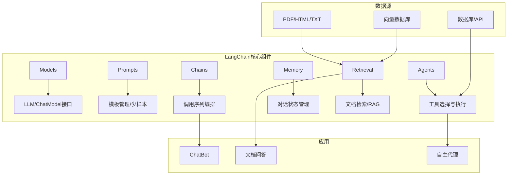
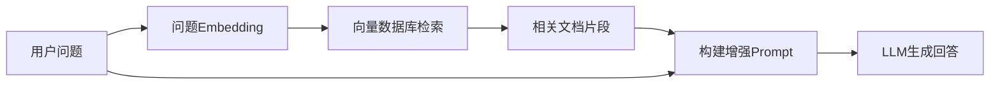

# LangChain大模型应用开发框架

LangChain是2022年最受关注的LLM应用开发框架，它提供了一套标准化接口来构建基于大语言模型的复杂应用，从简单的问答系统到具备工具使用能力的自主代理。

## 1. LangChain架构概览



## 2. 核心模块使用

### 2.1 Models - 模型接口

```python
from langchain.llms import OpenAI
from langchain.chat_models import ChatOpenAI
from langchain.schema import HumanMessage, SystemMessage, AIMessage

# 文本补全模型
llm = OpenAI(model_name="text-davinci-003", temperature=0.7)
result = llm("什么是机器学习？用一句话概括。")

# 聊天模型（推荐）
chat = ChatOpenAI(model="gpt-3.5-turbo", temperature=0.7)
messages = [
    SystemMessage(content="你是一个AI技术专家"),
    HumanMessage(content="解释Transformer的self-attention机制"),
]
response = chat(messages)
print(response.content)
```

### 2.2 Prompts - 提示词管理

```python
from langchain.prompts import (
    PromptTemplate, 
    ChatPromptTemplate,
    FewShotPromptTemplate
)

# 基础模板
template = PromptTemplate.from_template(
    "请为{product}写一段{style}风格的推广文案，字数在{word_count}字以内。"
)
prompt = template.format(
    product="AI编程助手", 
    style="科技感", 
    word_count=200
)

# 聊天模板
chat_template = ChatPromptTemplate.from_messages([
    ("system", "你是一个{role}，擅长{expertise}"),
    ("human", "{question}"),
])

# Few-Shot模板
examples = [
    {"input": "开心", "output": "😊 快乐的情绪，通常伴随着微笑和愉悦感"},
    {"input": "悲伤", "output": "😢 低落的情绪，通常伴随着失落和沮丧感"},
]

few_shot_prompt = FewShotPromptTemplate(
    prefix="分析以下情感词的含义和特征：",
    examples=examples,
    example_prompt=PromptTemplate(
        input_variables=["input", "output"],
        template="词: {input}\n分析: {output}"
    ),
    suffix="词: {word}\n分析:",
    input_variables=["word"]
)
```

### 2.3 Chains - 调用链

```python
from langchain.chains import LLMChain, SimpleSequentialChain, RetrievalQA

# 基础链
chain = LLMChain(
    llm=chat,
    prompt=chat_template,
    verbose=True  # 打印中间过程
)

# 顺序链：多个步骤串联
title_chain = LLMChain(
    llm=chat,
    prompt=PromptTemplate.from_template("为以下主题生成文章标题：{topic}")
)

outline_chain = LLMChain(
    llm=chat,
    prompt=PromptTemplate.from_template("根据标题生成文章大纲：{title}")
)

content_chain = LLMChain(
    llm=chat,
    prompt=PromptTemplate.from_template("根据大纲写一篇800字的文章：{outline}")
)

# 串联执行
overall_chain = SimpleSequentialChain(
    chains=[title_chain, outline_chain, content_chain],
    verbose=True
)

article = overall_chain.run("2022年AI技术发展趋势")
```

### 2.4 Memory - 记忆管理

```python
from langchain.memory import (
    ConversationBufferMemory,
    ConversationBufferWindowMemory,
    ConversationSummaryMemory
)
from langchain.chains import ConversationChain

# 方式1：完整对话历史
memory_full = ConversationBufferMemory()

# 方式2：滑动窗口（只保留最近K轮）
memory_window = ConversationBufferWindowMemory(k=5)

# 方式3：摘要记忆（压缩历史对话）
memory_summary = ConversationSummaryMemory(llm=chat)

# 使用记忆的对话链
conversation = ConversationChain(
    llm=chat,
    memory=memory_window,
    verbose=True
)

# 多轮对话
conversation.predict(input="你好，我叫小明")
conversation.predict(input="我最近在学习Python")
conversation.predict(input="我刚才说我叫什么名字？")  # 能记住"小明"
```

## 3. RAG - 检索增强生成

RAG是LangChain最核心的应用模式，将外部知识库与LLM结合：



### 3.1 文档加载与切分

```python
from langchain.document_loaders import (
    PyPDFLoader, 
    TextLoader, 
    UnstructuredHTMLLoader,
    DirectoryLoader
)
from langchain.text_splitter import (
    RecursiveCharacterTextSplitter,
    TokenTextSplitter
)

# 加载PDF
pdf_loader = PyPDFLoader("ai_technology_report.pdf")
pdf_docs = pdf_loader.load()

# 批量加载目录
dir_loader = DirectoryLoader(
    "./documents",
    glob="**/*.pdf",
    loader_cls=PyPDFLoader
)
all_docs = dir_loader.load()

# 文本切分
text_splitter = RecursiveCharacterTextSplitter(
    chunk_size=1000,       # 每块最大1000字符
    chunk_overlap=200,     # 块之间重叠200字符
    separators=["\n\n", "\n", "。", "！", "？", " ", ""]
)

splits = text_splitter.split_documents(all_docs)
print(f"原始文档: {len(all_docs)}个, 切分后: {len(splits)}个块")
```

### 3.2 向量化与存储

```python
from langchain.embeddings import OpenAIEmbeddings
from langchain.vectorstores import Chroma, FAISS

# 创建Embedding
embeddings = OpenAIEmbeddings()

# 使用Chroma向量数据库
vectorstore = Chroma.from_documents(
    documents=splits,
    embedding=embeddings,
    persist_directory="./chroma_db"
)

# 或使用FAISS（纯内存，速度快）
vectorstore = FAISS.from_documents(splits, embeddings)

# 保存和加载
vectorstore.save_local("./faiss_index")
loaded_vs = FAISS.load_local("./faiss_index", embeddings)

# 相似性检索
results = vectorstore.similarity_search(
    "什么是Transformer模型？",
    k=5  # 返回最相关的5个片段
)

for doc in results:
    print(f"来源: {doc.metadata['source']}")
    print(f"内容: {doc.page_content[:200]}...")
    print("---")
```

### 3.3 完整RAG问答系统

```python
from langchain.chains import RetrievalQA
from langchain.prompts import PromptTemplate

# 自定义QA提示模板
qa_template = """请基于以下参考资料回答问题。如果参考资料中没有相关信息，
请回答"根据已有资料无法回答此问题"。

参考资料：
{context}

问题：{question}

回答："""

qa_prompt = PromptTemplate(
    template=qa_template,
    input_variables=["context", "question"]
)

# 构建RAG链
qa_chain = RetrievalQA.from_chain_type(
    llm=chat,
    chain_type="stuff",  # stuff/map_reduce/refine
    retriever=vectorstore.as_retriever(
        search_type="mmr",        # 最大边际相关性
        search_kwargs={"k": 5}
    ),
    return_source_documents=True,
    chain_type_kwargs={"prompt": qa_prompt}
)

# 提问
result = qa_chain({"query": "RLHF训练分为哪几个阶段？"})
print(f"回答: {result['result']}")
print(f"\n来源文档:")
for doc in result['source_documents']:
    print(f"  - {doc.metadata['source']}")
```

## 4. Agent - 智能代理

```python
from langchain.agents import (
    AgentExecutor, 
    create_react_agent,
    Tool
)
from langchain import SerpAPIWrapper, WikipediaAPIWrapper

# 定义工具
tools = [
    Tool(
        name="Search",
        func=SerpAPIWrapper().run,
        description="用于搜索互联网上的最新信息，输入应该是搜索查询"
    ),
    Tool(
        name="Calculator",
        func=lambda x: eval(x),
        description="用于数学计算，输入应该是数学表达式"
    ),
    Tool(
        name="Wikipedia",
        func=WikipediaAPIWrapper().run,
        description="用于查询百科知识，输入应该是查询关键词"
    ),
]

# 创建ReAct Agent
agent = create_react_agent(
    llm=chat,
    tools=tools,
    prompt=None  # 使用默认ReAct提示
)

agent_executor = AgentExecutor(
    agent=agent,
    tools=tools,
    verbose=True,
    max_iterations=10,
    handle_parsing_errors=True
)

# 执行任务
result = agent_executor.run(
    "2022年诺贝尔物理学奖获得者是谁？他们的主要贡献是什么？"
)
```

## 5. 完整应用：文档问答ChatBot

```python
from langchain.chains import ConversationalRetrievalChain

def build_doc_chatbot(docs_dir, model_name="gpt-3.5-turbo"):
    """构建完整的文档问答ChatBot"""
    
    # 1. 加载文档
    loader = DirectoryLoader(docs_dir, glob="**/*.pdf", loader_cls=PyPDFLoader)
    docs = loader.load()
    
    # 2. 切分
    splitter = RecursiveCharacterTextSplitter(chunk_size=1000, chunk_overlap=200)
    splits = splitter.split_documents(docs)
    
    # 3. 向量化
    embeddings = OpenAIEmbeddings()
    vectorstore = FAISS.from_documents(splits, embeddings)
    
    # 4. 构建对话检索链
    chat = ChatOpenAI(model=model_name, temperature=0)
    
    qa_chain = ConversationalRetrievalChain.from_llm(
        llm=chat,
        retriever=vectorstore.as_retriever(search_kwargs={"k": 4}),
        return_source_documents=True,
        memory=ConversationBufferMemory(
            memory_key="chat_history",
            return_messages=True
        )
    )
    
    return qa_chain

# 运行
chatbot = build_doc_chatbot("./my_documents")

# 对话
chat_history = []
while True:
    question = input("你: ")
    if question.lower() in ["退出", "quit", "exit"]:
        break
    
    result = chatbot({"question": question, "chat_history": chat_history})
    print(f"AI: {result['answer']}")
    
    chat_history.append((question, result['answer']))
```

## 总结

LangChain为LLM应用开发提供了标准化框架，其核心组件（Models、Prompts、Chains、Agents、Memory、Retrieval）覆盖了从简单调用到复杂代理的全场景需求。RAG模式解决了LLM知识时效性问题，Agent模式赋予了LLM工具使用能力，这两者是构建LLM应用的基石。
