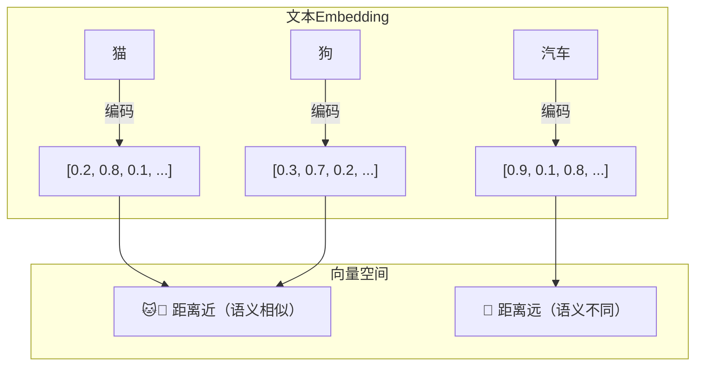
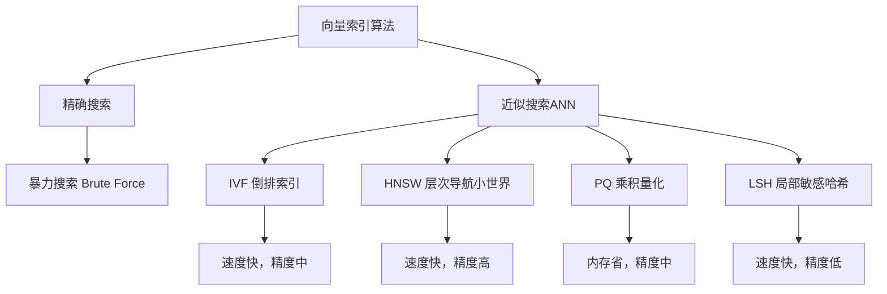

# 向量数据库与Embedding技术详解

在大模型时代，向量数据库成为AI基础设施的关键组件。无论是RAG检索增强生成、语义搜索还是推荐系统，都离不开高效的向量存储与检索能力。

## 1. Embedding向量化技术

### 1.1 什么是Embedding

Embedding将非结构化数据（文本、图像等）映射到高维向量空间，使语义相似的数据在向量空间中距离更近：



### 1.2 文本Embedding模型

```python
from sentence_transformers import SentenceTransformer
import numpy as np

# 加载预训练Embedding模型
model = SentenceTransformer('all-MiniLM-L6-v2')  # 384维，速度快
# model = SentenceTransformer('all-mpnet-base-v2')  # 768维，效果更好

# 文本向量化
texts = [
    "大语言模型是2022年最热门的AI技术",
    "ChatGPT引发了人工智能的新一轮浪潮",
    "今天天气真好，适合出去散步",
    "LLM的应用场景越来越广泛",
]

embeddings = model.encode(texts)
print(f"向量维度: {embeddings.shape}")  # (4, 384)

# 计算余弦相似度
def cosine_similarity(a, b):
    return np.dot(a, b) / (np.linalg.norm(a) * np.linalg.norm(b))

for i in range(len(texts)):
    for j in range(i+1, len(texts)):
        sim = cosine_similarity(embeddings[i], embeddings[j])
        print(f"'{texts[i][:15]}...' ↔ '{texts[j][:15]}...': {sim:.3f}")

# 输出示例：
# '大语言模型是2022...' ↔ 'ChatGPT引发了...': 0.672
# '大语言模型是2022...' ↔ '今天天气真好...': 0.089
# 'ChatGPT引发了...' ↔ 'LLM的应用场景...': 0.715
```

### 1.3 OpenAI Embedding API

```python
import openai

def get_embeddings(texts, model="text-embedding-ada-002"):
    """使用OpenAI Embedding API"""
    response = openai.Embedding.create(
        input=texts,
        model=model
    )
    embeddings = [item["embedding"] for item in response["data"]]
    return embeddings

def get_embedding(text, model="text-embedding-ada-002"):
    """单条文本Embedding"""
    response = openai.Embedding.create(input=text, model=model)
    return response["data"][0]["embedding"]

# 批量向量化
docs = [
    "Transformer架构是现代NLP的基础",
    "BERT通过双向编码理解上下文",
    "GPT系列采用自回归生成方式",
]

vectors = get_embeddings(docs)
print(f"向量维度: {len(vectors[0])}")  # 1536
```

## 2. 向量数据库对比

### 2.1 主流向量数据库

| 数据库 | 类型 | 特点 | 适用场景 |
|--------|------|------|----------|
| Pinecone | 云服务 | 全托管，零运维 | 快速上线 |
| Milvus | 开源 | 高性能，分布式 | 大规模生产 |
| Weaviate | 开源 | 内置向量化和GraphQL | 语义搜索 |
| Chroma | 开源 | 轻量级，Python友好 | 原型开发 |
| Qdrant | 开源 | Rust编写，高效 | 高性能需求 |
| FAISS | 库 | Meta开源，纯计算 | 纯内存检索 |

### 2.2 索引算法



## 3. Pinecone实战

```python
import pinecone

# 初始化
pinecone.init(api_key="your-api-key", environment="us-west1-gcp")

# 创建索引
pinecone.create_index(
    name="ai-knowledge",
    dimension=1536,      # OpenAI ada-002维度
    metric="cosine",     # 距离度量
    pods=1,              # Pod数量
    pod_type="p1.x1"     # Pod类型
)

index = pinecone.Index("ai-knowledge")

# 插入向量
def upsert_documents(docs, batch_size=100):
    """批量插入文档向量"""
    for i in range(0, len(docs), batch_size):
        batch = docs[i:i+batch_size]
        
        # 生成Embedding
        texts = [d["text"] for d in batch]
        embeddings = get_embeddings(texts)
        
        # 构建向量数据
        vectors = []
        for doc, emb in zip(batch, embeddings):
            vectors.append({
                "id": doc["id"],
                "values": emb,
                "metadata": {        # 元数据用于过滤
                    "source": doc["source"],
                    "category": doc["category"],
                    "timestamp": doc["timestamp"]
                }
            })
        
        # 批量upsert
        index.upsert(vectors=vectors)
        print(f"已插入 {i + len(batch)}/{len(docs)} 条数据")

# 查询
def search(query, top_k=5, filter_dict=None):
    """语义搜索"""
    query_embedding = get_embedding(query)
    
    results = index.query(
        vector=query_embedding,
        top_k=top_k,
        include_metadata=True,
        filter=filter_dict  # 元数据过滤
    )
    
    for match in results["matches"]:
        print(f"ID: {match['id']}")
        print(f"相似度: {match['score']:.4f}")
        print(f"元数据: {match['metadata']}")
        print("---")
    
    return results

# 带过滤的搜索
results = search(
    query="如何训练大语言模型",
    top_k=5,
    filter_dict={"category": {"$eq": "NLP"}}
)
```

## 4. Milvus实战

```python
from pymilvus import (
    connections, FieldSchema, CollectionSchema, 
    DataType, Collection, utility
)

# 连接Milvus
connections.connect(host="localhost", port="19530")

# 定义Schema
fields = [
    FieldSchema(name="id", dtype=DataType.INT64, is_primary=True, auto_id=True),
    FieldSchema(name="embedding", dtype=DataType.FLOAT_VECTOR, dim=768),
    FieldSchema(name="text", dtype=DataType.VARCHAR, max_length=65535),
    FieldSchema(name="source", dtype=DataType.VARCHAR, max_length=256),
]

schema = CollectionSchema(fields=fields, description="AI知识库")
collection = Collection(name="ai_knowledge", schema=schema)

# 创建IVF_FLAT索引
index_params = {
    "metric_type": "COSINE",
    "index_type": "IVF_FLAT",
    "params": {"nlist": 1024}  # 聚类数量
}
collection.create_index(field_name="embedding", index_params=index_params)

# 插入数据
def insert_data(texts, sources, model_name='all-mpnet-base-v2'):
    """插入文档数据"""
    encoder = SentenceTransformer(model_name)
    embeddings = encoder.encode(texts).tolist()
    
    entities = [
        embeddings,
        texts,
        sources
    ]
    
    collection.insert(entities)
    collection.flush()
    print(f"已插入 {len(texts)} 条数据")

# 搜索
def milvus_search(query_text, top_k=10):
    """在Milvus中搜索"""
    encoder = SentenceTransformer('all-mpnet-base-v2')
    query_vector = encoder.encode([query_text]).tolist()
    
    collection.load()
    
    search_params = {"metric_type": "COSINE", "params": {"nprobe": 16}}
    results = collection.search(
        data=query_vector,
        anns_field="embedding",
        param=search_params,
        limit=top_k,
        output_fields=["text", "source"]
    )
    
    for hits in results:
        for hit in hits:
            print(f"相似度: {hit.distance:.4f}")
            print(f"来源: {hit.entity.get('source')}")
            print(f"文本: {hit.entity.get('text')[:100]}...")
            print("---")

# HNSW索引（更高的召回率）
hnsw_params = {
    "metric_type": "COSINE",
    "index_type": "HNSW",
    "params": {"M": 16, "efConstruction": 256}
}
collection.create_index(field_name="embedding", index_params=hnsw_params)
```

## 5. Docker部署Milvus

```yaml
# docker-compose.yml
version: '3.5'

services:
  etcd:
    container_name: milvus-etcd
    image: quay.io/coreos/etcd:v3.5.5
    environment:
      - ETCD_AUTO_COMPACTION_MODE=revision
      - ETCD_AUTO_COMPACTION_RETENTION=1000
      - ETCD_QUOTA_BACKEND_BYTES=4294967296
    volumes:
      - etcd_data:/etcd

  minio:
    container_name: milvus-minio
    image: minio/minio:RELEASE.2022-03-17T06-34-49Z
    environment:
      MINIO_ACCESS_KEY: minioadmin
      MINIO_SECRET_KEY: minioadmin
    volumes:
      - minio_data:/minio/data
    command: minio server /minio/data
    healthcheck:
      test: ["CMD", "curl", "-f", "http://localhost:9000/minio/health/live"]
      interval: 30s
      timeout: 20s
      retries: 3

  standalone:
    container_name: milvus-standalone
    image: milvusdb/milvus:v2.2.8
    command: ["milvus", "run", "standalone"]
    environment:
      ETCD_ENDPOINTS: etcd:2379
      MINIO_ADDRESS: minio:9000
    volumes:
      - milvus_data:/var/lib/milvus
    ports:
      - "19530:19530"
      - "9091:9091"
    depends_on:
      - etcd
      - minio

volumes:
  etcd_data:
  minio_data:
  milvus_data:
```

```bash
# 启动Milvus
docker-compose up -d

# 验证
docker ps | grep milvus
curl http://localhost:9091/healthz
```

## 6. 性能优化建议

```python
# 1. 批量操作减少网络开销
def batch_upsert(index, documents, batch_size=500):
    for i in range(0, len(documents), batch_size):
        batch = documents[i:i+batch_size]
        index.upsert(vectors=batch)

# 2. 选择合适的索引类型
INDEX_SELECTION = {
    "小规模(<100万)": {"type": "FLAT", "reason": "数据量小，暴力搜索即可"},
    "中规模(100万-1000万)": {"type": "IVF_FLAT", "params": {"nlist": 1024}},
    "大规模(>1000万)": {"type": "IVF_PQ", "params": {"nlist": 4096, "m": 32}},
    "高召回率需求": {"type": "HNSW", "params": {"M": 32, "efConstruction": 512}},
}

# 3. 查询时调优
def optimized_search(index, query_vector, top_k=10):
    # HNSW搜索调优
    results = index.search(
        data=[query_vector],
        anns_field="embedding",
        param={"metric_type": "COSINE", "params": {"ef": 128}},  # ef越大越精确
        limit=top_k
    )
    return results
```

## 总结

向量数据库是LLM应用的核心基础设施。Embedding技术将语义信息编码为向量，向量数据库提供高效的存储和检索能力。Pinecone适合快速上线，Milvus适合大规模生产部署。选择合适的索引算法和参数调优，对于RAG应用的性能至关重要。
