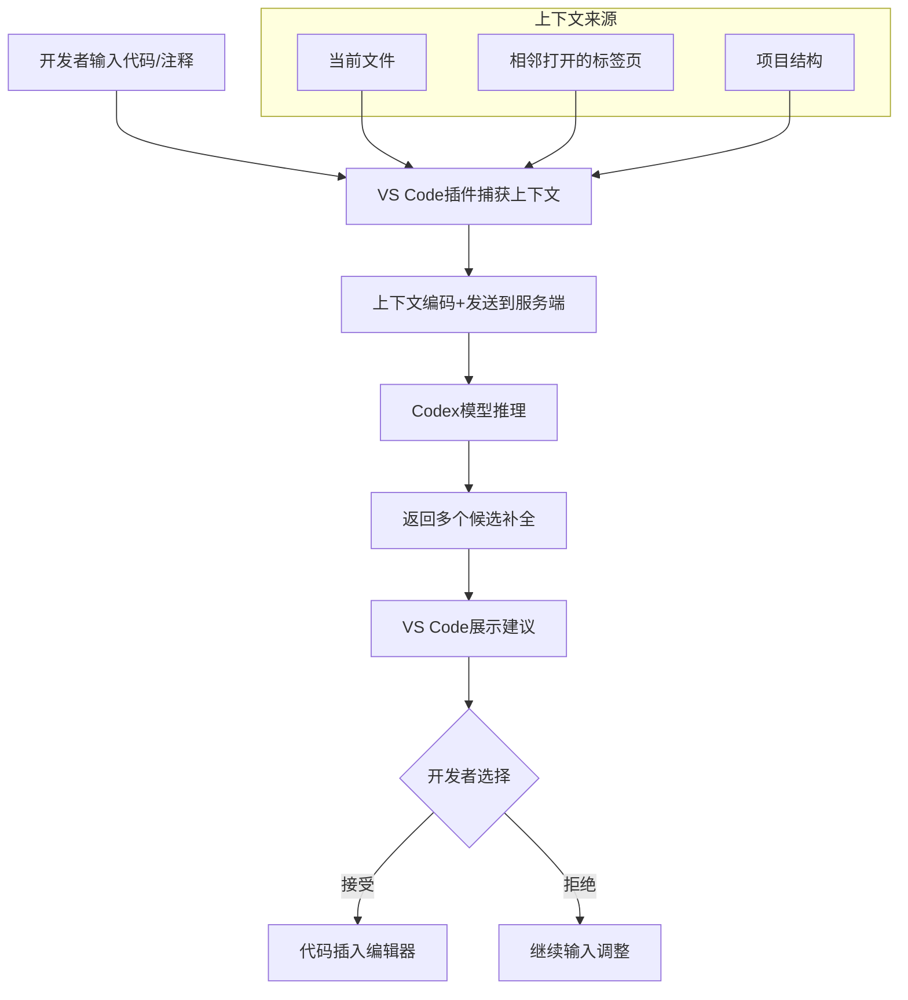
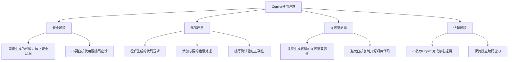

# AI编程助手Copilot深度使用指南

GitHub Copilot在2022年成为开发者最关注的AI工具之一。它不仅能够自动补全代码，还能根据自然语言注释生成完整函数，极大提升了开发效率。

## 1. Copilot工作原理

### 1.1 技术架构



### 1.2 Codex模型

Copilot基于OpenAI Codex模型，它是GPT-3在代码数据上的微调版本：

```python
# Copilot的底层API调用
import openai

def codex_complete(prompt, language="python", max_tokens=500):
    """模拟Copilot的代码补全"""
    response = openai.Completion.create(
        model="code-davinci-002",
        prompt=f"# Language: {language}\n{prompt}",
        max_tokens=max_tokens,
        temperature=0.2,     # 代码生成用低温度
        top_p=1.0,
        frequency_penalty=0.0,
        presence_penalty=0.0,
        stop=["#", "```"]
    )
    return response.choices[0].text
```

## 2. 高效使用技巧

### 2.1 注释驱动开发

通过清晰的注释引导Copilot生成高质量代码：

```python
# 好的注释示例 - Copilot能生成准确代码

# 读取CSV文件，按日期排序，计算每7天的移动平均值
# 使用pandas库，处理缺失值用前向填充
# 返回包含日期和移动平均值的新DataFrame

# Copilot自动生成：
import pandas as pd

def read_and_calculate_moving_avg(filepath, window=7):
    """读取CSV文件并计算移动平均值"""
    df = pd.read_csv(filepath)
    df['date'] = pd.to_datetime(df['date'])
    df = df.sort_values('date')
    df = df.fillna(method='ffill')
    df['moving_avg'] = df['value'].rolling(window=window).mean()
    return df[['date', 'moving_avg']]
```

```python
# 差的注释示例 - Copilot可能生成不准确的代码

# 处理数据

# Copilot可能生成：
def process_data(data):
    # 处理数据
    result = data
    return result
```

### 2.2 上下文管理

Copilot的质量高度依赖上下文，以下技巧可以提升生成质量：

```python
# 技巧1：在文件顶部导入所需库
import numpy as np
import pandas as pd
from sklearn.model_selection import train_test_split
from sklearn.ensemble import RandomForestClassifier

# 技巧2：定义数据类/类型，提供结构信息
from dataclasses import dataclass
from typing import List, Optional

@dataclass
class Customer:
    id: int
    name: str
    email: str
    purchase_history: List[float]
    is_active: bool

# 技巧3：在函数签名中提供类型注解
def calculate_customer_lifetime_value(
    customer: Customer,
    discount_rate: float = 0.1,
    months: int = 12
) -> float:
    """计算客户生命周期价值"""
    # Copilot现在知道输入类型，生成更准确
    ...
```

### 2.3 逐步构建复杂功能

```python
# 第一步：让Copilot生成基础框架
# 创建一个异步HTTP客户端，支持重试和超时

import aiohttp
import asyncio
from typing import Optional, Dict, Any

class AsyncHTTPClient:
    def __init__(self, base_url: str, timeout: int = 30, 
                 max_retries: int = 3):
        self.base_url = base_url.rstrip('/')
        self.timeout = aiohttp.ClientTimeout(total=timeout)
        self.max_retries = max_retries
        self.session: Optional[aiohttp.ClientSession] = None

# 第二步：让Copilot逐个方法生成
# 实现async context manager协议 __aenter__ 和 __aexit__

    async def __aenter__(self):
        self.session = aiohttp.ClientSession(timeout=self.timeout)
        return self
    
    async def __aexit__(self, exc_type, exc_val, exc_tb):
        if self.session:
            await self.session.close()

# 第三步：让Copilot实现带重试的GET方法
    
    async def get(self, path: str, params: Optional[Dict] = None) -> Any:
        url = f"{self.base_url}/{path.lstrip('/')}"
        for attempt in range(self.max_retries):
            try:
                async with self.session.get(url, params=params) as resp:
                    resp.raise_for_status()
                    return await resp.json()
            except (aiohttp.ClientError, asyncio.TimeoutError) as e:
                if attempt == self.max_retries - 1:
                    raise
                wait_time = 2 ** attempt
                await asyncio.sleep(wait_time)
```

## 3. 常见使用场景

### 3.1 算法实现

```python
# 实现LRU缓存，支持O(1)的get和put操作
# 使用OrderedDict实现

from collections import OrderedDict

class LRUCache:
    def __init__(self, capacity: int):
        self.cache = OrderedDict()
        self.capacity = capacity
    
    def get(self, key: int) -> int:
        if key not in self.cache:
            return -1
        self.cache.move_to_end(key)
        return self.cache[key]
    
    def put(self, key: int, value: int) -> None:
        if key in self.cache:
            self.cache.move_to_end(key)
        self.cache[key] = value
        if len(self.cache) > self.capacity:
            self.cache.popitem(last=False)
```

### 3.2 测试生成

```python
# 为以下函数生成pytest单元测试，包含正常情况和边界情况

def divide_numbers(a: float, b: float) -> float:
    """除法运算，除数为0时抛出ValueError"""
    if b == 0:
        raise ValueError("除数不能为零")
    return a / b

# Copilot生成的测试：
import pytest

def test_divide_normal():
    assert divide_numbers(10, 2) == 5.0
    assert divide_numbers(7, 2) == 3.5
    assert divide_numbers(-10, 2) == -5.0

def test_divide_by_zero():
    with pytest.raises(ValueError, match="除数不能为零"):
        divide_numbers(10, 0)

def test_divide_zero_numerator():
    assert divide_numbers(0, 5) == 0.0

def test_divide_negative():
    assert divide_numbers(-10, -2) == 5.0
    assert divide_numbers(10, -2) == -5.0
```

### 3.3 数据处理Pipeline

```python
# 创建一个数据预处理Pipeline，依次执行：
# 1. 去除重复行
# 2. 填充缺失值（数值用中位数，分类用众数）
# 3. 标准化数值列
# 4. 对分类列进行One-Hot编码
# 5. 删除相关性>0.95的特征

from sklearn.base import BaseEstimator, TransformerMixin
from sklearn.preprocessing import StandardScaler, OneHotEncoder
from sklearn.compose import ColumnTransformer
from sklearn.pipeline import Pipeline
from sklearn.impute import SimpleImputer
import pandas as pd
import numpy as np

class DataPreprocessingPipeline:
    def __init__(self, correlation_threshold=0.95):
        self.correlation_threshold = correlation_threshold
        self.pipeline = None
        self.numeric_cols = None
        self.categorical_cols = None
    
    def fit(self, df: pd.DataFrame):
        # 去重
        df = df.drop_duplicates()
        
        self.numeric_cols = df.select_dtypes(include=[np.number]).columns
        self.categorical_cols = df.select_dtypes(include=['object']).columns
        
        numeric_transformer = Pipeline([
            ('imputer', SimpleImputer(strategy='median')),
            ('scaler', StandardScaler())
        ])
        
        categorical_transformer = Pipeline([
            ('imputer', SimpleImputer(strategy='most_frequent')),
            ('encoder', OneHotEncoder(handle_unknown='ignore', sparse=False))
        ])
        
        self.pipeline = ColumnTransformer([
            ('num', numeric_transformer, self.numeric_cols),
            ('cat', categorical_transformer, self.categorical_cols)
        ])
        
        self.pipeline.fit(df)
        return self
    
    def transform(self, df: pd.DataFrame):
        df = df.drop_duplicates()
        result = self.pipeline.transform(df)
        # 删除高相关性特征
        corr_matrix = pd.DataFrame(result).corr().abs()
        upper = corr_matrix.where(np.triu(np.ones(corr_matrix.shape), k=1).astype(bool))
        to_drop = [col for col in upper.columns if any(upper[col] > self.correlation_threshold)]
        if to_drop:
            result = np.delete(result, to_drop, axis=1)
        return result
```

## 4. AI代码审查

### 4.1 使用Copilot进行代码审查

```python
# 审查以下代码的安全性和性能问题：

import sqlite3
import hashlib

def authenticate_user(username, password):
    conn = sqlite3.connect("users.db")
    cursor = conn.cursor()
    # 查询用户
    query = f"SELECT * FROM users WHERE username='{username}'"
    cursor.execute(query)
    user = cursor.fetchone()
    
    if user:
        stored_hash = user[2]
        input_hash = hashlib.md5(password.encode()).hexdigest()
        if stored_hash == input_hash:
            return True
    return False

# Copilot会指出：
# 1. SQL注入漏洞 - 使用参数化查询
# 2. MD5不安全 - 使用bcrypt/argon2
# 3. 时序攻击 - 使用constant-time比较
# 4. 资源泄漏 - 未关闭数据库连接

# 修复后的版本：
import sqlite3
import bcrypt
from contextlib import contextmanager

@contextmanager
def get_db_connection():
    conn = sqlite3.connect("users.db")
    try:
        yield conn
    finally:
        conn.close()

def authenticate_user_safe(username: str, password: str) -> bool:
    with get_db_connection() as conn:
        cursor = conn.cursor()
        cursor.execute(
            "SELECT password_hash FROM users WHERE username = ?",
            (username,)
        )
        user = cursor.fetchone()
        
        if user:
            stored_hash = user[0].encode('utf-8')
            return bcrypt.checkpw(password.encode('utf-8'), stored_hash)
        return False
```

## 5. 使用注意事项



### 最佳实践总结

| 场景 | 推荐用法 | 风险等级 |
|------|----------|----------|
| 模板代码 | 高度推荐 | 低 |
| 工具函数 | 推荐并审查 | 中 |
| 算法实现 | 仔细审查 | 中 |
| 安全相关 | 谨慎使用 | 高 |
| 核心业务 | 仅供参考 | 高 |

## 总结

GitHub Copilot是强大的AI编程助手，但它不能替代开发者的判断力。高效使用Copilot的关键在于：编写清晰的注释和类型注解来引导生成，逐步构建复杂功能，以及始终审查和测试生成的代码。AI编程助手是增强工具，不是替代工具。
