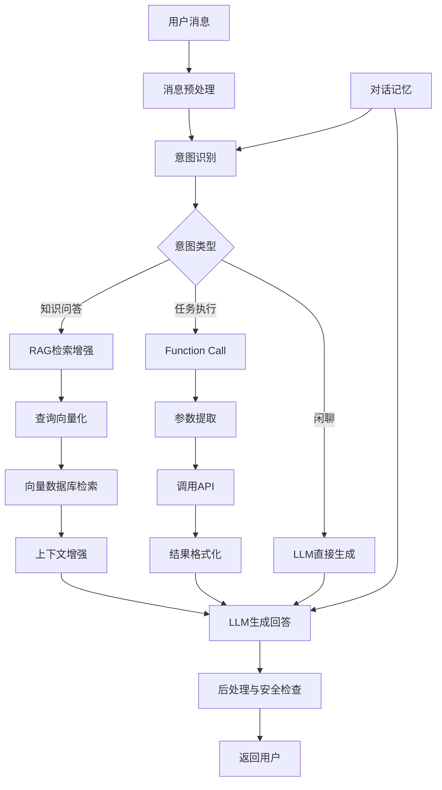

# ChatBot对话系统构建实战

2022年，基于大模型的ChatBot成为最热门的AI应用方向。从简单的FAQ机器人到具备知识检索能力的智能助手，本文将手把手教你构建一个完整的对话系统。

## 1. 对话系统架构



## 2. 基础对话管理

### 2.1 对话状态管理

```python
from dataclasses import dataclass, field
from typing import List, Dict, Optional
from datetime import datetime
import uuid

@dataclass
class Message:
    role: str  # user / assistant / system
    content: str
    timestamp: datetime = field(default_factory=datetime.now)
    metadata: Dict = field(default_factory=dict)

class ConversationManager:
    """对话状态管理器"""
    
    def __init__(self, max_history=20):
        self.conversations: Dict[str, List[Message]] = {}
        self.max_history = max_history
    
    def create_conversation(self, system_prompt=None) -> str:
        """创建新对话，返回对话ID"""
        conv_id = str(uuid.uuid4())
        self.conversations[conv_id] = []
        
        if system_prompt:
            self.conversations[conv_id].append(
                Message(role="system", content=system_prompt)
            )
        return conv_id
    
    def add_message(self, conv_id: str, role: str, content: str):
        """添加消息到对话历史"""
        if conv_id not in self.conversations:
            self.conversations[conv_id] = []
        
        self.conversations[conv_id].append(
            Message(role=role, content=content)
        )
        
        # 保持历史在限制内
        if len(self.conversations[conv_id]) > self.max_history:
            # 保留system消息和最近的对话
            msgs = self.conversations[conv_id]
            system_msgs = [m for m in msgs if m.role == "system"]
            other_msgs = [m for m in msgs if m.role != "system"]
            self.conversations[conv_id] = system_msgs + other_msgs[-self.max_history:]
    
    def get_messages(self, conv_id: str) -> List[Dict]:
        """获取对话历史（API格式）"""
        if conv_id not in self.conversations:
            return []
        return [
            {"role": m.role, "content": m.content} 
            for m in self.conversations[conv_id]
        ]
    
    def get_summary(self, conv_id: str) -> str:
        """生成对话摘要（用于长对话压缩）"""
        messages = self.conversations.get(conv_id, [])
        if len(messages) <= 10:
            return ""
        
        # 提取关键信息
        topics = set()
        for m in messages:
            if m.role == "user":
                topics.add(m.content[:50])
        
        return f"之前讨论过: {', '.join(list(topics)[:5])}"
```

### 2.2 基础聊天接口

```python
import openai

class ChatBot:
    """基础聊天机器人"""
    
    def __init__(self, model="gpt-3.5-turbo", system_prompt=None):
        self.model = model
        self.system_prompt = system_prompt or "你是一个友好且专业的AI助手。"
        self.conv_manager = ConversationManager()
    
    def chat(self, user_input: str, conv_id: str = None, 
             temperature=0.7, **kwargs) -> str:
        """对话主入口"""
        # 创建或获取对话
        if conv_id is None:
            conv_id = self.conv_manager.create_conversation(self.system_prompt)
        
        # 添加用户消息
        self.conv_manager.add_message(conv_id, "user", user_input)
        
        # 获取完整对话历史
        messages = self.conv_manager.get_messages(conv_id)
        
        # 调用LLM
        response = openai.ChatCompletion.create(
            model=self.model,
            messages=messages,
            temperature=temperature,
            **kwargs
        )
        
        assistant_reply = response.choices[0].message.content
        
        # 保存助手回复
        self.conv_manager.add_message(conv_id, "assistant", assistant_reply)
        
        return assistant_reply
    
    def stream_chat(self, user_input: str, conv_id: str = None):
        """流式输出"""
        if conv_id is None:
            conv_id = self.conv_manager.create_conversation(self.system_prompt)
        
        self.conv_manager.add_message(conv_id, "user", user_input)
        messages = self.conv_manager.get_messages(conv_id)
        
        full_reply = ""
        for chunk in openai.ChatCompletion.create(
            model=self.model,
            messages=messages,
            stream=True
        ):
            content = chunk.choices[0].delta.get("content", "")
            if content:
                full_reply += content
                yield content
        
        self.conv_manager.add_message(conv_id, "assistant", full_reply)

# 使用示例
bot = ChatBot(system_prompt="你是一个Python编程专家，擅长解释技术概念。")
conv_id = bot.conv_manager.create_conversation("你是一个Python编程专家")

print(bot.chat("什么是装饰器？", conv_id=conv_id))
print(bot.chat("能举个例子吗？", conv_id=conv_id))  # 记住上文
```

## 3. RAG增强的对话系统

```python
from langchain.embeddings import OpenAIEmbeddings
from langchain.vectorstores import FAISS
from langchain.text_splitter import RecursiveCharacterTextSplitter
from langchain.document_loaders import PyPDFLoader, DirectoryLoader

class RAGChatBot(ChatBot):
    """具备知识检索能力的ChatBot"""
    
    def __init__(self, knowledge_dir="./knowledge", **kwargs):
        super().__init__(**kwargs)
        self.knowledge_dir = knowledge_dir
        self.vectorstore = None
        self._build_knowledge_base()
    
    def _build_knowledge_base(self):
        """构建知识库"""
        print("正在构建知识库...")
        
        # 加载文档
        loader = DirectoryLoader(
            self.knowledge_dir,
            glob="**/*.{pdf,txt,md}",
            show_progress=True
        )
        docs = loader.load()
        
        # 切分
        splitter = RecursiveCharacterTextSplitter(
            chunk_size=500,
            chunk_overlap=50,
            separators=["\n\n", "\n", "。", " ", ""]
        )
        splits = splitter.split_documents(docs)
        
        # 向量化
        embeddings = OpenAIEmbeddings()
        self.vectorstore = FAISS.from_documents(splits, embeddings)
        print(f"知识库构建完成，共 {len(splits)} 个文档块")
    
    def chat(self, user_input: str, conv_id: str = None, 
             use_rag=True, top_k=4, **kwargs) -> str:
        """带RAG的对话"""
        if conv_id is None:
            conv_id = self.conv_manager.create_conversation(self.system_prompt)
        
        # 检索相关知识
        context = ""
        if use_rag and self.vectorstore:
            relevant_docs = self.vectorstore.similarity_search(
                user_input, k=top_k
            )
            context = "\n\n".join([
                f"[来源{i+1}]: {doc.page_content}" 
                for i, doc in enumerate(relevant_docs)
            ])
        
        # 构建增强prompt
        if context:
            enhanced_input = f"""基于以下参考资料回答用户问题。
如果参考资料中没有相关信息，请根据你的知识回答，并说明这不是来自知识库。

参考资料：
{context}

用户问题：{user_input}"""
        else:
            enhanced_input = user_input
        
        return super().chat(enhanced_input, conv_id=conv_id, **kwargs)
```

## 4. 多技能ChatBot

```python
import json
import re

class SkillChatBot(RAGChatBot):
    """具备多种技能的ChatBot"""
    
    def __init__(self, **kwargs):
        super().__init__(**kwargs)
        self.skills = {}
        self._register_skills()
    
    def _register_skills(self):
        """注册技能"""
        self.skills = {
            "calculate": {
                "description": "执行数学计算",
                "pattern": r"计算[：:]?\s*(.+)",
                "handler": self._handle_calculate
            },
            "search_knowledge": {
                "description": "搜索知识库",
                "pattern": r"(什么是|解释|介绍).+",
                "handler": self._handle_search
            },
            "code_generate": {
                "description": "生成代码",
                "pattern": r"(写|编写|生成|实现).*(代码|函数|程序|脚本)",
                "handler": self._handle_code
            },
            "translate": {
                "description": "翻译文本",
                "pattern": r"(翻译|translate).+",
                "handler": self._handle_translate
            }
        }
    
    def _route_skill(self, user_input: str):
        """路由到合适的技能"""
        for skill_name, skill in self.skills.items():
            if re.search(skill["pattern"], user_input):
                return skill["handler"]
        return None  # 无匹配，走默认LLM
    
    def chat(self, user_input: str, conv_id: str = None, **kwargs):
        """带技能路由的对话"""
        handler = self._route_skill(user_input)
        
        if handler:
            return handler(user_input, conv_id, **kwargs)
        
        # 默认走RAG增强对话
        return super().chat(user_input, conv_id=conv_id, **kwargs)
    
    def _handle_calculate(self, user_input, conv_id, **kwargs):
        """处理数学计算"""
        expr = re.search(r"计算[：:]?\s*(.+)", user_input)
        if expr:
            try:
                # 安全计算（仅允许数学运算）
                import ast
                result = ast.literal_eval(expr.group(1))
                return f"计算结果：{result}"
            except:
                return "无法计算该表达式，请检查格式是否正确"
        return "请提供要计算的表达式"
    
    def _handle_search(self, user_input, conv_id, **kwargs):
        """处理知识检索"""
        return super().chat(user_input, conv_id=conv_id, use_rag=True, **kwargs)
    
    def _handle_code(self, user_input, conv_id, **kwargs):
        """处理代码生成"""
        enhanced = f"""请生成代码来满足以下需求。
要求：
1. 代码包含完整的功能实现
2. 添加必要的注释
3. 包含错误处理
4. 附带使用示例

需求：{user_input}"""
        return super().chat(enhanced, conv_id=conv_id, 
                           use_rag=False, temperature=0.3, **kwargs)
    
    def _handle_translate(self, user_input, conv_id, **kwargs):
        """处理翻译"""
        enhanced = f"""请翻译以下内容，先自动检测语言，然后翻译为另一种语言：

{user_input}"""
        return super().chat(enhanced, conv_id=conv_id, 
                           use_rag=False, temperature=0.3, **kwargs)
```

## 5. Web界面搭建

```python
from fastapi import FastAPI, WebSocket
from fastapi.middleware.cors import CORSMiddleware
import asyncio

app = FastAPI(title="AI ChatBot API")
app.add_middleware(CORSMiddleware, allow_origins=["*"], 
                   allow_methods=["*"], allow_headers=["*"])

bot = SkillChatBot(
    knowledge_dir="./knowledge",
    system_prompt="你是一个专业的AI助手，能够回答技术问题、生成代码、翻译文本。"
)

@app.post("/chat")
async def chat_endpoint(request: dict):
    """REST API聊天端点"""
    user_input = request.get("message", "")
    conv_id = request.get("conversation_id", None)
    
    reply = bot.chat(user_input, conv_id=conv_id)
    
    return {
        "reply": reply,
        "conversation_id": conv_id or list(bot.conv_manager.conversations.keys())[-1]
    }

@app.websocket("/ws/chat")
async def websocket_chat(websocket: WebSocket):
    """WebSocket流式聊天端点"""
    await websocket.accept()
    conv_id = bot.conv_manager.create_conversation(bot.system_prompt)
    
    try:
        while True:
            data = await websocket.receive_text()
            
            # 流式输出
            for chunk in bot.stream_chat(data, conv_id=conv_id):
                await websocket.send_json({"chunk": chunk})
            
            await websocket.send_json({"done": True})
    except Exception as e:
        print(f"WebSocket错误: {e}")

# 启动: uvicorn chatbot_api:app --host 0.0.0.0 --port 8000
```

## 6. 安全与防护

```python
class SafetyChecker:
    """输出安全检查"""
    
    # 敏感模式
    PATTERNS = {
        "pii": r"(\d{18}|\d{17}[Xx])",  # 身份证号
        "phone": r"1[3-9]\d{9}",          # 手机号
        "email": r"[\w.-]+@[\w.-]+\.\w+", # 邮箱
        "api_key": r"[A-Za-z0-9]{32,}",   # API密钥
    }
    
    def check(self, text: str) -> tuple:
        """检查文本是否安全"""
        for category, pattern in self.PATTERNS.items():
            if re.search(pattern, text):
                return False, f"检测到敏感信息: {category}"
        return True, "安全"
    
    def sanitize(self, text: str) -> str:
        """脱敏处理"""
        text = re.sub(self.PATTERNS["pii"], "[身份证号已隐藏]", text)
        text = re.sub(self.PATTERNS["phone"], "[手机号已隐藏]", text)
        text = re.sub(self.PATTERNS["email"], "[邮箱已隐藏]", text)
        text = re.sub(self.PATTERNS["api_key"], "[API密钥已隐藏]", text)
        return text
```

## 总结

构建一个完整的ChatBot需要对话管理、RAG检索增强、技能路由和Web服务等多个模块的协同。2022年的大模型使得构建高质量ChatBot的门槛大幅降低，但系统的工程化设计——状态管理、安全防护、流式输出——仍然是决定产品质量的关键。
