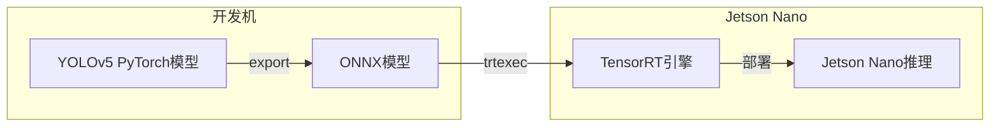

# NVIDIA Jetson Nano边缘AI部署实战

Jetson Nano是NVIDIA推出的入门级边缘AI计算平台，搭载128核Maxwell GPU和4核ARM Cortex-A57 CPU，以不到千元的价格提供了472 GFLOPS的AI算力，是学习和实践边缘AI部署的理想平台。

## 1. Jetson Nano环境搭建

### 1.1 系统安装

```bash
# 1. 下载JetPack SDK镜像
# 访问 https://developer.nvidia.com/embedded/jetpack
# 下载JetPack 4.6.x for Jetson Nano

# 2. 烧录SD卡
sudo dd if=jetson-nano-jp461-sd-card-image.img \
    of=/dev/sdX bs=4M status=progress

# 3. 首次启动配置
# 插入SD卡，连接显示器、键盘、鼠标，开机
# 完成初始设置（语言、时区、用户等）

# 4. 验证安装
nvidia@jetson:~$ cat /etc/nv_tegra_release
# R32 (release), REVISION: 7.1

nvidia@jetson:~$ nvcc --version
# nvcc: NVIDIA (R) Cuda compiler driver, release 10.2

nvidia@jetson:~$ tegrastats
# RAM 1584/3964MB, CPU [28%@1479, 32%@1479, ...], GPU 208MHz
```

### 1.2 性能模式切换

```bash
# 查看当前模式
sudo nvpmodel -q verbose

# 7W高性能模式（推荐，需要散热风扇）
sudo nvpmodel -m 0

# 5W节能模式
sudo nvpmodel -m 1

# 开启最大频率
sudo jetson_clocks

# 查看详细频率信息
sudo jetson_clocks --show
```

### 1.3 Python环境配置

```bash
# JetPack自带Python3，安装PyTorch
# 需要安装适配ARM架构的PyTorch版本

# 安装依赖
sudo apt-get install python3-pip libopenblas-base libopenmpi-dev

# 下载预编译的PyTorch wheel
wget https://nvidia.box.com/shared/static/fjtbno0vho6e4j7lnn3sa2prcrhis4wh.whl -O torch-1.10.0-cp36-cp36m-linux_aarch64.whl

# 安装PyTorch
pip3 install torch-1.10.0-cp36-cp36m-linux_aarch64.whl

# 安装TorchVision
sudo apt-get install libjpeg-dev zlib1g-dev libpython3-dev
pip3 install torchvision==0.11.1

# 验证
python3 -c "import torch; print(torch.__version__); print(torch.cuda.is_available())"
# 1.10.0
# True
```

## 2. YOLO目标检测部署

### 2.1 模型准备



```python
# 在开发机上：导出YOLOv5为ONNX
import torch
from models.experimental import attempt_load

# 加载YOLOv5s模型
model = attempt_load('yolov5s.pt', map_location='cpu')
model.eval()

# 创建示例输入
dummy_input = torch.randn(1, 3, 640, 640)

# 导出ONNX
torch.onnx.export(
    model,
    dummy_input,
    "yolov5s.onnx",
    opset_version=11,
    input_names=['images'],
    output_names=['output'],
    dynamic_axes={
        'images': {0: 'batch'},
        'output': {0: 'batch'}
    }
)
print("ONNX导出完成")
```

### 2.2 ONNX转TensorRT

```bash
# 将ONNX模型复制到Jetson Nano
scp yolov5s.onnx nvidia@<jetson-ip>:~/models/

# 在Jetson Nano上转换为TensorRT引擎
# FP16精度（推荐，速度翻倍）
trtexec \
    --onnx=yolov5s.onnx \
    --saveEngine=yolov5s_fp16.engine \
    --fp16 \
    --batch=1 \
    --workspace=1024 \
    --verbose

# INT8精度（需要校准数据）
trtexec \
    --onnx=yolov5s.onnx \
    --saveEngine=yolov5s_int8.engine \
    --int8 \
    --calib=calibration_cache.bin \
    --batch=1
```

### 2.3 TensorRT推理代码

```python
import tensorrt as trt
import pycuda.driver as cuda
import pycuda.autoinit
import numpy as np
import cv2
import time

class TensorRTInference:
    """TensorRT推理引擎"""
    
    def __init__(self, engine_path, conf_thres=0.5, iou_thres=0.45):
        self.conf_thres = conf_thres
        self.iou_thres = iou_thres
        
        # 加载引擎
        self.logger = trt.Logger(trt.Logger.WARNING)
        with open(engine_path, 'rb') as f:
            runtime = trt.Runtime(self.logger)
            self.engine = runtime.deserialize_cuda_engine(f.read())
        
        self.context = self.engine.create_execution_context()
        
        # 分配GPU内存
        self.inputs = []
        self.outputs = []
        self.bindings = []
        self.stream = cuda.Stream()
        
        for i in range(self.engine.num_bindings):
            shape = self.engine.get_binding_shape(i)
            dtype = trt.nptype(self.engine.get_binding_dtype(i))
            size = np.prod(shape)
            
            # 分配主机和设备内存
            host_mem = cuda.pagelocked_empty(size, dtype)
            device_mem = cuda.mem_alloc(host_mem.nbytes)
            
            self.bindings.append(int(device_mem))
            
            if self.engine.binding_is_input(i):
                self.inputs.append({
                    'host': host_mem,
                    'device': device_mem,
                    'shape': shape
                })
            else:
                self.outputs.append({
                    'host': host_mem,
                    'device': device_mem,
                    'shape': shape
                })
    
    def preprocess(self, img):
        """图像预处理"""
        # 保存原始尺寸用于后处理
        self.orig_shape = img.shape[:2]
        
        # Letterbox缩放
        h, w = img.shape[:2]
        target = 640
        scale = min(target / h, target / w)
        new_h, new_w = int(h * scale), int(w * scale)
        
        img_resized = cv2.resize(img, (new_w, new_h))
        
        # 填充
        pad_h = (target - new_h) // 2
        pad_w = (target - new_w) // 2
        
        canvas = np.full((target, target, 3), 114, dtype=np.uint8)
        canvas[pad_h:pad_h+new_h, pad_w:pad_w+new_w] = img_resized
        
        # 归一化
        blob = canvas.astype(np.float32) / 255.0
        blob = blob.transpose(2, 0, 1)[np.newaxis]  # NCHW
        
        self.scale = scale
        self.pad = (pad_w, pad_h)
        
        return blob
    
    def infer(self, img):
        """执行推理"""
        # 预处理
        blob = self.preprocess(img)
        
        # 拷贝到GPU
        np.copyto(self.inputs[0]['host'], blob.ravel())
        cuda.memcpy_htod_async(
            self.inputs[0]['device'], 
            self.inputs[0]['host'], 
            self.stream
        )
        
        # 执行推理
        self.context.execute_async_v2(
            bindings=self.bindings, 
            stream_handle=self.stream.handle
        )
        
        # 拷贝回CPU
        cuda.memcpy_dtoh_async(
            self.outputs[0]['host'], 
            self.outputs[0]['device'], 
            self.stream
        )
        self.stream.synchronize()
        
        # 后处理
        output = self.outputs[0]['host'].reshape(self.outputs[0]['shape'])
        detections = self.postprocess(output)
        
        return detections
    
    def postprocess(self, output):
        """YOLOv5后处理"""
        predictions = output[0]  # [1, 25200, 85]
        
        # 过滤低置信度
        scores = predictions[:, 4:].max(axis=1)
        mask = scores > self.conf_thres
        predictions = predictions[mask]
        scores = scores[mask]
        
        # 获取类别
        class_ids = predictions[:, 4:].argmax(axis=1)
        
        # 获取边界框
        boxes = predictions[:, :4]
        
        # 转换回原始坐标
        pad_w, pad_h = self.pad
        boxes[:, 0] = (boxes[:, 0] - pad_w) / self.scale
        boxes[:, 1] = (boxes[:, 1] - pad_h) / self.scale
        boxes[:, 2] = (boxes[:, 2] - pad_w) / self.scale
        boxes[:, 3] = (boxes[:, 3] - pad_h) / self.scale
        
        # NMS
        indices = self.nms(boxes, scores, self.iou_thres)
        
        results = []
        for i in indices:
            results.append({
                'bbox': boxes[i].tolist(),
                'score': float(scores[i]),
                'class_id': int(class_ids[i])
            })
        
        return results
    
    def nms(self, boxes, scores, iou_thres):
        """非极大值抑制"""
        x1, y1, x2, y2 = boxes[:, 0], boxes[:, 1], boxes[:, 2], boxes[:, 3]
        areas = (x2 - x1) * (y2 - y1)
        order = scores.argsort()[::-1]
        
        keep = []
        while order.size > 0:
            i = order[0]
            keep.append(i)
            
            xx1 = np.maximum(x1[i], x1[order[1:]])
            yy1 = np.maximum(y1[i], y1[order[1:]])
            xx2 = np.minimum(x2[i], x2[order[1:]])
            yy2 = np.minimum(y2[i], y2[order[1:]])
            
            inter = np.maximum(0, xx2-xx1) * np.maximum(0, yy2-yy1)
            iou = inter / (areas[i] + areas[order[1:]] - inter)
            
            inds = np.where(iou <= iou_thres)[0]
            order = order[inds + 1]
        
        return keep

# 实时推理
def realtime_detection(engine_path, camera_id=0):
    """实时目标检测"""
    detector = TensorRTInference(engine_path)
    cap = cv2.VideoCapture(camera_id)
    cap.set(cv2.CAP_PROP_FRAME_WIDTH, 640)
    cap.set(cv2.CAP_PROP_FRAME_HEIGHT, 480)
    
    COCO_CLASSES = [
        'person', 'bicycle', 'car', 'motorcycle', 'airplane',
        'bus', 'train', 'truck', 'boat', 'traffic light', ...
    ]
    
    fps_list = []
    
    while True:
        ret, frame = cap.read()
        if not ret:
            break
        
        start = time.time()
        detections = detector.infer(frame)
        fps = 1.0 / (time.time() - start)
        fps_list.append(fps)
        
        # 绘制结果
        for det in detections:
            x1, y1, x2, y2 = [int(v) for v in det['bbox']]
            label = f"{COCO_CLASSES[det['class_id']]} {det['score']:.2f}"
            cv2.rectangle(frame, (x1, y1), (x2, y2), (0, 255, 0), 2)
            cv2.putText(frame, label, (x1, y1-10),
                       cv2.FONT_HERSHEY_SIMPLEX, 0.5, (0, 255, 0), 2)
        
        avg_fps = np.mean(fps_list[-30:])
        cv2.putText(frame, f"FPS: {avg_fps:.1f}", (10, 30),
                   cv2.FONT_HERSHEY_SIMPLEX, 1, (0, 0, 255), 2)
        
        cv2.imshow('YOLOv5 Detection', frame)
        if cv2.waitKey(1) & 0xFF == ord('q'):
            break
    
    cap.release()
    cv2.destroyAllWindows()

# 运行
realtime_detection('yolov5s_fp16.engine', camera_id=0)
```

## 3. 性能基准测试

### 3.1 不同模型和精度对比

```python
def benchmark_models():
    """Jetson Nano性能基准测试"""
    models = {
        'YOLOv5s FP32': 'yolov5s_fp32.engine',
        'YOLOv5s FP16': 'yolov5s_fp16.engine',
        'YOLOv5s INT8': 'yolov5s_int8.engine',
        'YOLOv5n FP16': 'yolov5n_fp16.engine',
    }
    
    results = {}
    dummy_img = np.random.randint(0, 255, (480, 640, 3), dtype=np.uint8)
    
    for name, engine in models.items():
        detector = TensorRTInference(engine)
        
        # 预热
        for _ in range(10):
            detector.infer(dummy_img)
        
        # 测试
        times = []
        for _ in range(100):
            start = time.time()
            detector.infer(dummy_img)
            times.append(time.time() - start)
        
        avg_time = np.mean(times) * 1000
        fps = 1000 / avg_time
        results[name] = {'latency_ms': avg_time, 'fps': fps}
        print(f"{name}: {avg_time:.1f}ms, {fps:.1f} FPS")
    
    return results
```

### 3.2 性能数据参考

| 模型 | 精度 | 延迟(ms) | FPS | 功耗(W) |
|------|------|----------|-----|---------|
| YOLOv5s | FP32 | 180 | 5.5 | 7.5 |
| YOLOv5s | FP16 | 95 | 10.5 | 7.2 |
| YOLOv5s | INT8 | 65 | 15.4 | 6.8 |
| YOLOv5n | FP16 | 45 | 22.2 | 6.5 |
| MobileNetV2 | FP16 | 18 | 55.6 | 5.8 |

## 4. 系统优化

### 4.1 内存优化

```bash
# 查看内存使用
free -h
# 总内存约4GB，需精打细算

# 增加Swap空间
sudo fallocate -l 4G /swapfile
sudo chmod 600 /swapfile
sudo mkswap /swapfile
sudo swapon /swapfile

# 永久生效
echo '/swapfile none swap sw 0 0' | sudo tee -a /etc/fstab

# 关闭桌面环境（无头模式，释放约500MB内存）
sudo systemctl set-default multi-user.target
# 恢复桌面：sudo systemctl set-default graphical.target
```

### 4.2 摄像头优化

```python
# 使用GStreamer加速摄像头读取
def gstreamer_pipeline(
    sensor_id=0,
    capture_width=1280,
    capture_height=720,
    display_width=640,
    display_height=480,
    framerate=30,
    flip_method=0
):
    return (
        f"nvarguscamerasrc sensor-id={sensor_id} ! "
        f"video/x-raw(memory:NVMM), "
        f"width=(int){capture_width}, height=(int){capture_height}, "
        f"framerate=(fraction){framerate}/1 ! "
        f"nvvidconv flip-method={flip_method} ! "
        f"video/x-raw, width=(int){display_width}, "
        f"height=(int){display_height}, format=(string)BGRx ! "
        f"videoconvert ! "
        f"video/x-raw, format=(string)BGR ! appsink"
    )

# 使用CSI摄像头
cap = cv2.VideoCapture(gstreamer_pipeline(flip_method=0), cv2.CAP_GSTREAMER)
```

## 5. Docker容器化部署

```dockerfile
# Dockerfile for Jetson Nano AI Service
FROM nvcr.io/nvidia/l4t-pytorch:r32.7.1-pth1.10-py3

WORKDIR /app

# 安装依赖
RUN pip3 install --no-cache-dir \
    fastapi==0.85.0 \
    uvicorn==0.19.0 \
    python-multipart \
    opencv-python-headless

# 复制应用代码和模型
COPY . /app/

# 暴露端口
EXPOSE 8000

# 启动命令
CMD ["python3", "server.py"]
```

```bash
# 构建镜像
docker build -t jetson-ai:latest .

# 运行容器（启用GPU）
docker run -it --rm \
    --runtime nvidia \
    --network host \
    -v /tmp/.X11-unix:/tmp/.X11-unix \
    -e DISPLAY=$DISPLAY \
    jetson-ai:latest
```

## 总结

Jetson Nano为边缘AI部署提供了高性价比的解决方案。通过TensorRT加速，YOLOv5s在FP16精度下可以达到10+FPS的实时检测速度。关键优化策略包括：使用FP16/INT8量化、关闭桌面释放内存、使用GStreamer加速摄像头、Docker容器化部署。
