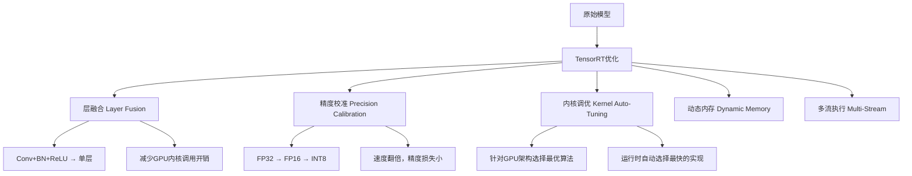
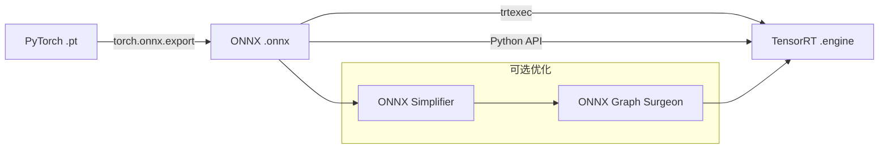
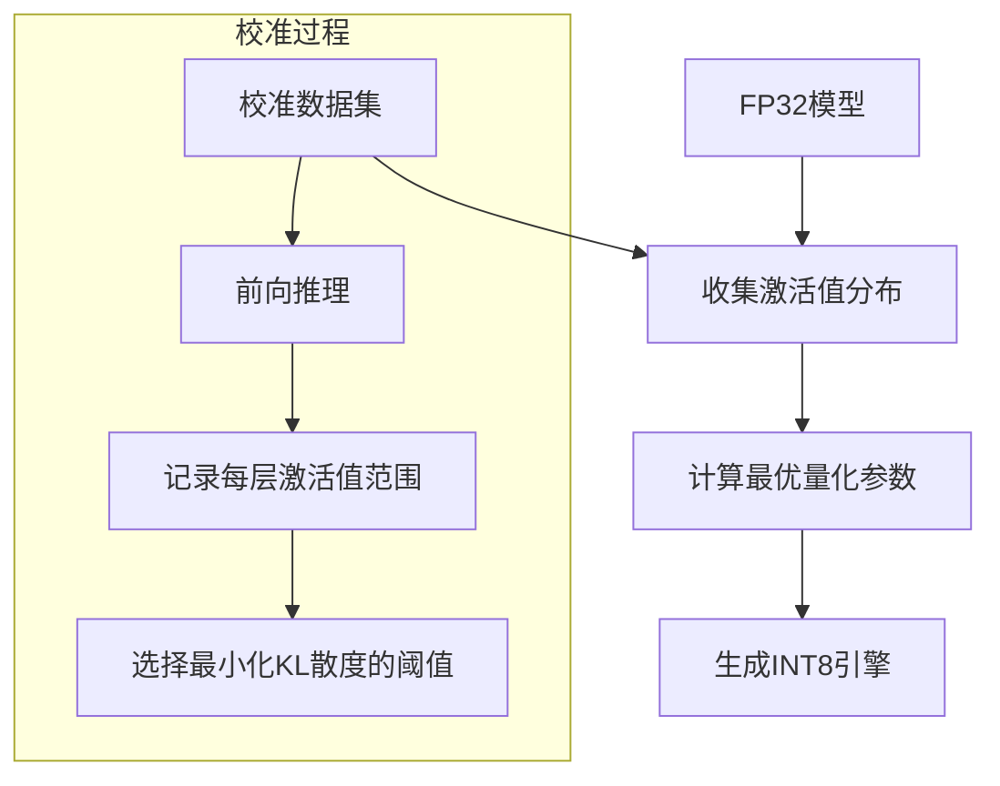

# TensorRT模型加速优化详解

TensorRT是NVIDIA推出的高性能深度学习推理优化器，通过层融合、精度校准、内核自动调优等技术，可将模型推理速度提升2-10倍。2022年，TensorRT已成为工业界模型部署的事实标准。

## 1. TensorRT优化原理

### 1.1 核心优化技术



### 1.2 优化前后对比

```
优化前 (PyTorch FP32):
  Conv2d → BatchNorm → ReLU → Conv2d → BatchNorm → ReLU
  (6次kernel launch, 6次显存读写)

优化后 (TensorRT FP16):
  [Conv+BN+ReLU 融合层] → [Conv+BN+ReLU 融合层]
  (2次kernel launch, 2次显存读写)
```

## 2. 模型转换流程

### 2.1 PyTorch → ONNX → TensorRT



```python
import torch
import torch.onnx
import onnx
from onnxsim import simplify

def export_to_onnx(model, output_path, input_shape=(1, 3, 640, 640)):
    """导出PyTorch模型为ONNX"""
    model.eval()
    dummy_input = torch.randn(*input_shape)
    
    torch.onnx.export(
        model,
        dummy_input,
        output_path,
        opset_version=11,
        do_constant_folding=True,
        input_names=['input'],
        output_names=['output'],
        dynamic_axes={
            'input': {0: 'batch_size'},
            'output': {0: 'batch_size'}
        }
    )
    
    # 验证ONNX模型
    onnx_model = onnx.load(output_path)
    onnx.checker.check_model(onnx_model)
    
    # 简化ONNX模型
    model_simplified, check = simplify(onnx_model)
    if check:
        onnx.save(model_simplified, output_path)
        print(f"ONNX模型已简化并保存到 {output_path}")
    
    return output_path
```

### 2.2 使用trtexec转换

```bash
# FP16精度（推荐，速度翻倍，精度损失极小）
trtexec \
    --onnx=model.onnx \
    --saveEngine=model_fp16.engine \
    --fp16 \
    --workspace=2048 \
    --minShapes=input:1x3x640x640 \
    --optShapes=input:4x3x640x640 \
    --maxShapes=input:8x3x640x640

# INT8精度（需要校准数据，速度最快）
trtexec \
    --onnx=model.onnx \
    --saveEngine=model_int8.engine \
    --int8 \
    --calib=calibration_cache.bin

# 性能测试
trtexec \
    --loadEngine=model_fp16.engine \
    --batch=1 \
    --iterations=100 \
    --warmUp=10
```

### 2.3 Python API转换

```python
import tensorrt as trt

def build_engine(onnx_path, fp16=True, int8=False, 
                 max_batch=1, workspace_size=1<<30):
    """使用Python API构建TensorRT引擎"""
    logger = trt.Logger(trt.Logger.WARNING)
    builder = trt.Builder(logger)
    
    # 创建网络
    network = builder.create_network(1 << int(trt.NetworkDefinitionCreationFlag.EXPLICIT_BATCH))
    parser = trt.OnnxParser(network, logger)
    
    # 解析ONNX模型
    with open(onnx_path, 'rb') as f:
        if not parser.parse(f.read()):
            for error in range(parser.num_errors):
                print(parser.get_error(error))
            return None
    
    # 配置builder
    config = builder.create_builder_config()
    config.max_workspace_size = workspace_size
    
    if fp16:
        if builder.platform_has_fast_fp16:
            config.set_flag(trt.BuilderFlag.FP16)
            print("已启用FP16精度")
    
    if int8:
        if builder.platform_has_fast_int8:
            config.set_flag(trt.BuilderFlag.INT8)
            config.int8_calibrator = Int8Calibrator()
            print("已启用INT8精度")
    
    # 构建引擎
    print("正在构建TensorRT引擎（可能需要几分钟）...")
    engine = builder.build_engine(network, config)
    
    # 保存引擎
    if engine:
        with open(onnx_path.replace('.onnx', '.engine'), 'wb') as f:
            f.write(engine.serialize())
        print("引擎构建完成")
    
    return engine
```

## 3. INT8量化校准

### 3.1 校准原理



### 3.2 自定义校准器

```python
import os
import cv2
import numpy as np
from tensorrt import IInt8EntropyCalibrator2

class Int8Calibrator(IInt8EntropyCalibrator2):
    """INT8校准器"""
    
    def __init__(self, calibration_images_dir, batch_size=1, 
                 input_shape=(3, 640, 640), cache_file='calibration.cache'):
        self.batch_size = batch_size
        self.input_shape = input_shape
        self.cache_file = cache_file
        
        # 收集校准图片路径
        self.image_paths = []
        for ext in ['*.jpg', '*.png', '*.bmp']:
            self.image_paths.extend(
                glob.glob(os.path.join(calibration_images_dir, ext))
            )
        
        self.current_idx = 0
        self.batch_count = len(self.image_paths) // batch_size
        
        # 分配GPU内存
        self.device_input = cuda.mem_alloc(
            batch_size * np.prod(input_shape) * 4  # float32
        )
    
    def preprocess(self, img_path):
        """图像预处理"""
        img = cv2.imread(img_path)
        img = cv2.resize(img, (self.input_shape[2], self.input_shape[1]))
        img = cv2.cvtColor(img, cv2.COLOR_BGR2RGB)
        img = img.astype(np.float32) / 255.0
        img = img.transpose(2, 0, 1)  # HWC → CHW
        return img
    
    def get_batch_size(self):
        return self.batch_size
    
    def get_batch(self, names):
        """获取一批校准数据"""
        if self.current_idx >= len(self.image_paths):
            return None
        
        batch_images = []
        for i in range(self.batch_size):
            idx = self.current_idx + i
            if idx >= len(self.image_paths):
                break
            img = self.preprocess(self.image_paths[idx])
            batch_images.append(img)
        
        batch = np.ascontiguousarray(np.array(batch_images))
        cuda.memcpy_htod(self.device_input, batch)
        
        self.current_idx += self.batch_size
        return [int(self.device_input)]
    
    def read_calibration_cache(self):
        """读取校准缓存"""
        if os.path.exists(self.cache_file):
            with open(self.cache_file, 'rb') as f:
                return f.read()
        return None
    
    def write_calibration_cache(self, cache):
        """写入校准缓存"""
        with open(self.cache_file, 'wb') as f:
            f.write(cache)

# 使用校准器构建INT8引擎
calibrator = Int8Calibrator(
    calibration_images_dir='./calibration_images',
    batch_size=8,
    input_shape=(3, 640, 640)
)

engine = build_engine(
    'model.onnx',
    fp16=False,
    int8=True
)
```

## 4. 高级推理封装

```python
import tensorrt as trt
import pycuda.driver as cuda
import pycuda.autoinit
import numpy as np
import time
from collections import namedtuple

Binding = namedtuple('Binding', ('name', 'dtype', 'shape', 'data', 'ptr'))

class TRTInference:
    """高性能TensorRT推理封装"""
    
    def __init__(self, engine_path, device_id=0):
        self.logger = trt.Logger(trt.Logger.INFO)
        
        # 加载引擎
        with open(engine_path, 'rb') as f:
            runtime = trt.Runtime(self.logger)
            self.engine = runtime.deserialize_cuda_engine(f.read())
        
        self.context = self.engine.create_execution_context()
        self.stream = cuda.Stream()
        
        # 准备绑定
        self.bindings = []
        self.inputs = {}
        self.outputs = {}
        
        for i in range(self.engine.num_bindings):
            name = self.engine.get_binding_name(i)
            dtype = trt.nptype(self.engine.get_binding_dtype(i))
            shape = self.engine.get_binding_shape(i)
            
            data = cuda.pagelocked_empty(
                trt.volume(shape), dtype
            )
            ptr = cuda.mem_alloc(data.nbytes)
            
            binding = Binding(name, dtype, shape, data, ptr)
            self.bindings.append(binding)
            
            if self.engine.binding_is_input(i):
                self.inputs[name] = binding
            else:
                self.outputs[name] = binding
    
    def infer(self, input_data: dict):
        """执行推理"""
        # 拷贝输入数据到GPU
        for name, data in input_data.items():
            binding = self.inputs[name]
            np.copyto(binding.data, data.ravel())
            cuda.memcpy_htod_async(binding.ptr, binding.data, self.stream)
        
        # 设置绑定地址
        binding_addrs = [b.ptr for b in self.bindings]
        
        # 执行推理
        self.context.execute_async_v2(
            bindings=binding_addrs,
            stream_handle=self.stream.handle
        )
        
        # 拷贝输出回CPU
        results = {}
        for name, binding in self.outputs.items():
            cuda.memcpy_dtoh_async(binding.data, binding.ptr, self.stream)
            results[name] = binding.data.reshape(binding.shape)
        
        self.stream.synchronize()
        return results
    
    def benchmark(self, input_data, warmup=10, iterations=100):
        """性能基准测试"""
        # 预热
        for _ in range(warmup):
            self.infer(input_data)
        
        # 测试
        latencies = []
        for _ in range(iterations):
            start = time.perf_counter()
            self.infer(input_data)
            latencies.append((time.perf_counter() - start) * 1000)
        
        stats = {
            'mean_ms': np.mean(latencies),
            'std_ms': np.std(latencies),
            'p50_ms': np.percentile(latencies, 50),
            'p95_ms': np.percentile(latencies, 95),
            'p99_ms': np.percentile(latencies, 99),
            'fps': 1000 / np.mean(latencies)
        }
        
        print(f"推理性能:")
        print(f"  平均延迟: {stats['mean_ms']:.2f} ± {stats['std_ms']:.2f} ms")
        print(f"  P50: {stats['p50_ms']:.2f} ms")
        print(f"  P95: {stats['p95_ms']:.2f} ms")
        print(f"  P99: {stats['p99_ms']:.2f} ms")
        print(f"  FPS: {stats['fps']:.1f}")
        
        return stats
```

## 5. ONNX模型转换与优化

```python
import onnx
from onnx import optimizer, numpy_helper
import onnx_graphsurgeon as og

def optimize_onnx(input_path, output_path):
    """ONNX模型优化"""
    model = onnx.load(input_path)
    
    # 1. 基本优化
    passes = [
        'eliminate_unused_initializer',  # 删除未使用的初始化器
        'eliminate_nop_transpose',        # 删除无用的转置
        'eliminate_nop_pad',              # 删除无用的填充
        'eliminate_identity',             # 删除恒等操作
        'fuse_consecutive_concats',       # 融合连续concat
        'fuse_consecutive_reduce_unsqueeze', # 融合连续reduce
        'fuse_consecutive_squeezes',      # 融合连续squeeze
        'fuse_consecutive_transposes',    # 融合连续转置
        'fuse_pad_into_conv',             # 融合pad到conv
        'fuse_transpose_into_gemm',       # 融合转置到GEMM
    ]
    
    model = optimizer.optimize(model, passes)
    
    # 2. 使用Graph Surgeon进行高级修改
    graph = og.import_onnx(model)
    
    # 示例：替换NMS操作为TensorRT高效实现
    # 找到原始NMS节点
    nms_nodes = [n for n in graph.nodes if n.op_type == 'NonMaxSuppression']
    
    for nms_node in nms_nodes:
        # 创建TensorRT插件节点
        new_node = og.Node(
            op='EfficientNMS_TRT',
            name='efficient_nms',
            attrs={
                'backgroundClass': -1,
                'iouThreshold': 0.45,
                'scoreThreshold': 0.25,
                'maxOutputBoxes': 100,
            }
        )
        # 替换连接
        new_node.inputs = nms_node.inputs
        new_node.outputs = nms_node.outputs
        graph.nodes.append(new_node)
        graph.nodes.remove(nms_node)
    
    # 3. 保存优化后的模型
    model = og.export_onnx(graph)
    onnx.save(model, output_path)
    print(f"优化后的ONNX模型已保存到 {output_path}")

# ONNX形状推断
def shape_inference(onnx_path):
    """ONNX形状推断"""
    model = onnx.load(onnx_path)
    inferred_model = onnx.shape_inference.infer_shapes(model)
    onnx.save(inferred_model, onnx_path)
    print("形状推断完成")
```

## 6. 性能对比

| 优化手段 | 相对加速 | 精度损失 |
|----------|----------|----------|
| FP32基线 | 1.0x | 0% |
| FP16 | 1.8-2.5x | <0.1% |
| INT8 | 2.5-4.0x | 0.5-2% |
| 层融合 | 1.2-1.5x | 0% |
| ONNX优化 | 1.1-1.3x | 0% |
| FP16+融合+优化 | 2.5-3.5x | <0.1% |

## 总结

TensorRT通过层融合、精度量化和内核调优三大核心优化技术，为NVIDIA GPU上的深度学习推理提供了极致性能。INT8量化配合KL散度校准，可以在保持精度的同时获得最大加速。掌握PyTorch→ONNX→TensorRT的完整转换流程，是AI工程师部署生产级模型的基本功。
