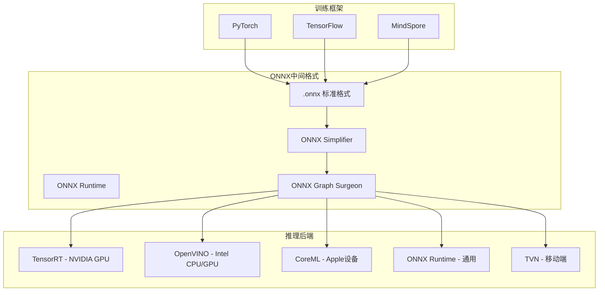
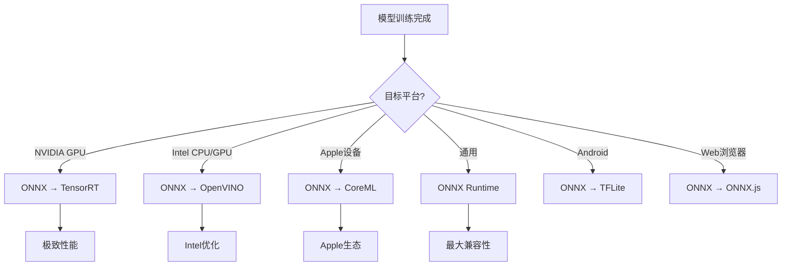

# ONNX模型转换与跨平台部署

ONNX（Open Neural Network Exchange）是微软和Facebook联合推出的开放神经网络交换格式，已成为AI模型跨平台部署的核心中间格式。通过ONNX，模型可以在不同框架和硬件之间自由迁移。

## 1. ONNX生态系统



## 2. PyTorch导出ONNX

### 2.1 基础导出

```python
import torch
import torch.nn as nn
import torch.onnx

class SimpleModel(nn.Module):
    def __init__(self):
        super().__init__()
        self.conv1 = nn.Conv2d(3, 64, 3, padding=1)
        self.bn1 = nn.BatchNorm2d(64)
        self.relu = nn.ReLU()
        self.pool = nn.AdaptiveAvgPool2d(1)
        self.fc = nn.Linear(64, 10)
    
    def forward(self, x):
        x = self.relu(self.bn1(self.conv1(x)))
        x = self.pool(x)
        x = x.view(x.size(0), -1)
        x = self.fc(x)
        return x

model = SimpleModel()
model.eval()

# 基础导出
dummy_input = torch.randn(1, 3, 224, 224)
torch.onnx.export(
    model,
    dummy_input,
    "simple_model.onnx",
    opset_version=13,
    do_constant_folding=True,
    input_names=['input'],
    output_names=['output'],
    dynamic_axes={
        'input': {0: 'batch_size'},
        'output': {0: 'batch_size'}
    }
)
print("ONNX导出完成")
```

### 2.2 复杂模型导出

```python
# 带自定义操作的导出
class CustomOpModel(nn.Module):
    def __init__(self):
        super().__init__()
        self.encoder = nn.Sequential(
            nn.Conv2d(3, 64, 3, padding=1),
            nn.BatchNorm2d(64),
            nn.SiLU(),
            nn.Conv2d(64, 128, 3, stride=2, padding=1),
            nn.BatchNorm2d(128),
            nn.SiLU(),
        )
        self.decoder = nn.Sequential(
            nn.ConvTranspose2d(128, 64, 3, stride=2, padding=1, output_padding=1),
            nn.BatchNorm2d(64),
            nn.SiLU(),
            nn.Conv2d(64, 3, 3, padding=1),
            nn.Sigmoid(),
        )
    
    def forward(self, x):
        features = self.encoder(x)
        return self.decoder(features)

# 自定义ONNX导出配置
def export_with_custom_config(model, output_path):
    model.eval()
    dummy_input = torch.randn(1, 3, 256, 256)
    
    # 注册自定义符号函数
    from torch.onnx import register_custom_op_symbolic
    
    # 导出
    torch.onnx.export(
        model,
        dummy_input,
        output_path,
        opset_version=13,
        do_constant_folding=True,
        input_names=['input'],
        output_names=['output'],
        dynamic_axes={
            'input': {0: 'batch', 2: 'height', 3: 'width'},
            'output': {0: 'batch', 2: 'height', 3: 'width'}
        },
        verbose=False
    )
    
    # 验证
    import onnx
    model_onnx = onnx.load(output_path)
    onnx.checker.check_model(model_onnx)
    print("验证通过")
```

## 3. ONNX模型优化

### 3.1 ONNX Simplifier

```python
from onnxsim import simplify
import onnx

def simplify_onnx(input_path, output_path=None):
    """简化ONNX模型"""
    if output_path is None:
        output_path = input_path.replace('.onnx', '_sim.onnx')
    
    model = onnx.load(input_path)
    
    # 简化
    model_simplified, check = simplify(
        model,
        input_shapes={'input': [1, 3, 640, 640]},  # 指定输入形状
        perform_optimization=True
    )
    
    if check:
        onnx.save(model_simplified, output_path)
        
        # 对比大小
        import os
        orig_size = os.path.getsize(input_path) / 1024 / 1024
        simp_size = os.path.getsize(output_path) / 1024 / 1024
        print(f"原始: {orig_size:.1f}MB → 简化后: {simp_size:.1f}MB")
        print(f"压缩率: {(1-simp_size/orig_size)*100:.1f}%")
    else:
        print("简化验证失败！")
    
    return output_path
```

### 3.2 ONNX Graph Surgeon修改

```python
import onnx_graphsurgeon as og
import onnx
import numpy as np

def modify_onnx_graph(input_path, output_path):
    """使用Graph Surgeon修改ONNX图"""
    graph = og.import_onnx(input_path)
    
    # 1. 修改节点属性
    for node in graph.nodes:
        if node.op_type == 'Resize':
            # 修改插值模式为nearest
            if 'mode' in node.attrs:
                node.attrs['mode'] = 'nearest'
            print(f"修改Resize节点: {node.name}")
    
    # 2. 插入后处理节点
    # 在输出前添加Sigmoid
    old_output = graph.outputs[0]
    
    sigmoid_node = og.Node(
        op='Sigmoid',
        name='output_sigmoid',
        inputs=[old_output.inputs[0]]  # 连接到原输出的输入
    )
    graph.nodes.append(sigmoid_node)
    
    # 更新输出
    new_output = og.Variable(
        name='prob_output',
        dtype=np.float32,
        shape=old_output.shape
    )
    sigmoid_node.outputs.append(new_output)
    graph.outputs = [new_output]
    
    # 3. 删除孤立节点
    graph.cleanup().toposort()
    
    # 保存
    model = og.export_onnx(graph)
    onnx.save(model, output_path)
    print(f"修改后的ONNX保存到 {output_path}")
```

## 4. ONNX Runtime推理

### 4.1 基础推理

```python
import onnxruntime as ort
import numpy as np
import time

class ONNXRuntimeInference:
    """ONNX Runtime推理封装"""
    
    def __init__(self, model_path, provider='CUDAExecutionProvider'):
        # 查看可用Provider
        available = ort.get_available_providers()
        print(f"可用Provider: {available}")
        
        # 配置Session选项
        sess_options = ort.SessionOptions()
        sess_options.graph_optimization_level = ort.GraphOptimizationLevel.ORT_ENABLE_ALL
        sess_options.intra_op_num_threads = 4
        sess_options.inter_op_num_threads = 4
        
        # 创建Session
        providers = [provider] if provider in available else ['CPUExecutionProvider']
        self.session = ort.InferenceSession(
            model_path,
            sess_options=sess_options,
            providers=providers
        )
        
        # 获取输入输出信息
        self.input_info = {
            inp.name: {
                'shape': inp.shape,
                'type': inp.type
            }
            for inp in self.session.get_inputs()
        }
        self.output_names = [out.name for out in self.session.get_outputs()]
        
        print(f"输入: {self.input_info}")
        print(f"输出: {self.output_names}")
        print(f"使用Provider: {self.session.get_providers()}")
    
    def infer(self, input_data):
        """执行推理"""
        if isinstance(input_data, np.ndarray):
            input_feed = {list(self.input_info.keys())[0]: input_data}
        else:
            input_feed = input_data
        
        outputs = self.session.run(self.output_names, input_feed)
        return outputs[0] if len(outputs) == 1 else outputs
    
    def benchmark(self, input_data, warmup=20, iterations=100):
        """性能测试"""
        # 预热
        for _ in range(warmup):
            self.infer(input_data)
        
        # 测试
        latencies = []
        for _ in range(iterations):
            start = time.perf_counter()
            self.infer(input_data)
            latencies.append((time.perf_counter() - start) * 1000)
        
        stats = {
            'mean': np.mean(latencies),
            'p50': np.percentile(latencies, 50),
            'p95': np.percentile(latencies, 95),
            'fps': 1000 / np.mean(latencies)
        }
        print(f"ONNX Runtime 性能: {stats['mean']:.2f}ms, FPS: {stats['fps']:.1f}")
        return stats

# 使用示例
ort_infer = ONNXRuntimeInference('yolov5s.onnx', provider='CUDAExecutionProvider')
dummy = np.random.randn(1, 3, 640, 640).astype(np.float32)
result = ort_infer.infer(dummy)
ort_infer.benchmark(dummy)
```

### 4.2 不同后端对比

```python
def compare_providers(model_path, input_data):
    """对比不同Provider的性能"""
    providers = ort.get_available_providers()
    results = {}
    
    for provider in providers:
        try:
            infer = ONNXRuntimeInference(model_path, provider=provider)
            stats = infer.benchmark(input_data)
            results[provider] = stats
        except Exception as e:
            print(f"{provider} 不可用: {e}")
    
    # 打印对比表
    print("\n" + "="*60)
    print(f"{'Provider':<25} {'延迟(ms)':<12} {'FPS':<10}")
    print("-"*60)
    for provider, stats in sorted(results.items(), key=lambda x: x[1]['mean']):
        print(f"{provider:<25} {stats['mean']:<12.2f} {stats['fps']:<10.1f}")
    print("="*60)
    
    return results
```

## 5. OpenVINO部署（Intel平台）

```python
from openvino.runtime import Core

def deploy_openvino(onnx_path, input_shape=(1, 3, 640, 640)):
    """使用OpenVINO部署ONNX模型"""
    ie = Core()
    
    # 转换为OpenVINO IR格式
    from openvino.tools.mo import convert_model
    ov_model = convert_model(onnx_path)
    
    # 编译模型
    compiled = ie.compile_model(ov_model, device_name='CPU')
    
    # 推理
    infer_request = compiled.create_infer_request()
    
    # 创建输入tensor
    import numpy as np
    input_tensor = np.random.randn(*input_shape).astype(np.float32)
    
    # 执行推理
    infer_request.infer({0: input_tensor})
    
    # 获取输出
    output = infer_request.get_output_tensor().data
    print(f"输出形状: {output.shape}")
    
    return compiled

# 命令行转换
# mo --input_model model.onnx --output_dir ./openvino_model --data_type FP16
```

## 6. 跨平台部署最佳实践



| 平台 | 推荐方案 | 精度 | 延迟 |
|------|----------|------|------|
| NVIDIA A100 | TensorRT FP16 | FP16 | 最低 |
| Intel Xeon | OpenVINO FP16 | FP16 | 低 |
| Apple M1 | CoreML FP16 | FP16 | 低 |
| 通用x86 | ONNX Runtime | FP32 | 中 |
| Jetson Nano | TensorRT INT8 | INT8 | 低 |
| 树莓派 | ONNX Runtime | FP32 | 高 |

## 总结

ONNX作为AI模型的"通用语言"，打通了训练框架与推理后端之间的壁垒。掌握PyTorch→ONNX的导出技巧、ONNX Simplifier的优化方法、以及ONNX Runtime/OpenVINO/TensorRT等不同后端的部署方案，是AI工程师实现模型落地的核心能力。
