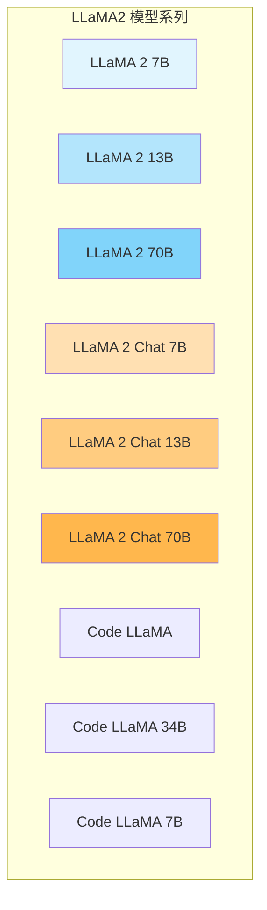
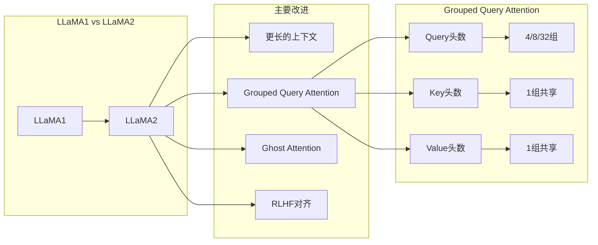
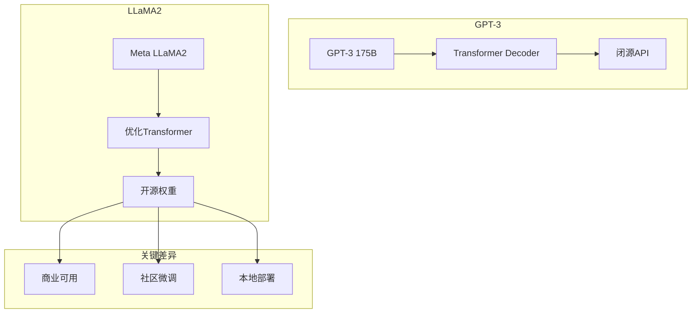
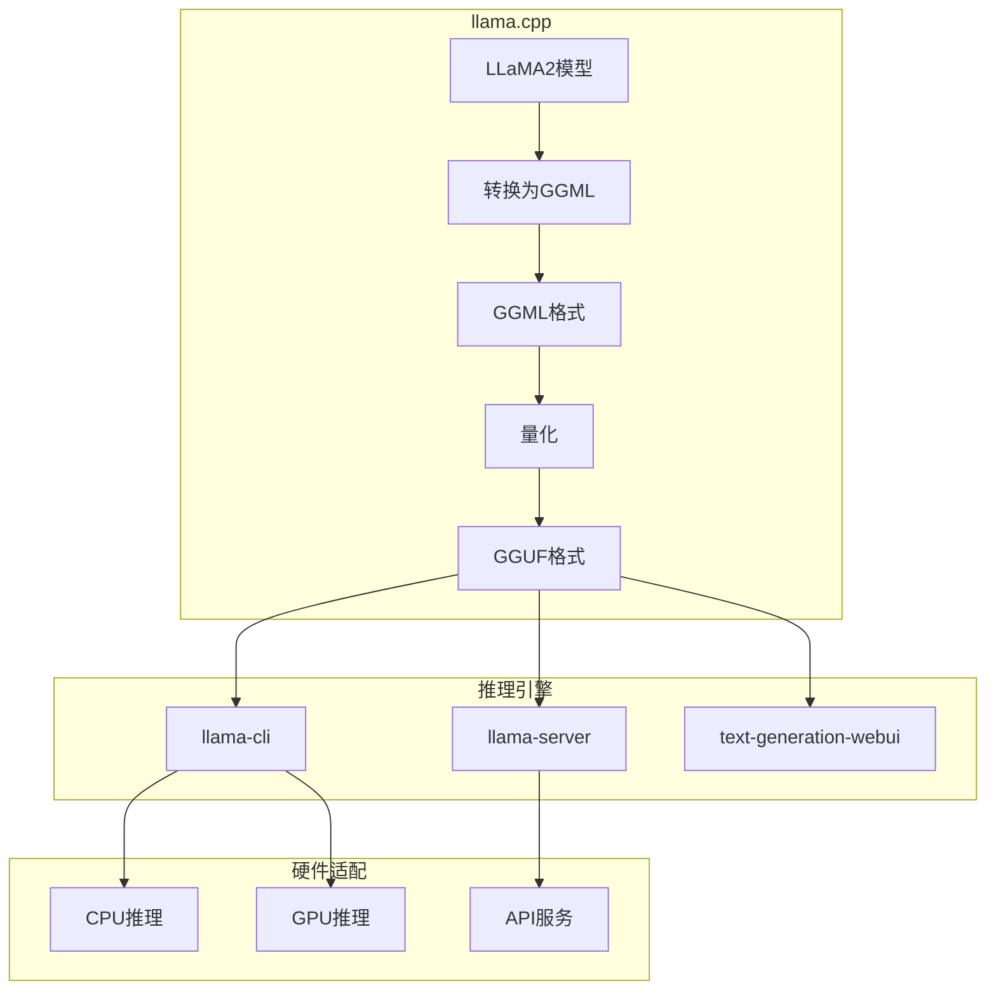
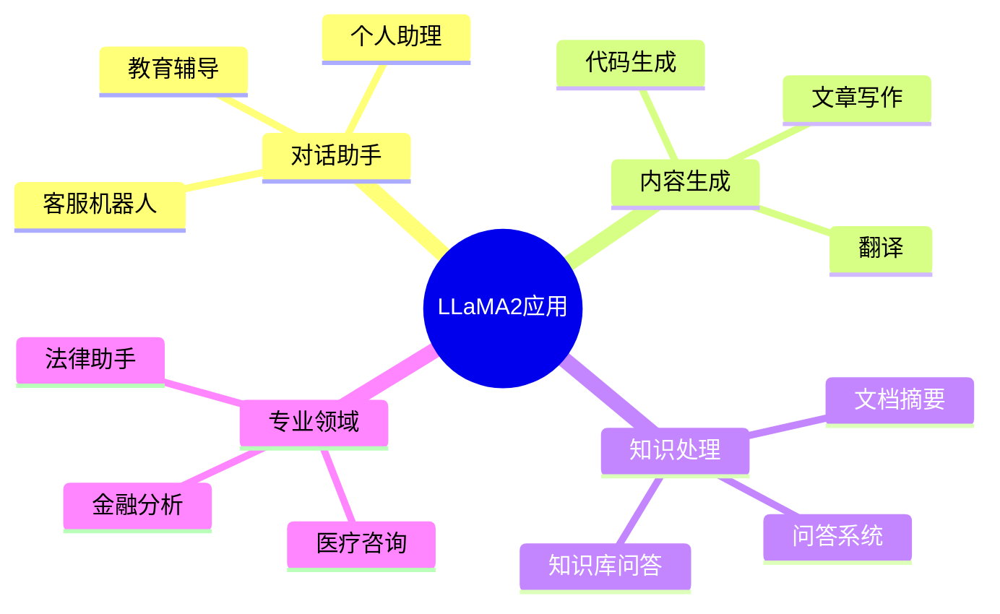

## 概述

LLaMA2是Meta发布的开源大语言模型，引发了开源AI社区的革命性变革。本文全面解析LLaMA2的技术特点、微调方法和部署实践。

## LLaMA2模型家族

### 模型规模对比



### 技术规格对比

| 模型 | 参数量 | 隐藏维度 | 注意力头数 | 层数 | 上下文长度 |
|------|--------|----------|------------|------|------------|
| LLaMA 2 7B | 7B | 4096 | 32 | 32 | 4K |
| LLaMA 2 13B | 13B | 5120 | 40 | 40 | 4K |
| LLaMA 2 70B | 70B | 8192 | 64 (GQA) | 80 | 4K |
| Code LLaMA 34B | 34B | 8192 | 64 (GQA) | 48 | 16K |

## LLaMA2核心技术创新

### 架构改进



### 与GPT-3对比



## 微调技术

### LoRA微调原理

```mermaid
flowchart TB
    subgraph 原始全量微调
        W[原始权重 W] --> GRAD[梯度计算]
        GRAD --> UPDATE[全量更新]
        UPDATE --> W'[W' = W + ΔW]
    end
    
    subgraph LoRA微调
        W0[预训练权重 W0] --> FREEZE[冻结W0]
        FREEZE --> AB[添加低秩矩阵]
        AB --> A[A ∈ R^{d×r}]
        AB --> B[B ∈ R^{r×k}]
        
        A --> NEW[新权重]
        B --> NEW
        NEW --> OUT[W' = W0 + BA]
    end
    
    subgraph 效率对比
        FULL[全量: 7B参数]
        FULL --> FT[需要全部更新]
        LO[LoRA: ~4M参数]
        LO --> LT[仅更新低秩矩阵]
    end
```

### LLaMA2 + LoRA实现

```python
from peft import LoraConfig, get_peft_model, TaskType
from transformers import AutoModelForCausalLM

class LLaMA2LoRAFineTuner:
    """LLaMA2 LoRA微调器"""
    
    def __init__(self, model_name="meta-llama/Llama-2-7b-hf"):
        self.model_name = model_name
        self.tokenizer = None
        self.model = None
    
    def setup_model(self):
        """加载模型并应用LoRA"""
        # 加载预训练模型
        self.model = AutoModelForCausalLM.from_pretrained(
            self.model_name,
            device_map="auto",
            load_in_8bit=True,
            torch_dtype=torch.float16
        )
        
        # LoRA配置
        lora_config = LoraConfig(
            task_type=TaskType.CAUSAL_LM,
            r=8,  # LoRA秩
            lora_alpha=16,  # LoRA缩放因子
            lora_dropout=0.05,
            target_modules=[
                "q_proj", "v_proj", "k_proj", "o_proj",
                "gate_proj", "up_proj", "down_proj"
            ],
            bias="none",
            inference_mode=False
        )
        
        # 应用LoRA
        self.model = get_peft_model(self.model, lora_config)
        self.model.print_trainable_parameters()
        # 输出: trainable params: 4M || all params: 6.7B || trainable%: 0.06%
    
    def prepare_dataset(self, dataset_path):
        """准备微调数据集"""
        def format_promt(example):
            return {
                "text": f"### 指令:\n{example['instruction']}\n\n### 回答:\n{example['response']}"
            }
        
        from datasets import load_dataset
        dataset = load_dataset("json", data_files=dataset_path)
        dataset = dataset.map(lambda x: format_promt(x))
        
        def tokenize(example):
            result = self.tokenizer(
                example["text"],
                truncation=True,
                max_length=2048,
                padding="max_length"
            )
            result["labels"] = result["input_ids"].copy()
            return result
        
        return dataset.map(tokenize, batched=True)
    
    def train(self, train_dataset, output_dir="./lora_output"):
        """训练"""
        from transformers import TrainingArguments, Trainer
        
        training_args = TrainingArguments(
            output_dir=output_dir,
            num_train_epochs=3,
            per_device_train_batch_size=4,
            gradient_accumulation_steps=4,
            learning_rate=2e-4,
            warmup_ratio=0.03,
            lr_scheduler_type="cosine",
            logging_steps=10,
            save_steps=500,
            fp16=True,
            optim="paged_adamw_8bit"
        )
        
        trainer = Trainer(
            model=self.model,
            args=training_args,
            train_dataset=train_dataset,
            data_collator=DataCollator(self.tokenizer)
        )
        
        trainer.train()
        self.model.save_pretrained(output_dir)
```

### QLoRA量化微调

```python
class QLoRAFineTuner:
    """QLoRA量化微调"""
    
    def setup_model(self, model_name="meta-llama/Llama-2-70b-hf"):
        """4-bit量化加载"""
        from transformers import BitsAndBytesConfig
        
        # 4-bit量化配置
        bnb_config = BitsAndBytesConfig(
            load_in_4bit=True,
            bnb_4bit_use_double_quant=True,
            bnb_4bit_quant_type="nf4",  # Normal Float 4
            bnd_4bit_compute_dtype=torch.bfloat16
        )
        
        # 加载量化模型
        self.model = AutoModelForCausalLM.from_pretrained(
            model_name,
            quantization_config=bnb_config,
            device_map="auto"
        )
        
        # 配置LoRA
        lora_config = LoraConfig(
            r=64,
            lora_alpha=16,
            target_modules=["q_proj", "v_proj"],
            lora_dropout=0.05,
            bias="none",
            task_type=TaskType.CAUSAL_LM
        )
        
        self.model = get_peft_model(self.model, lora_config)
```

## 部署实践

### 本地部署方案



### 量化模型转换

```bash
# 安装llama.cpp
git clone https://github.com/ggerganov/llama.cpp
cd llama.cpp
mkdir build && cd build
cmake ..
make -j4

# 转换模型为GGML格式
python ../convert.py /path/to/llama2-7b/ \
    --outfile ./llama2-7b.gguf \
    --vocab-type bpe

# 量化模型
./quantize ./llama2-7b.gguf \
    ./llama2-7b-Q4_K_M.gguf \
    Q4_K_M
```

### 本地推理服务

```python
from llama_cpp import Llama

class LocalLLM:
    """本地LLM推理"""
    
    def __init__(self, model_path, n_ctx=4096, n_gpu_layers=-1):
        self.llm = Llama(
            model_path=model_path,
            n_ctx=n_ctx,  # 上下文长度
            n_gpu_layers=n_gpu_layers,  # GPU层数
            n_threads=8,
            n_batch=512,
            use_mmap=True,
            use_mlock=False
        )
    
    def chat(self, messages, temperature=0.7, max_tokens=256):
        """对话"""
        response = self.llm.create_ch_completion(
            messages=messages,
            temperature=temperature,
            max_tokens=max_tokens,
            stop=["</s>", "User:"]
        )
        return response["choices"][0]["message"]["content"]
    
    def stream_chat(self, messages):
        """流式对话"""
        for token in self.llm.create_chat_completion(
            messages=messages,
            stream=True
        ):
            yield token["choices"][0]["delta"]["content"]
```

## 应用场景



## 总结

LLaMA2的开源彻底改变了AI格局，其主要优势包括：

| 特性 | 优势 |
|------|------|
| 开源可商用 | 7B/13B/70B均可商用 |
| 高性能 | 接近GPT-3.5水平 |
| 社区生态 | 大量微调模型可用 |
| 本地部署 | 隐私保护、无网络依赖 |
| 低成本 | 减少API费用 |

LLaMA2 + LoRA/QLoRA为企业和开发者提供了经济高效的AI解决方案。
