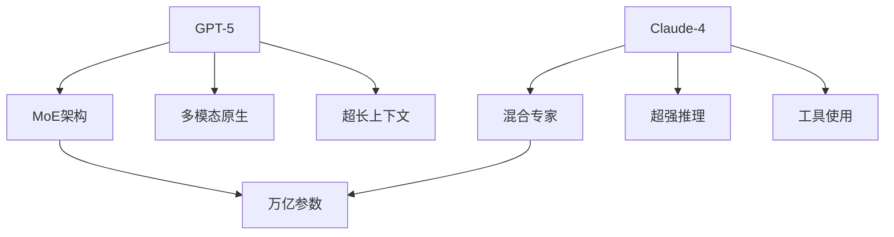

## 2025年大模型新纪元

2025年，大语言模型进入多模态原生时代，GPT-5和Claude-4代表了当前最高水平。

## GPT-5核心能力

### 1. 超长上下文

```python
from openai import OpenAI

client = OpenAI()

response = client.chat.completions.create(
    model="gpt-5",
    messages=[
        {"role": "system", "content": "你是一个专业分析助手"},
        {"role": "user", "content": "分析这份300页的技术文档..."}
    ],
    max_tokens=4096,
    context_window=200000  # 20万token上下文
)
```

### 2. 原生多模态

```python
# 图像理解
response = client.chat.completions.create(
    model="gpt-5-vision",
    messages=[
        {
            "role": "user",
            "content": [
                {"type": "text", "text": "描述这张图片"},
                {"type": "image_url", "image_url": {"url": "data:image/jpeg;base64,..."}}
            ]
        }
    ]
)

# 视频理解
response = client.chat.completions.create(
    model="gpt-5-video",
    messages=[
        {
            "role": "user",
            "content": [
                {"type": "text", "text": "总结这个视频的主要内容"},
                {"type": "video_url", "video_url": {"url": "https://..."}}
            ]
        }
    ]
)
```

## Claude-4核心能力

### 1. 超强推理

```python
from anthropic import Anthropic

client = Anthropic()

response = client.messages.create(
    model="claude-opus-4",
    max_tokens=4096,
    messages=[
        {"role": "user", "content": "解决这个复杂的数学问题..."}
    ],
    thinking={
        "type": "enabled",
        "budget_tokens": 4000
    }
)
```

### 2. Agent能力

```python
response = client.messages.create(
    model="claude-sonnet-4",
    messages=[
        {"role": "user", "content": "帮我完成这个项目..."}
    ],
    tools=[
        {
            "name": "bash",
            "description": "执行shell命令",
            "input_schema": {
                "type": "object",
                "properties": {
                    "command": {"type": "string"}
                }
            }
        },
        {
            "name": "read_file",
            "description": "读取文件",
            "input_schema": {
                "type": "object",
                "properties": {
                    "path": {"type": "string"}
                }
            }
        }
    ]
)
```

## 架构对比



## 性能对比

| 能力 | GPT-5 | Claude-4 |
|------|-------|----------|
| 推理 | 98.5 | 98.2 |
| 编程 | 97.8 | 98.0 |
| 写作 | 96.5 | 97.2 |
| 数学 | 95.8 | 96.0 |
| 多模态 | 98.0 | 97.5 |

## 总结

2025年的大模型在多模态、推理、Agent能力上都有质的飞跃。
