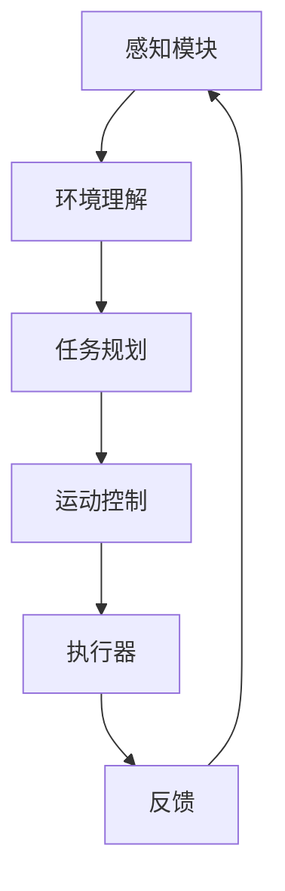

## 具身智能概述

具身智能(Embodied AI)让AI拥有物理身体，能够感知环境、执行动作。

## 核心框架



## 视觉-语言-动作模型(VLA)

```python
import torch
import torch.nn as nn

class VLA_Model(nn.Module):
    def __init__(self, vision_dim, lang_dim, action_dim):
        super().__init__()
        
        # 视觉编码器
        self.vision_encoder = nn.Sequential(
            nn.Linear(vision_dim, 2048),
            nn.ReLU(),
            nn.Linear(2048, 512)
        )
        
        # 语言编码器
        self.lang_encoder = nn.Sequential(
            nn.Linear(lang_dim, 2048),
            nn.ReLU(),
            nn.Linear(2048, 512)
        )
        
        # 融合模块
        self.fusion = nn.MultiheadAttention(512, num_heads=8)
        
        # 动作解码器
        self.action_head = nn.Sequential(
            nn.Linear(512, 512),
            nn.ReLU(),
            nn.Linear(512, action_dim)
        )
        
    def forward(self, vision_input, lang_input):
        # 编码
        vision_feat = self.vision_encoder(vision_input)
        lang_feat = self.lang_encoder(lang_input)
        
        # 融合
        fused, _ = self.fusion(vision_feat, lang_feat, lang_feat)
        
        # 输出动作
        action = self.action_head(fused)
        return action
```

## 仿真环境

```python
import gymnasium as gym
import maniskill2

# 创建仿真环境
env = gym.make('PickCube-v1', obs_mode='rgbd', control_mode='pd_ee_delta_pose')

obs, info = env.reset(seed=0)

for step in range(100):
    # VLA模型推理
    action = vla_model.predict(obs, "抓取红色方块")
    
    obs, reward, terminated, truncated, info = env.step(action)
    
    if terminated or truncated:
        obs, info = env.reset()
```

## 实际部署

```python
# ROS2集成
import rclpy
from rclpy.node import Node

class RobotController(Node):
    def __init__(self):
        super().__init__('robot_controller')
        self.vla_model = VLAModel()
        self.vla_model.load_weights('/path/to/weights.pt')
        
        self.subscription = self.create_subscription(
            Image,
            '/camera/image',
            self.image_callback,
            10
        )
        
    def image_callback(self, msg):
        # 处理图像
        obs = self.preprocess(msg)
        action = self.vla_model(obs)
        self.publish_action(action)
```

## 关键技术

| 技术 | 描述 |
|------|------|
| Sim2Real | 仿真到真实迁移 |
| 灵巧手控制 | 多指操作 |
| 视觉伺服 | 视觉反馈控制 |
| 任务规划 | 层级规划 |

## 总结

具身智能是AI发展的重要方向，VLA模型是其核心。
