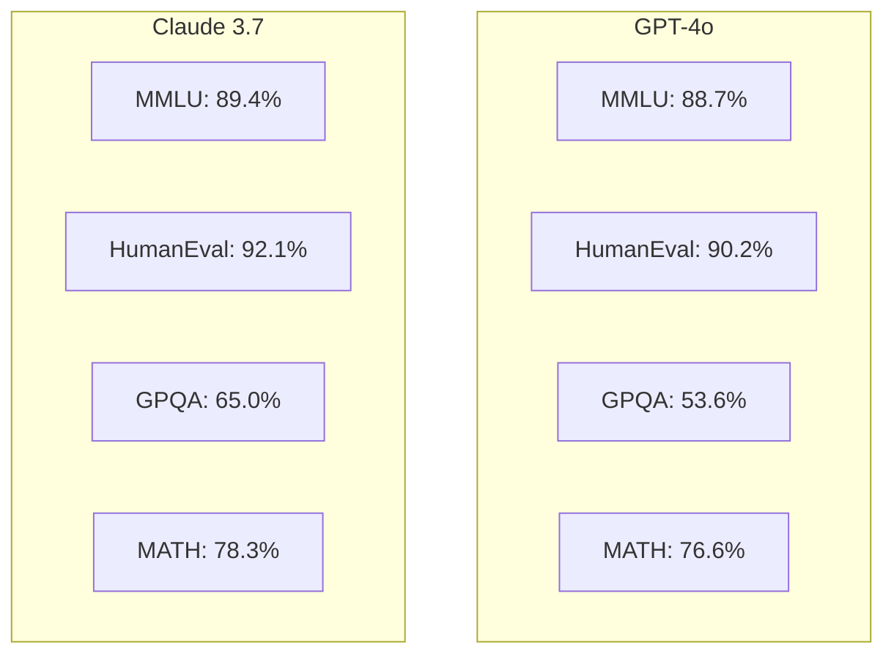
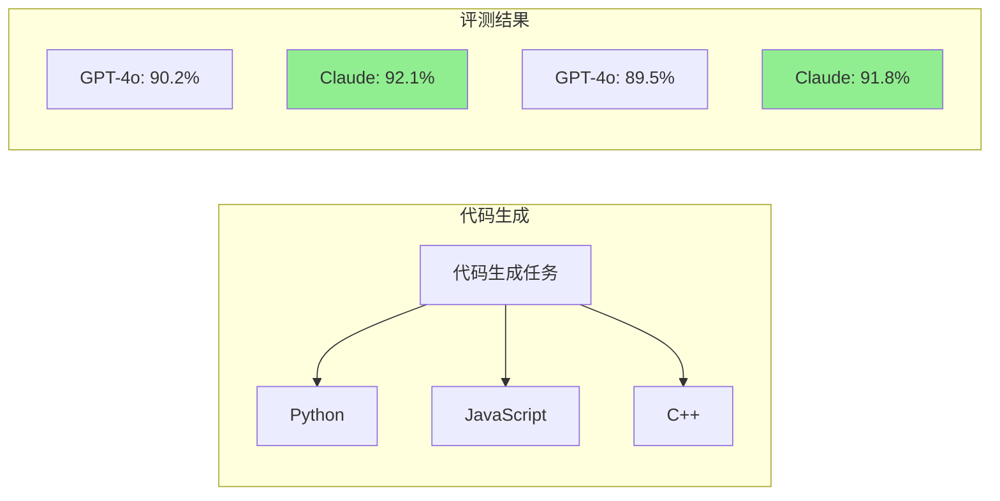
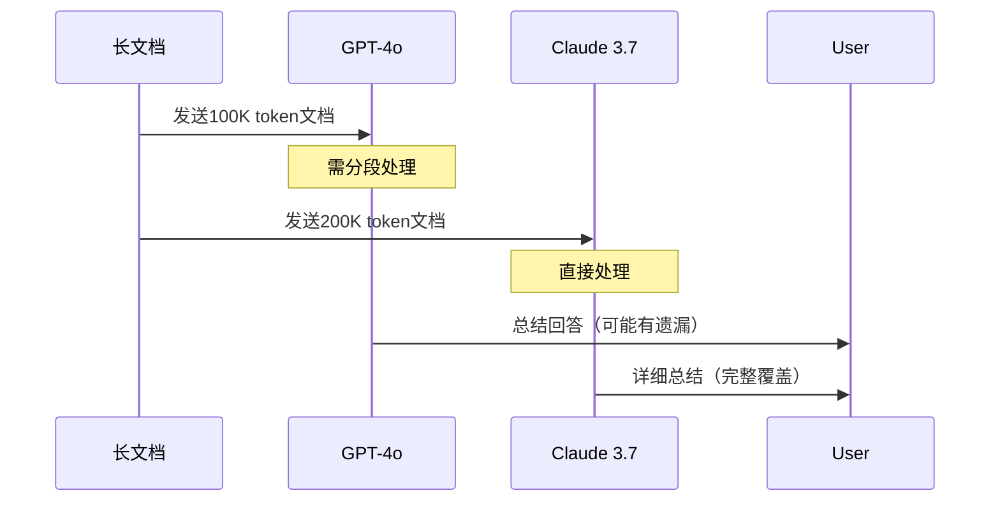
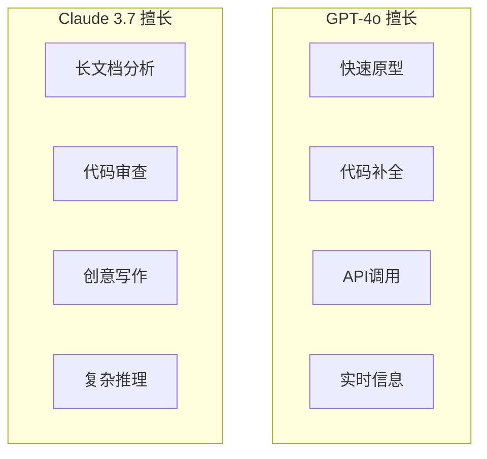
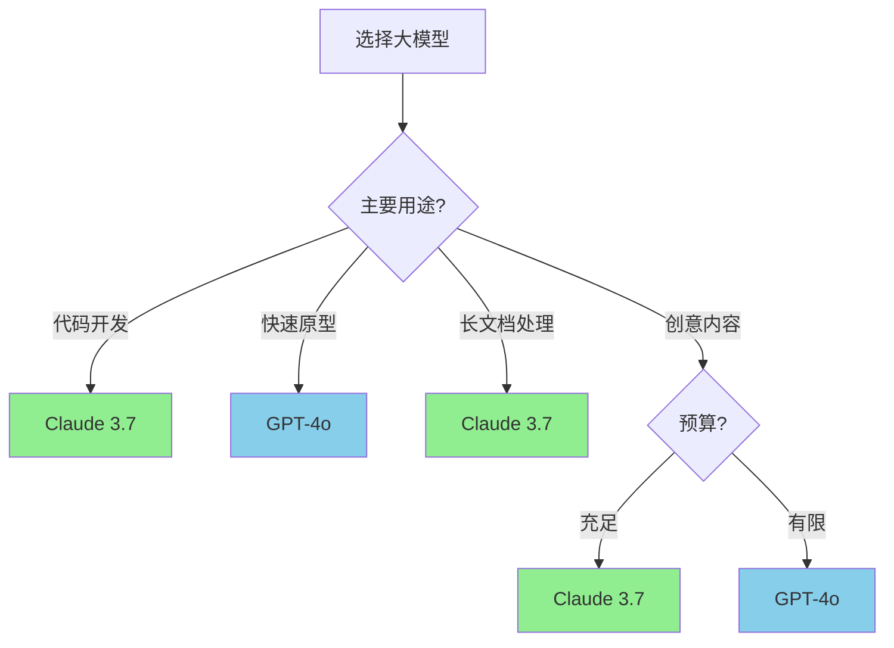

## 概述

2025年，大模型竞争进入白热化阶段。GPT-4o与Claude 3.7作为两大主流模型，各有特色。本文全面对比分析这两款模型的能力与适用场景。

## 模型基本信息对比

### 核心参数对比

| 特性 | GPT-4o | Claude 3.7 Sonnet |
|------|--------|-------------------|
| 发布日期 | 2024年5月 | 2025年2月 |
| 上下文窗口 | 128K | 200K |
| 多模态 | 原生 | 原生 |
| 训练数据截止 | 2023年10月 | 2025年1月 |
| 主要厂商 | OpenAI | Anthropic |

## 能力对比测试

### 基准测试结果



### 详细评测表格

| 评测集 | GPT-4o | Claude 3.7 | 胜者 |
|--------|--------|------------|------|
| MMLU | 88.7% | 89.4% | Claude |
| HumanEval | 90.2% | 92.1% | Claude |
| GPQA Diamond | 53.6% | 65.0% | Claude |
| MATH | 76.6% | 78.3% | Claude |
| GSM8K | 96.5% | 97.2% | Claude |
| HellaSwag | 95.3% | 95.8% | Claude |
| ARC-Challenge | 96.3% | 96.1% | GPT-4o |
| MGSM | 90.5% | 91.2% | Claude |

## 专项能力对比

### 编程能力



**代码质量分析：**
- Claude：代码更规范，注释更详细，错误处理更好
- GPT-4o：代码更简洁，算法效率更高

### 数学推理能力

```python
# 测试题目：概率推理
problem = """
一个袋子里有3个红球和2个蓝球。
不放回地依次取出2个球。
求两个球颜色相同的概率。
"""

# Claude 3.7 解答
claude_solution = """
解法分析：
1. 第一次取球概率：红球3/5，蓝球2/5
2. 第二次取球（不放回）：
   - 若第一次红球(3/5)：第二次红球2/4 = 1/2
   - 若第一次蓝球(2/5)：第二次蓝球1/4 = 1/4

概率 = P(RR) + P(BB)
     = (3/5) × (1/2) + (2/5) × (1/4)
     = 3/10 + 2/20
     = 3/10 + 1/10
     = 4/10 = 2/5 = 0.4
"""
```

### 长上下文理解



## 响应特性对比

### 响应风格

| 维度 | GPT-4o | Claude 3.7 |
|------|--------|------------|
| 正式程度 | 适中 | 较正式 |
| 回答长度 | 简洁 | 详细 |
| 创意表达 | 强 | 中等 |
| 逻辑严谨 | 强 | 强 |
| 安全性 | 高 | 很高 |

### 典型场景表现



## API定价对比

| 服务 | GPT-4o | Claude 3.7 |
|------|--------|------------|
| 输入($/1M tokens) | $5.00 | $3.00 |
| 输出($/1M tokens) | $15.00 | $15.00 |
| Cache输入 | $1.25 | $0.30 |

## 选择建议



## 总结对比

| 维度 | GPT-4o | Claude 3.7 | 推荐 |
|------|--------|------------|------|
| 编程 | ⭐⭐⭐⭐ | ⭐⭐⭐⭐⭐ | Claude |
| 数学 | ⭐⭐⭐⭐ | ⭐⭐⭐⭐⭐ | Claude |
| 创意 | ⭐⭐⭐⭐⭐ | ⭐⭐⭐⭐ | GPT-4o |
| 长文本 | ⭐⭐⭐ | ⭐⭐⭐⭐⭐ | Claude |
| 速度 | ⭐⭐⭐⭐⭐ | ⭐⭐⭐⭐ | GPT-4o |
| 性价比 | ⭐⭐⭐ | ⭐⭐⭐⭐ | Claude |

**总结：**
- **选择GPT-4o**：需要快速响应、创意生成、API优先
- **选择Claude 3.7**：需要深度分析、代码审查、长文档处理
