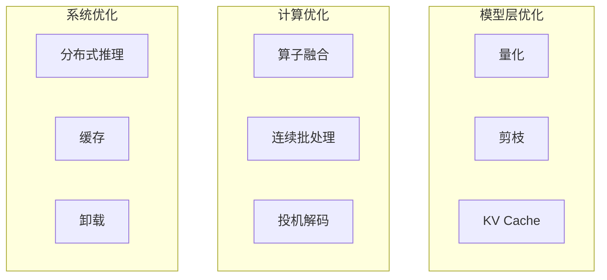
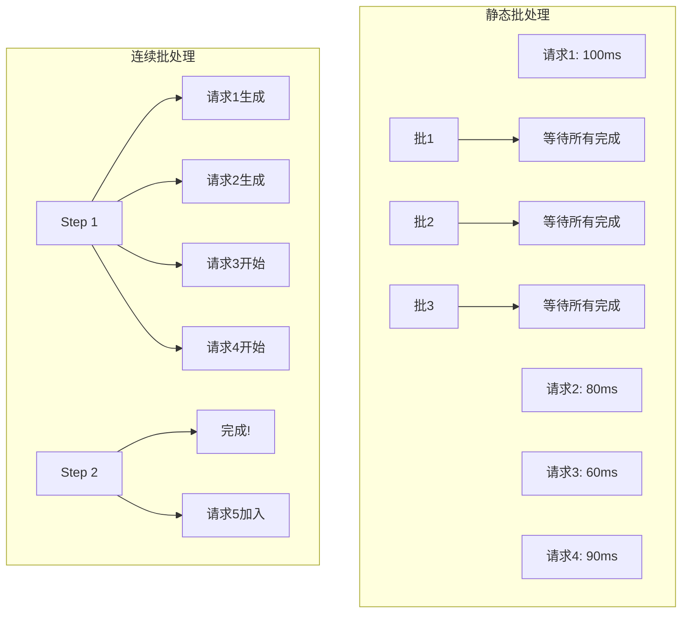
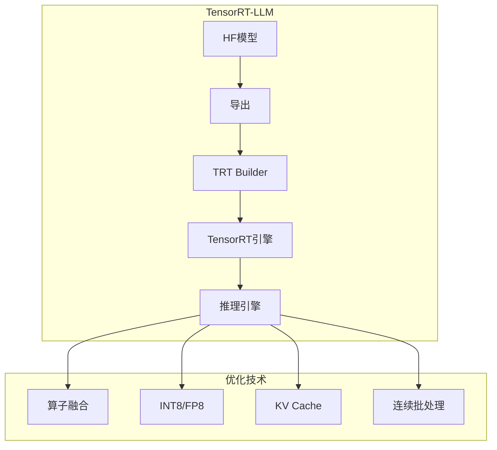
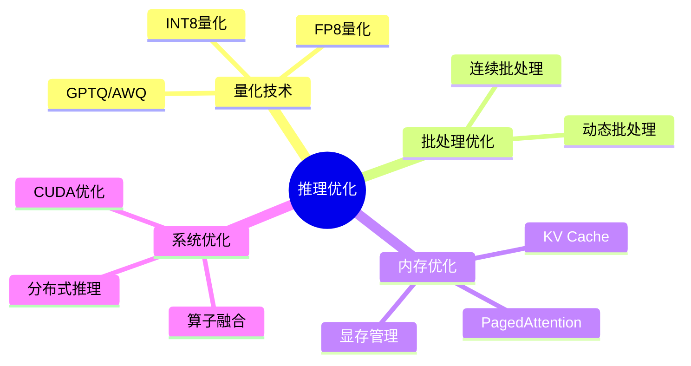

## 概述

大模型推理优化是降低成本、提升用户体验的关键技术。本文系统介绍vLLM、TensorRT-LLM等主流推理框架的原理与实践。

## 推理优化技术全景



## KV Cache优化

### 传统vs KV Cache

```mermaid
flowchart LR
    subgraph 传统推理
        T1[Token 1] --> L1[LLM层]
        L1 --> T2[Token 2]
        T2 --> L2[LLM层]
        L2 --> T3[Token 3]
        T3 --> L3[LLM层]
        T1 --> T3: 重复计算
        T2 --> T3: 重复计算
    end
    
    subgraph KV Cache
        K1[Cache K1, V1] --> L1'[LLM层]
        T1' --> L1'
        L1' --> K2[Cache K2, V2]
        K1 --> L2'[LLM层]
        T2' --> L2'
        L2' --> K3[Cache K3, V3]
    end
```

### KV Cache实现

```python
class KVCache:
    """KV Cache管理器"""
    
    def __init__(self, max_batch_size, max_seq_len, num_heads, head_dim):
        self.k_cache = torch.zeros(
            max_batch_size, max_seq_len, num_heads, head_dim
        )
        self.v_cache = torch.zeros(
            max_batch_size, max_seq_len, num_heads, head_dim
        )
        self.seq_lens = [0] * max_batch_size
    
    def update(self, batch_idx, seq_len, k, v):
        """更新KV Cache"""
        self.k_cache[batch_idx, seq_len] = k
        self.v_cache[batch_idx, seq_len] = v
        self.seq_lens[batch_idx] = seq_len + 1
    
    def get(self, batch_idx, start, end):
        """获取KV序列"""
        return (
            self.k_cache[batch_idx, start:end],
            self.v_cache[batch_idx, start:end]
        )
```

## 连续批处理

### 原理



### vLLM实现

```python
from vllm import LLM, SamplingParams

class VLLMInference:
    """vLLM推理引擎"""
    
    def __init__(self, model_name="meta-llama/Llama-2-70b-chat-hf"):
        self.llm = LLM(
            model=model_name,
            tensor_parallel_size=4,  # 4卡并行
            gpu_memory_utilization=0.9,
            max_num_seqs=256,  # 最大并发数
            max_num_batched_tokens=32768
        )
    
    def batch_inference(self, prompts, max_tokens=512):
        """批量推理"""
        sampling_params = SamplingParams(
            temperature=0.7,
            top_p=0.95,
            max_tokens=max_tokens
        )
        
        outputs = self.llm.generate(prompts, sampling_params)
        
        return [output.outputs[0].text for output in outputs]
    
    def streaming_inference(self, prompt, max_tokens=512):
        """流式推理"""
        sampling_params = SamplingParams(
            temperature=0.7,
            max_tokens=max_tokens,
            stream=True
        )
        
        outputs = self.llm.generate([prompt], sampling_params)
        
        for output in outputs:
            for token in output.outputs:
                yield token.text
```

## TensorRT-LLM优化

### TensorRT-LLM架构



### TensorRT-LLM使用

```python
from tensorrt_llm import LLM, BuildConfig

class TensorRTLLMInference:
    """TensorRT-LLM推理"""
    
    def __init__(self, model_path):
        build_config = BuildConfig(
            max_batch_size=128,
            max_input_len=4096,
            max_output_len=2048,
            max_num_tokens=32768,
            enable_chunked_context=True,
            enable_air=False
        )
        
        self.llm = LLM(model=model_path, build_config=build_config)
    
    def generate(self, prompts):
        from tensorrt_llm import SamplingParams
        
        sampling_params = SamplingParams(
            max_new_tokens=512,
            temperature=0.8,
            top_p=0.95
        )
        
        outputs = self.llm.generate(prompts, sampling_params)
        return [output.outputs[0].text for output in outputs]
```

## 推理性能对比

| 框架 | 吞吐量(token/s) | 延迟(P99) | 显存占用 |
|------|-----------------|-----------|----------|
| HuggingFace | 50 | 2000ms | 100% |
| vLLM | 280 | 300ms | 90% |
| TensorRT-LLM | 450 | 150ms | 85% |
| SGLang | 320 | 250ms | 88% |

## 总结



推理优化是大模型落地的关键技术，需要根据实际场景选择合适的优化方案。
