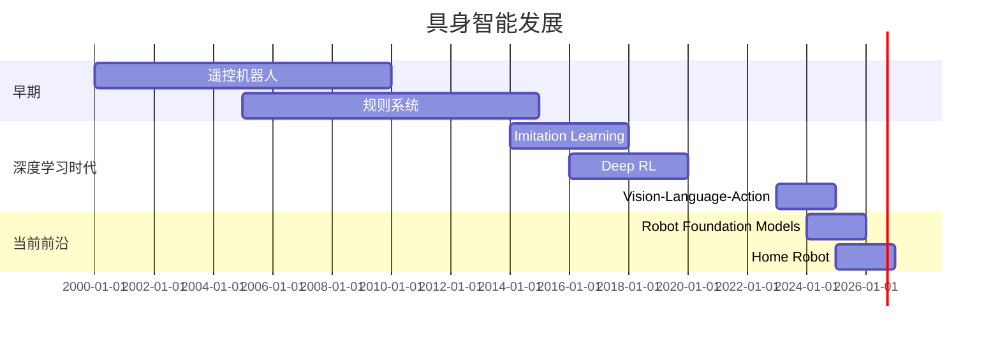
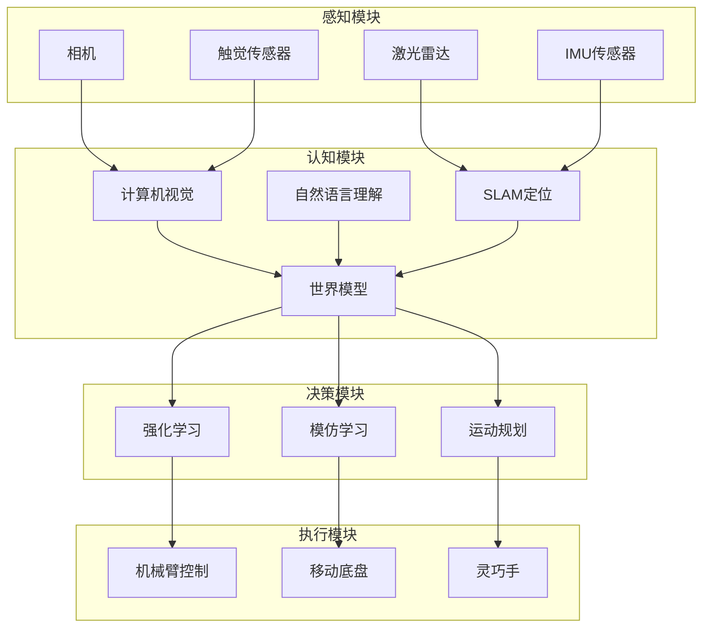
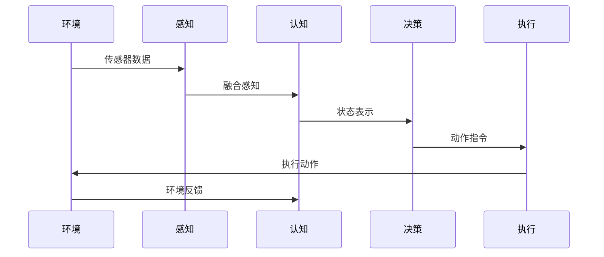
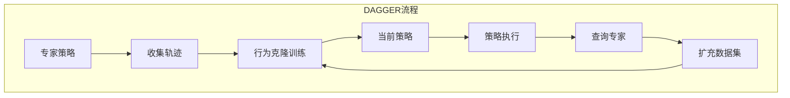
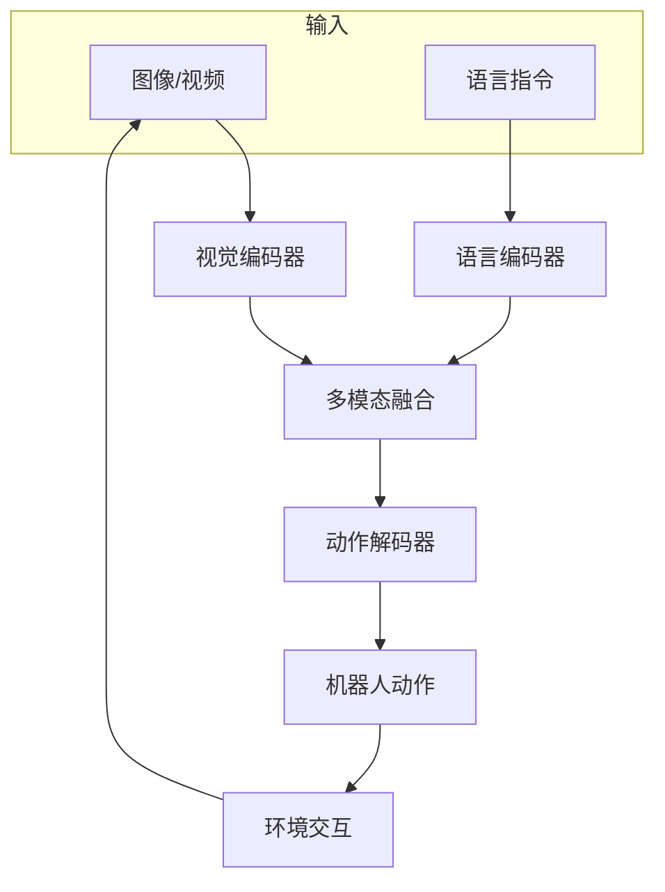
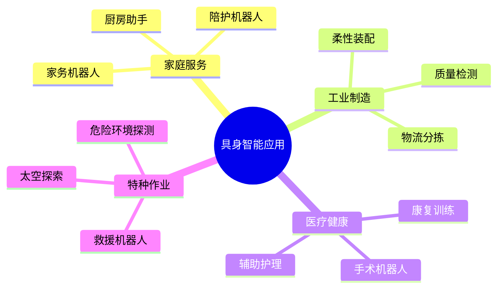

## 概述

具身智能（Embodied AI）是AI领域的下一个前沿方向，让智能体在物理世界中感知、理解并行动。本文系统介绍具身智能的核心技术与最新进展。

## 具身智能发展历程



## 具身智能系统架构

### 核心组件



### 数据流程



## 模仿学习

### 行为克隆

```python
import torch
import torch.nn as nn

class BehaviorCloning:
    """行为克隆 - 模仿学习"""
    
    def __init__(self, obs_dim, action_dim):
        self.policy = nn.Sequential(
            nn.Linear(obs_dim, 256),
            nn.ReLU(),
            nn.Linear(256, 256),
            nn.ReLU(),
            nn.Linear(256, action_dim)
        )
        self.optimizer = torch.optim.Adam(self.policy.parameters())
    
    def update(self, observations, actions):
        """
        observations: [batch, obs_dim]
        actions: [batch, action_dim]
        """
        predicted_actions = self.policy(observations)
        loss = nn.MSELoss()(predicted_actions, actions)
        
        self.optimizer.zero_grad()
        loss.backward()
        self.optimizer.step()
        
        return loss.item()
```

### DAGGER算法



## 强化学习控制

### PPO机械臂控制

```python
class RobotArmPPO:
    """机械臂PPO控制器"""
    
    def __init__(self, state_dim, action_dim):
        self.actor = Actor(state_dim, action_dim)
        self.critic = Critic(state_dim)
        self.optimizer = torch.optim.Adam([
            {'params': self.actor.parameters()},
            {'params': self.critic.parameters()}
        ])
    
    def compute_reward(self, state, action, next_state):
        """奖励设计"""
        # 目标达成奖励
        goal_reward = self.check_goal(next_state)
        
        # 动作平滑奖励
        smooth_reward = -0.01 * torch.sum(action ** 2)
        
        # 碰撞惩罚
        collision_penalty = -1.0 if self.check_collision(next_state) else 0
        
        return goal_reward + smooth_reward + collision_penalty
```

## 视觉-语言-动作模型

### VLA架构



### RT-2实现

```python
class RT2Model(nn.Module):
    """RT-2: Vision-Language-Action Model"""
    
    def __init__(self, config):
        super().__init__()
        
        # 视觉编码器
        self.vision_encoder = ViTEncoder()
        
        # 语言编码器
        self.language_encoder = nn.TransformerEncoder(
            nn.TransformerEncoderLayer(d_model=512, nhead=8),
            num_layers=6
        )
        
        # 动作预测头
        self.action_head = nn.Linear(512, action_dim)
        
        # VLA融合
        self.fusion = nn.MultiheadAttention(512, num_heads=8)
    
    def forward(self, images, text):
        # 视觉特征
        vision_features = self.vision_encoder(images)
        
        # 语言特征
        text_features = self.language_encoder(text)
        
        # 跨模态注意力
        fused, _ = self.fusion(
            vision_features, text_features, text_features
        )
        
        # 预测动作
        actions = self.action_head(fused)
        
        return actions
```

## 应用场景



## 总结

具身智能是AI从虚拟走向物理世界的关键桥梁，随着视觉-语言-动作模型的突破，机器人正在从"自动化工具"向"智能助手"进化。
