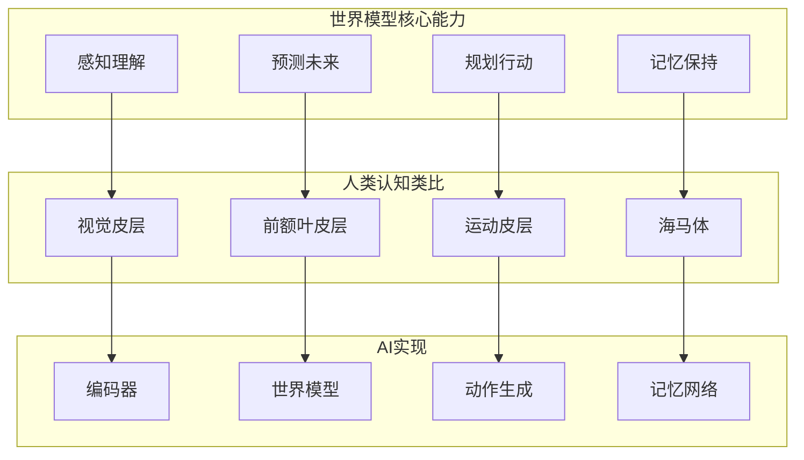
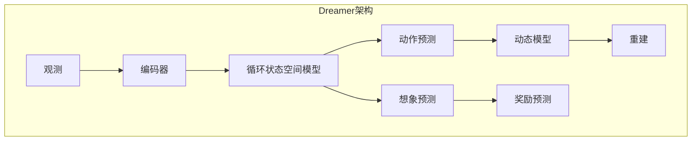
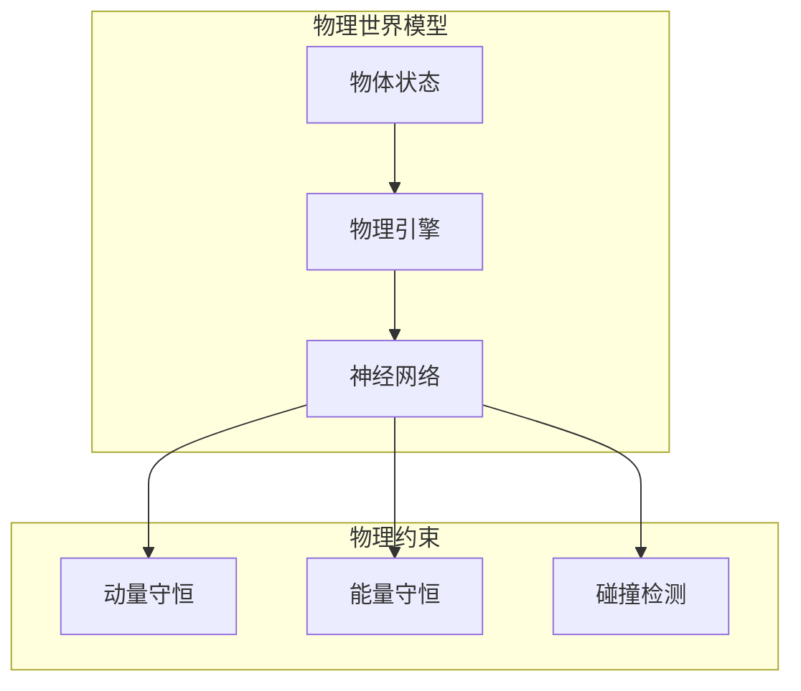
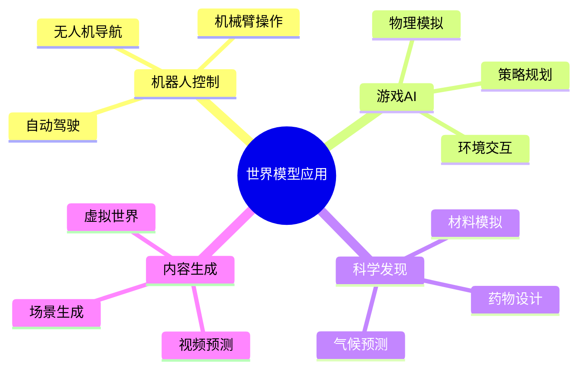

## 概述

世界模型（World Model）是让AI系统理解物理世界运行规律的核心技术。本文深入解析世界模型的基本概念、关键技术及最新进展。

## 世界模型基础

### 定义与意义



### 世界模型分类

| 类型 | 代表工作 | 特点 |
|------|---------|------|
| 梦境/想象 | Dreamer, World Models | 生成式预测 |
| 物理引擎 | PhysNet, NIWA | 物理规律建模 |
| 神经渲染 | NeRF, 3D Gaussian | 视觉重建 |
| 混合模型 | AMAGO, SynJAX | 结合两者 |

## 核心技术

### Dreamer世界模型



### RSSM实现

```python
class RSSM(nn.Module):
    """循环状态空间模型"""
    
    def __init__(self, obs_dim, action_dim, deter_dim=200, stoch_dim=32):
        super().__init__()
        self.deter_dim = deter_dim
        self.stoch_dim = stoch_dim
        
        # 确定性状态GRU
        self.rnn = nn.GRUCell(deter_dim, deter_dim)
        
        # 观测编码器
        self.obs_encoder = nn.Linear(obs_dim, stoch_dim * 2)
        
        # 先行模型
        self.prior = nn.Sequential(
            nn.Linear(deter_dim + action_dim, 400),
            nn.ReLU(),
            nn.Linear(400, stoch_dim * 2)
        )
        
        # 观测解码器
        self.decoder = nn.Sequential(
            nn.Linear(deter_dim + stoch_dim, 400),
            nn.ReLU(),
            nn.Linear(400, obs_dim)
        )
        
        # 奖励预测
        self.reward_model = nn.Sequential(
            nn.Linear(deter_dim + stoch_dim, 400),
            nn.ReLU(),
            nn.Linear(400, 1)
        )
    
    def forward(self, obs, action, prev_deter):
        # 先行：预测先验分布
        prior_input = torch.cat([prev_deter, action], dim=-1)
        prior_params = self.prior(prior_input)
        prior_mean, prior_std = prior_params.chunk(2, dim=-1)
        prior_std = prior_std.exp()
        
        # 后验：更新后验分布
        post_params = self.obs_encoder(obs)
        post_mean, post_std = post_params.chunk(2, dim=-1)
        post_std = post_std.exp()
        
        # 采样
        stoch = torch.randn_like(post_mean) * post_std + post_mean
        
        # 更新确定性状态
        deter = self.rnn(prior_input, prev_deter)
        
        # 重建和奖励
        recon = self.decoder(torch.cat([deter, stoch], dim=-1))
        reward = self.reward_model(torch.cat([deter, stoch], dim=-1))
        
        return deter, stoch, prior_mean, post_mean, recon, reward
```

## 物理世界模型

### 物理规律建模



### 神经物理引擎

```python
class NeuralPhysicsEngine(nn.Module):
    """神经物理引擎"""
    
    def __init__(self, obj_dim):
        super().__init__()
        
        # 物体状态编码
        self.state_encoder = nn.Sequential(
            nn.Linear(obj_dim, 256),
            nn.ReLU(),
            nn.Linear(256, 128)
        )
        
        # 物理预测网络
        self.physics_net = nn.Sequential(
            nn.Linear(128 * 2 + 2, 256),  # 两个物体 + 时间
            nn.ReLU(),
            nn.Linear(256, 256),
            nn.ReLU(),
            nn.Linear(256, 128)  # 预测加速度
        )
        
        # 碰撞检测
        self.collision_net = nn.Sequential(
            nn.Linear(128 * 2, 64),
            nn.ReLU(),
            nn.Linear(64, 1),
            nn.Sigmoid()
        )
    
    def forward(self, obj1, obj2, dt):
        """预测物理交互"""
        s1 = self.state_encoder(obj1)
        s2 = self.state_encoder(obj2)
        
        # 碰撞检测
        collision_prob = self.collision_net(torch.cat([s1, s2], dim=-1))
        
        # 物理预测
        physics_input = torch.cat([s1, s2, dt.unsqueeze(-1)], dim=-1)
        acceleration = self.physics_net(physics_input)
        
        # 应用物理约束
        acceleration = self.apply_constraints(acceleration, collision_prob)
        
        return acceleration, collision_prob
    
    def apply_constraints(self, acceleration, collision):
        """应用物理约束"""
        # 碰撞时动量守恒
        constraint = collision * (-acceleration * 0.5)
        return acceleration + constraint
```

## 应用场景



## 总结

世界模型是实现通用人工智能的关键技术之一，通过让AI学习物理世界的运行规律，我们可以构建更加智能、可靠的AI系统。
