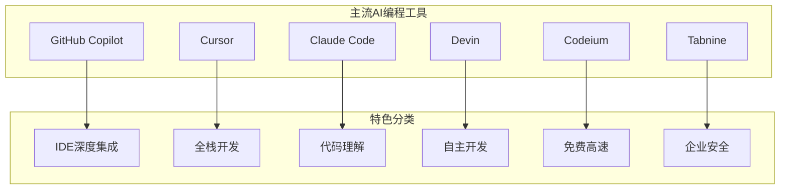
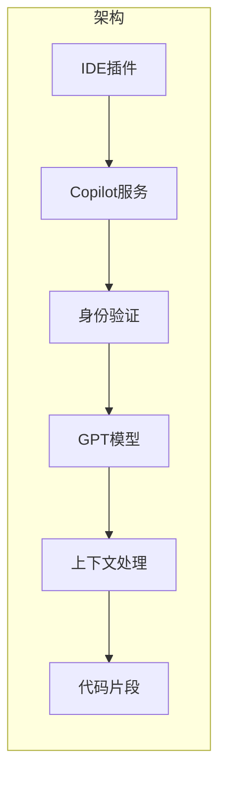
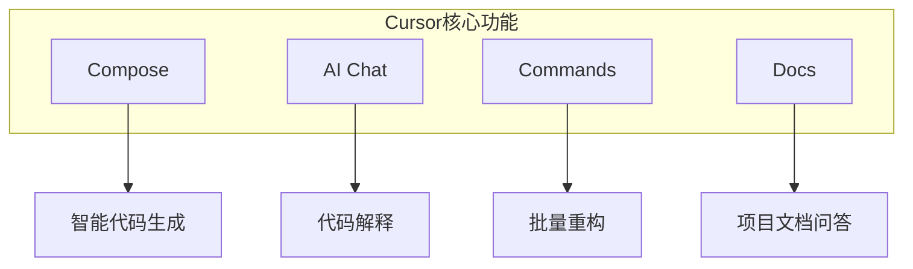
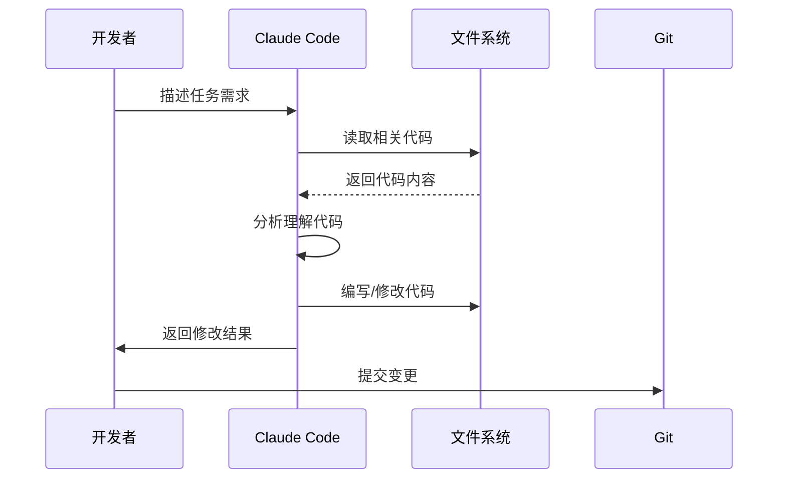
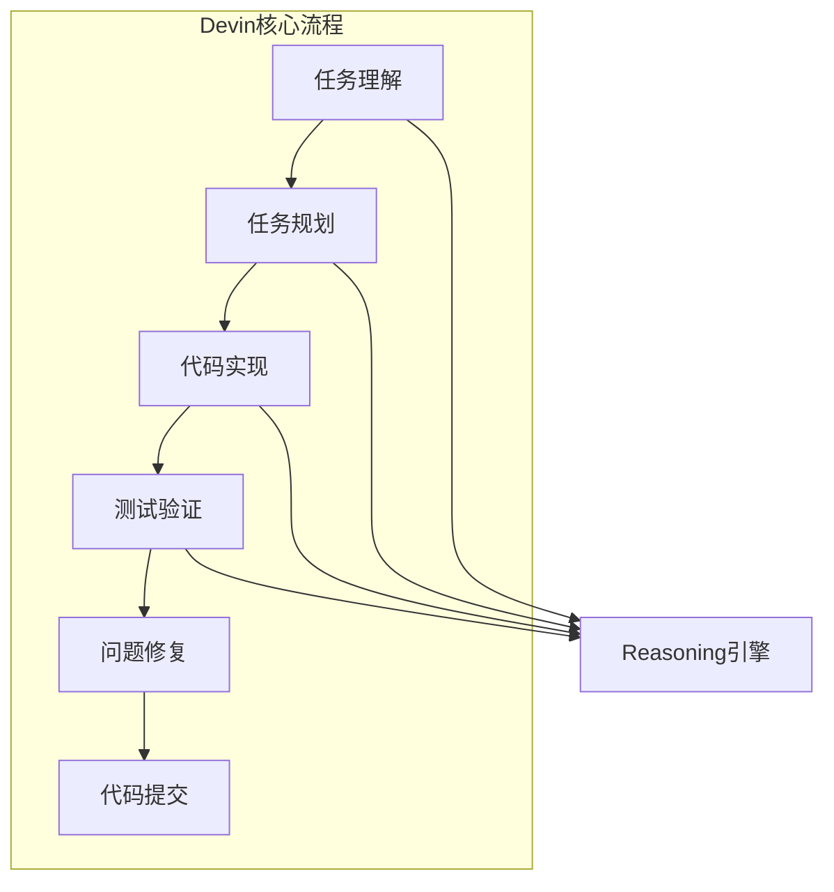
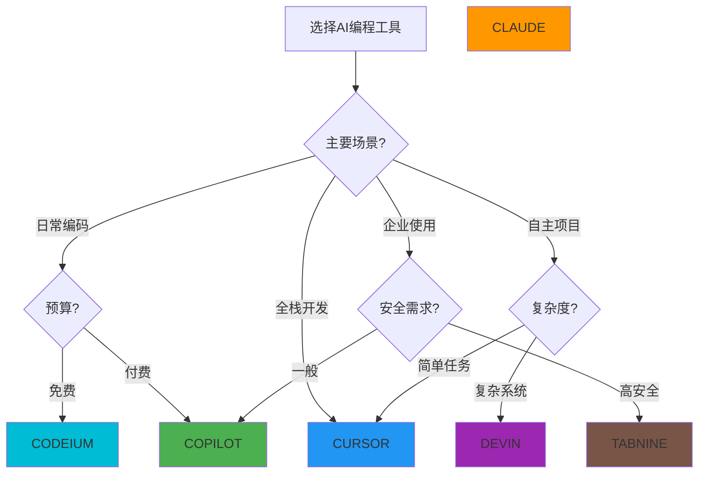
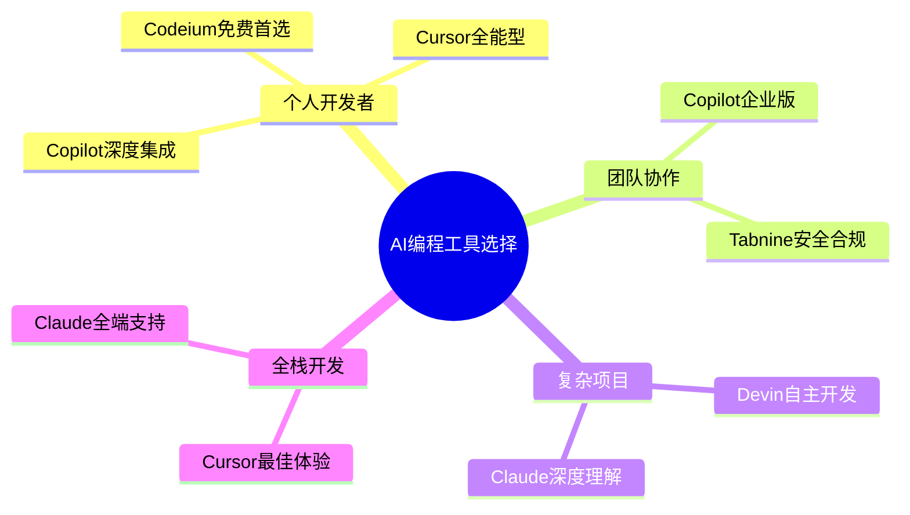

## 概述

2025年AI编程工具市场百花齐放，本文全面对比主流AI编程助手，帮助开发者选择最适合的工具。

## AI编程工具全景图



## 核心功能对比

### 功能矩阵

| 功能 | GitHub Copilot | Cursor | Claude Code | Devin |
|------|----------------|--------|-------------|-------|
| 代码补全 | ✅ | ✅ | ✅ | ✅ |
| 代码解释 | ✅ | ✅ | ✅ | ✅ |
| 代码重构 | ✅ | ✅ | ✅ | ✅ |
| 调试辅助 | ✅ | ✅ | ✅ | ✅ |
| 多文件编辑 | ✅ | ✅ | ✅ | ✅ |
| 自主Agent | ❌ | ⚠️ | ✅ | ✅ |
| 对话式编程 | ✅ | ✅ | ✅ | ✅ |
| 终端集成 | ❌ | ❌ | ✅ | ✅ |

## 各工具深度解析

### GitHub Copilot



**优势：**
- 深度集成VS Code、JetBrains等主流IDE
- 上下文理解能力强
- 企业级安全性

**价格：**
| 套餐 | 月费 | 年费 |
|------|------|------|
| 个人版 | $10 | $100 |
| 商业版 | $19 | $228 |
| 企业版 | $39 | $468 |

### Cursor



**独特优势：**
- **Compose**：描述性代码生成
- **Tab补全**：预测性代码补全
- **多模型选择**：Claude 3.5/GPT-4/GPT-4o

```python
# Cursor API示例
import cursor

# 创建项目上下文
project = cursor.Project("./my-project")

# 批量重构
project.refactor(
    pattern="def old_function",
    replacement="async def new_function"
)

# 生成测试
project.generate_tests(file="src/utils.py")
```

### Claude Code



**核心能力：**
- 终端直接集成
- 代码库深度理解
- 自主文件编辑
- Git操作自动化

```bash
# Claude Code命令示例
claude "实现用户认证模块"
claude "为API添加单元测试"
claude "重构登录逻辑使用JWT"
```

### Devin AI



**革命性特点：**
- 端到端任务完成
- 自主调试修复
- 全栈开发能力
- 持续学习适应

## 性能实测对比

### 代码补全速度

```mermaid
gantt
    title 代码补全响应时间 (ms)
    dateFormat  X
    axisFormat  %s ms
    
    section 补全速度
    Copilot     :0, 150
    Cursor      :0, 200
    Claude Code :0, 300
    Codeium     :0, 100
```



### 代码生成质量（HumanEval测试）

| 工具 | Pass@1 | Pass@10 | Pass@100 |
|------|--------|---------|----------|
| Claude 3.5 | 92.0% | 96.5% | 98.1% |
| GPT-4o | 90.2% | 95.8% | 97.5% |
| Cursor | 89.5% | 95.2% | 97.0% |
| Copilot | 87.3% | 94.0% | 96.2% |

## 选择指南



## 使用技巧

### Cursor最佳实践

```python
# 1. 使用@添加上下文
@src/components/Button.tsx
生成一个支持loading状态的按钮

# 2. Cmd+K快速编辑
Cmd+K后选择代码片段
描述要做的修改

# 3. Cmd+Shift+L全局搜索替换
批量修改变量名
跨文件重构
```

### Claude Code进阶用法

```bash
# 1. 项目级上下文
cd /my-project
claude "分析这个项目的架构"

# 2. Git操作
claude "创建一个新分支并实现功能"
claude "审查当前分支的改动"

# 3. 终端辅助
# 在终端直接运行
claude "帮我调试这个错误"
```

## 总结



2025年AI编程工具已经相当成熟，选择时应根据团队规模、项目需求和预算综合考虑。对于大多数开发者来说，**Cursor**凭借其全面的功能和优秀的用户体验是首选；对于企业用户，**GitHub Copilot**的企业级安全和管理功能更合适。
