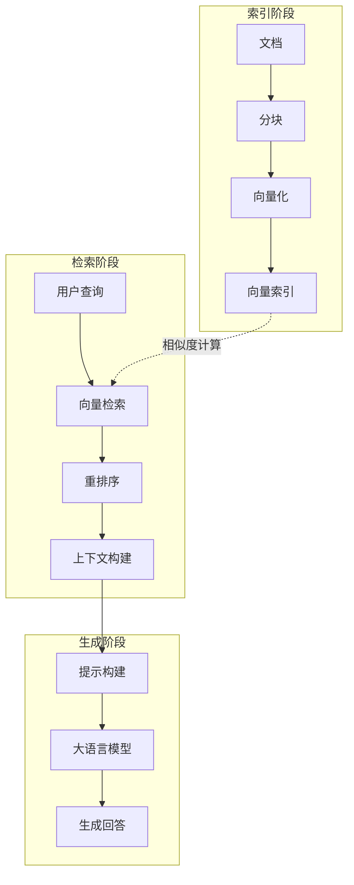
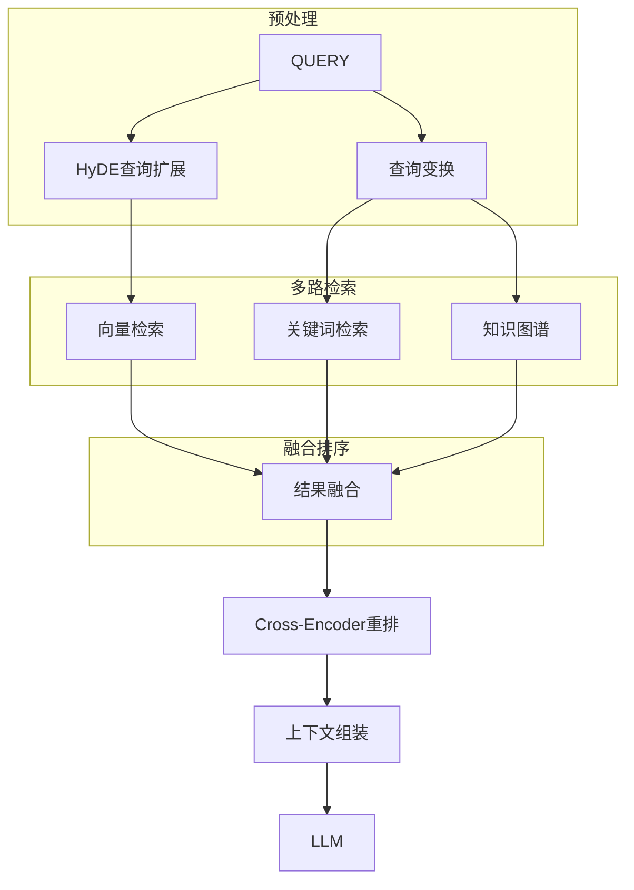
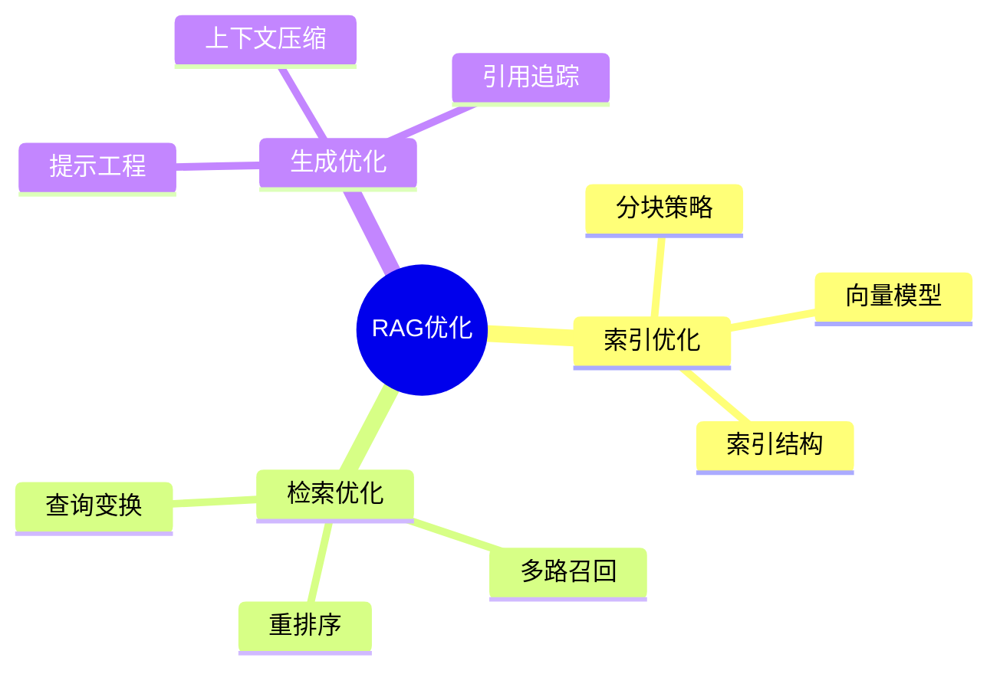

## 概述

RAG（Retrieval-Augmented Generation）是构建知识密集型AI应用的核心技术。本文系统介绍RAG从基础到高级优化的完整技术栈。

## RAG核心流程



## 高级RAG架构

### 完整RAG Pipeline



## 实现代码

### 高级RAG Pipeline

```python
from langchain.vectorstores import Chroma
from langchain.embeddings import OpenAIEmbeddings
from sentence_transformers import CrossEncoder

class AdvancedRAG:
    """高级RAG系统"""
    
    def __init__(self, model_name="gpt-4o"):
        self.embeddings = OpenAIEmbeddings()
        self.vectorstore = Chroma(
            persist_directory="./chroma_db",
            embedding_function=self.embeddings
        )
        self.reranker = CrossEncoder('cross-encoder/ms-marco-MiniLM-L-6-v2')
        self.llm = model_name
    
    def retrieve(self, query, top_k=10):
        """多路检索"""
        # 向量检索
        vector_results = self.vectorstore.similarity_search(query, k=top_k)
        
        # BM25关键词检索
        bm25_results = self.bm25_search(query, top_k)
        
        # 知识图谱检索
        kg_results = self.kg_search(query, top_k)
        
        # 融合结果
        fused_results = self Reciprocal_Rank_Fusion(
            [vector_results, bm25_results, kg_results],
            k=60
        )
        
        return fused_results
    
    def rerank(self, query, documents):
        """Cross-Encoder重排"""
        pairs = [(query, doc.page_content) for doc in documents]
        scores = self.reranker.predict(pairs)
        
        ranked_indices = sorted(range(len(scores)), 
                               key=lambda i: scores[i], 
                               reverse=True)
        
        return [documents[i] for i in ranked_indices[:5]]
    
    def generate(self, query, context):
        """生成回答"""
        prompt = f"""
你是一个专业的AI助手。以下是相关的背景信息：

{context}

用户问题：{query}

请基于以上信息，给出准确、详细的回答。
"""
        return self.llm.generate(prompt)
```

## RAG优化技术

### 查询优化

| 技术 | 说明 | 效果 |
|------|------|------|
| HyDE | 生成假设性答案再检索 | +15% |
| Query Decomposition | 分解复杂查询 | +12% |
| Step-back | 抽象化再检索 | +10% |
| Query Expansion | 同义词扩展 | +8% |

### 索引优化

| 技术 | 说明 | 适用场景 |
|------|------|----------|
| Parent Document | 保留父文档上下文 | 复杂问题 |
| Sentence Window | 句子窗口检索 | 精确匹配 |
| Auto-merging | 自动合并相关块 | 连贯性要求高 |

## 总结



RAG是构建企业级AI应用的核心技术，需要根据具体场景不断优化。
