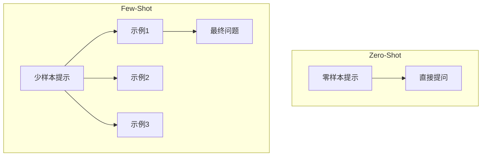
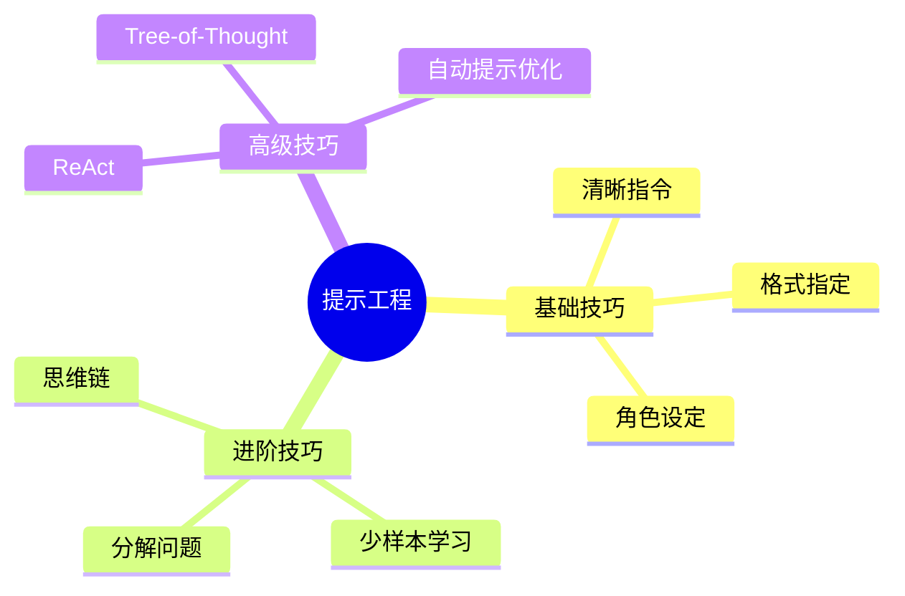

## 概述

提示工程是发挥大模型能力的关键技术，本文介绍从基础到高级的提示技巧。

## 提示工程核心技巧

### 零样本 vs 少样本



### 思维链提示

```python
class ChainOfThought:
    """思维链提示"""
    
    def zero_shot_cot(self, question):
        """零样本思维链"""
        prompt = f"""
问题: {question}

请逐步思考，然后给出答案。
"""
        return self.llm.generate(prompt)
    
    def few_shot_cot(self, question, examples):
        """少样本思维链"""
        prompt = "请逐步推理：\n\n"
        for ex in examples:
            prompt += f"问题: {ex['q']}\n思考: {ex['thought']}\n答案: {ex['a']}\n\n"
        prompt += f"问题: {question}\n思考:"
        return self.llm.generate(prompt)
```

## 高级提示模式

| 模式 | 适用场景 | 效果提升 |
|------|----------|----------|
| CoT | 推理任务 | +30% |
| Few-Shot | 格式要求 | +50% |
| ReAct | 工具使用 | +100% |
| Tree-of-Thought | 复杂决策 | +40% |

## 总结



掌握提示工程能显著提升大模型的使用效率和输出质量。
