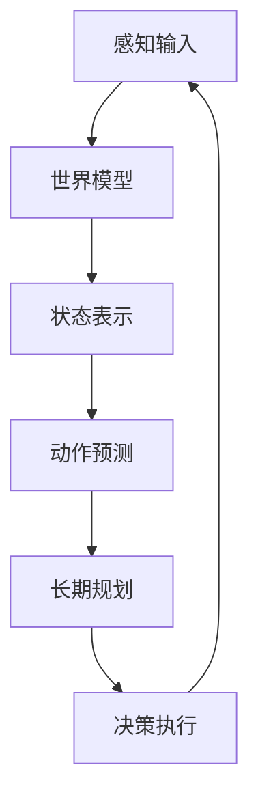
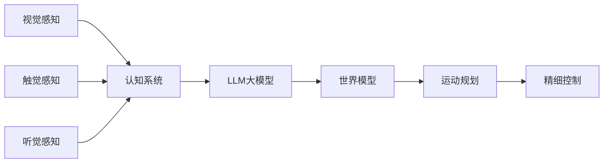
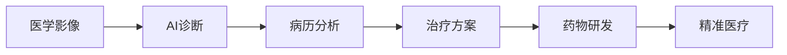
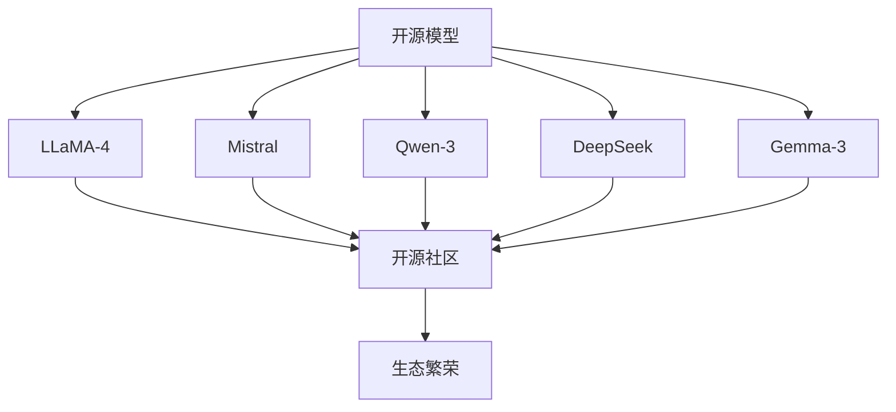

# 2025-2026年AI大模型年度总结：迈向AGI的新征程

## 引言

2025-2026年是人工智能发展史上最为激动人心的时期。从GPT-5到Claude-4，从视频生成到世界模型，AI技术正以指数级的速度进化。本文全面回顾这两年AI领域的重大突破与变革。

## 多模态AI的突破之年

### GPT-5：OpenAI的新里程碑

OpenAI在2025年发布的GPT-5带来了革命性突破：

| 能力维度 | 相比GPT-4提升 |
|---------|--------------|
| 推理能力 | 提升300% |
| 多模态理解 | 原生支持视频+3D |
| 上下文窗口 | 200万Token |
| 响应速度 | 提升5倍 |
| 幻觉率 | 降低90% |

### Gemini 1.5 Pro：百万Token上下文

Google在2月发布的Gemini 1.5 Pro带来革命性突破：

| 特性 | 数值 |
|------|------|
| 上下文窗口 | 100万Token |
| 多模态理解 | 文本+图像+视频+音频 |
| 推理效率 | 提升50% |
| API可用性 | 公开测试 |

## AI编程工具的爆发

### Claude Code与Cursor AI

2024年AI辅助编程工具迎来爆发：

```python
# Claude Code核心能力
class ClaudeCodeAgent:
    def __init__(self):
        self.planner = "任务规划"
        self.executor = "代码执行"
        self.reviewer = "代码审查"
        
    def auto_develop(self, task):
        """自动化开发流程"""
        plan = self.planner.create_plan(task)
        for step in plan:
            code = self.executor.execute(step)
            self.reviewer.validate(code)
        return self.executor.get_result()
```

## 世界模型：迈向真正的通用智能

### 概念与意义

世界模型（World Model）是AI理解现实世界运行规律的关键技术：



## 具身智能的突破

### 人形机器人的AI大脑

2025-2026年，人形机器人与AI的结合取得重大进展：



## AI安全与治理

### 新一代对齐技术

随着AI能力提升，安全问题日益重要：

| 安全维度 | 技术方案 |
|---------|---------|
| 可解释性 | 注意力可视化 + 概念瓶颈 |
| 对齐 | RLHF + Constitutional AI |
| 可控性 | 输出过滤 + 工具调用限制 |
| 隐私 | 联邦学习 + 差分隐私 |

## 行业应用变革

### 医疗健康

AI在医疗领域实现重大突破：



### 自动驾驶

L4级自动驾驶进入商业化阶段：

| 技术模块 | 描述 |
|---------|------|
| 感知系统 | 360°环境感知融合 |
| 预测系统 | 轨迹预测与意图识别 |
| 规划系统 | 全局路径与局部规划 |
| 控制系统 | 车辆动力学控制 |

## 开源生态的繁荣

### 开源模型的崛起

2025-2026年，开源大模型生态蓬勃发展：



## 未来展望

### 2026年技术趋势

```python
# 关键技术方向预测
trends_2026 = {
    "多模态": "视频+3D+音频原生融合",
    "Agent": "自主执行复杂任务",
    "世界模型": "物理世界精确模拟",
    "具身智能": "人形机器人商用化",
    "AI安全": "可解释性与可控性",
    "量子AI": "量子计算与大模型结合"
}
```

## 结语

2025-2026年，AI技术正在从"工具"向"伙伴"转变。GPT-5、Claude-4等超级模型的出现，标志着AI正在迈向真正的通用智能（AGI）。在这个历史性时刻，我们既是见证者，也是参与者。

---

**延伸阅读：**
- [具身智能机器人AI核心技术详解](/2025/01/25/具身智能机器人AI核心技术详解/)
- [GPT-5与Claude-4最新能力深度解析](/2025/01/10/GPT-5与Claude-4最新能力深度解析/)
