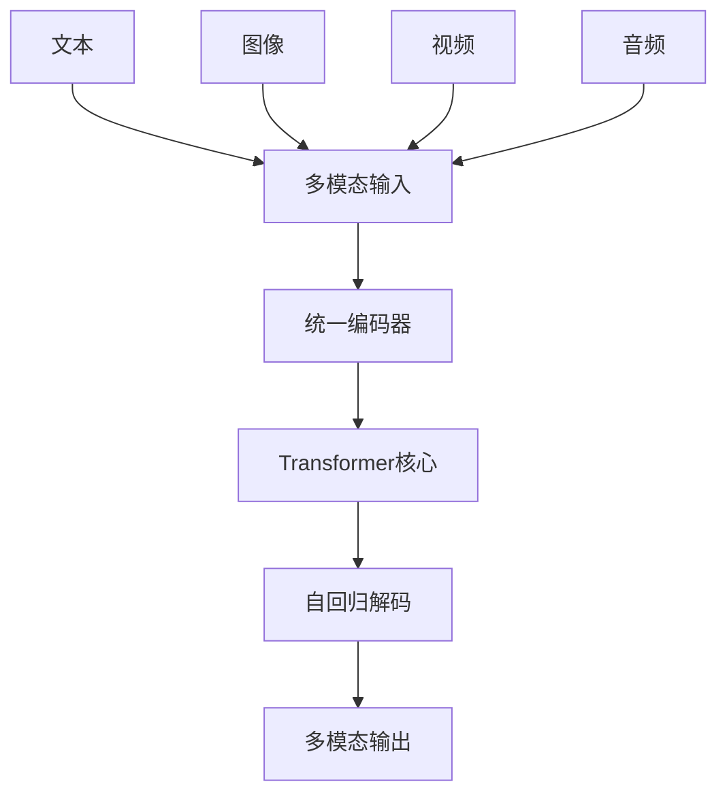
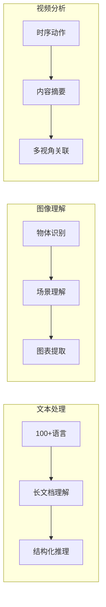
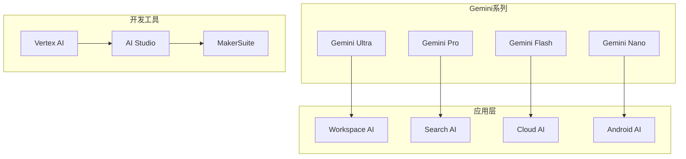
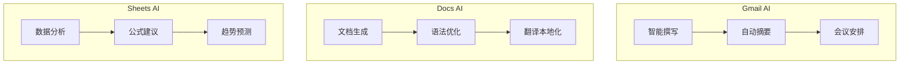
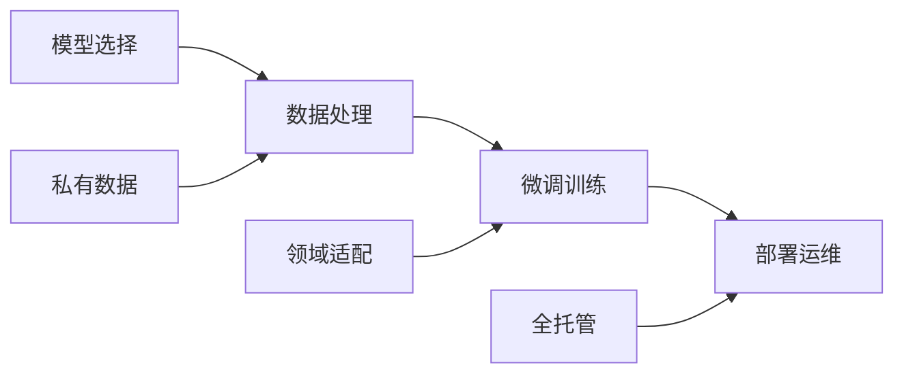
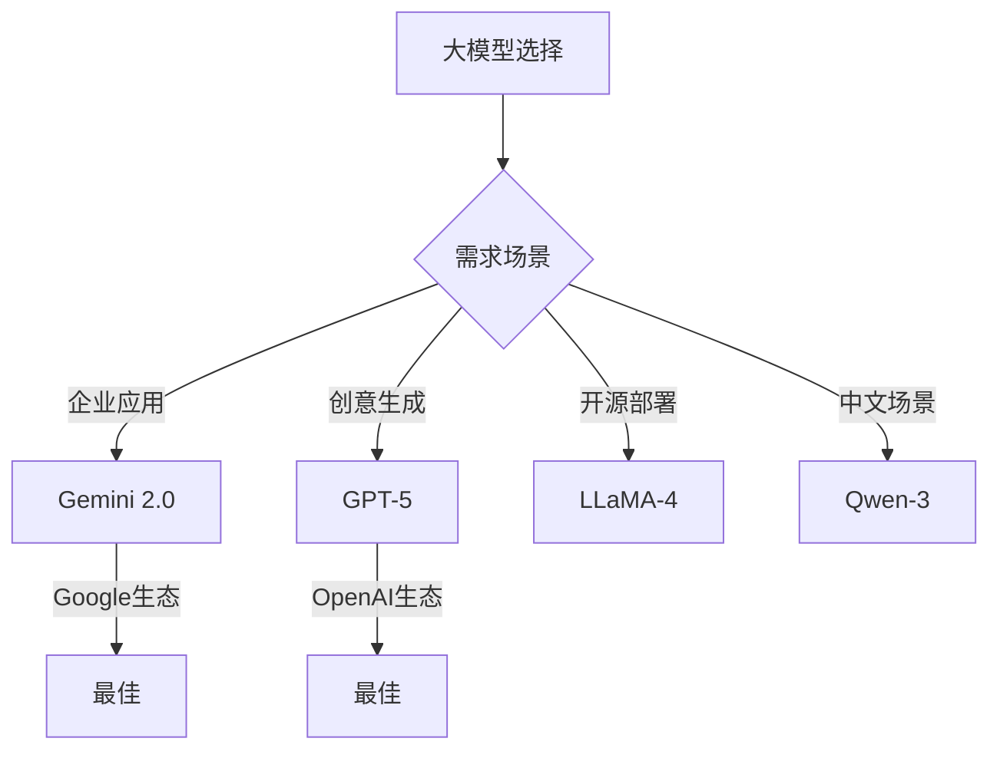
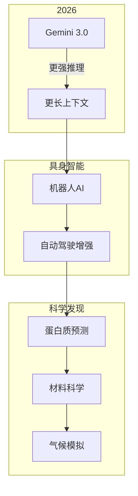

# Gemini 2.0与Google AI生态系统深度解析

## 引言

Google在2025年发布的Gemini 2.0代表了大模型发展的新高度。作为Google AI战略的核心，Gemini 2.0不仅在技术能力上实现突破，更构建了完整的AI生态系统。

## Gemini 2.0 技术架构

### 核心设计理念

Gemini 2.0采用全新的技术架构设计：



### 技术突破详解

#### 1. 原生多模态融合



#### 2. 超长上下文处理

| 特性 | 描述 |
|------|------|
| 上下文窗口 | 200万Token |
| 处理能力 | 完整代码库理解 |
| 文档理解 | 千页PDF精准 |

```python
# Gemini 2.0 上下文处理
context_window = 2_000_000  # 200万Token

applications = {
    "代码库理解": "完整项目代码分析与重构",
    "长文档分析": "千页PDF精准理解",
    "视频理解": "数小时长视频内容提取",
    "多文件关联": "跨文档知识整合"
}
```

## Google AI生态系统

### 产品矩阵



### 技术栈整合

```python
# Google Cloud AI 技术栈
GoogleCloudAI = {
    "基础模型": ["Gemini", "PaLM", "Imagen", "MusicLM"],
    "微调工具": ["Vertex AI Fine-tuning", "AutoML"],
    "部署方案": ["Cloud Endpoints", "Serverless"],
    "企业特性": ["数据安全", "合规认证", "SLA保障"]
}
```

## 实际应用案例

### 1. Google Workspace集成



### 2. Vertex AI企业应用



## 技术对比

### Gemini 2.0 vs GPT-5

| 维度 | Gemini 2.0 | GPT-5 |
|------|------------|-------|
| 多模态 | 原生融合 | 整合架构 |
| 上下文 | 200万Token | 100万Token |
| 推理速度 | TPU优化 | GPU优化 |
| 生态整合 | Google全家桶 | 独立API |
| 价格 | 性价比高 | 订阅制 |



## 开发实践

### Vertex AI 调用示例

```python
import vertexai
from vertexai.generative_models import GenerativeModel

# 初始化
vertexai.init(project="my-project", location="us-central1")

# 创建模型
model = GenerativeModel("gemini-2.0-pro")

# 多模态请求
response = model.generate_content([
    "分析这张图片中的数据结构",
    {"text": "请用Python代码实现对应的数据处理逻辑"}
])
```

## 未来展望

### Google AI路线图



## 结语

Gemini 2.0不仅是技术突破，更是Google AI生态系统的集大成者。从底层模型到上层应用，Google正在构建AI时代的基础设施。

---

**相关阅读：**
- [GPT-5与Claude-4最新能力深度解析](/2025/01/10/GPT-5与Claude-4最新能力深度解析/)
