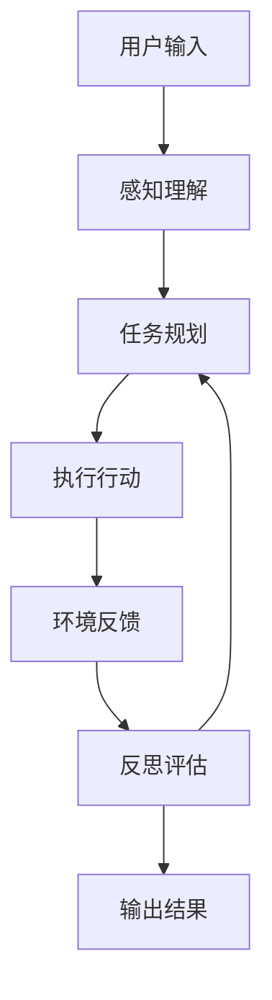
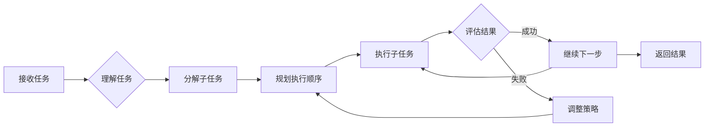
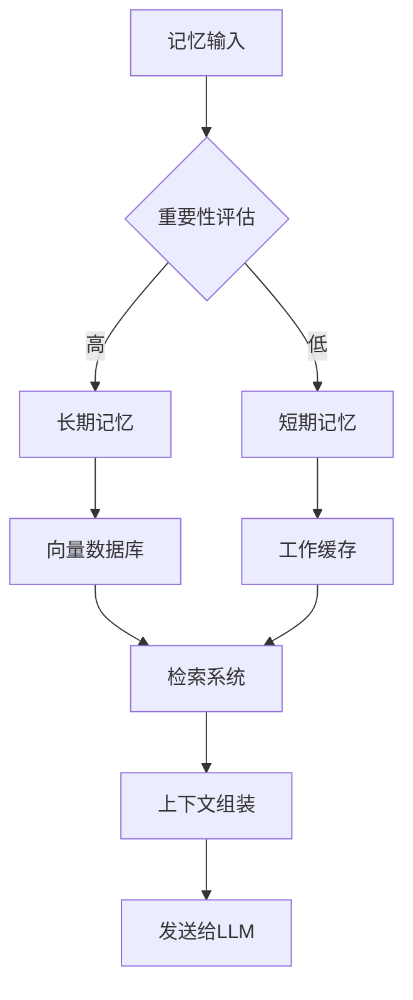
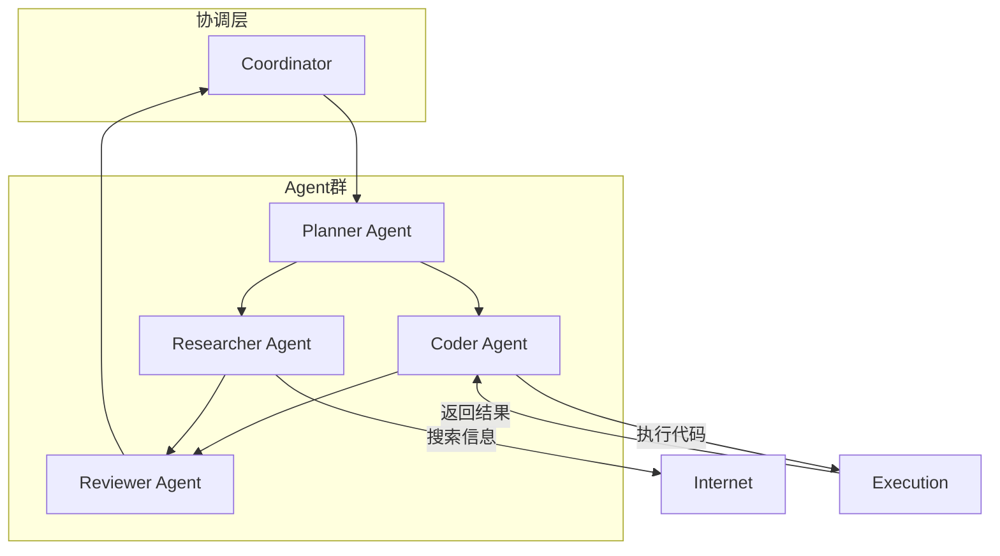
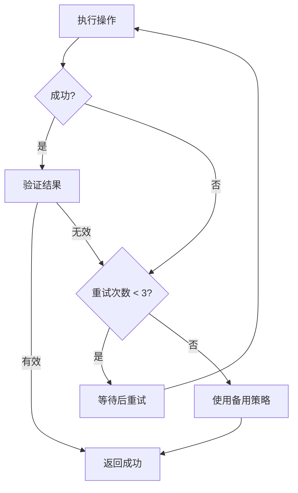
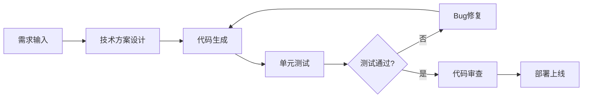
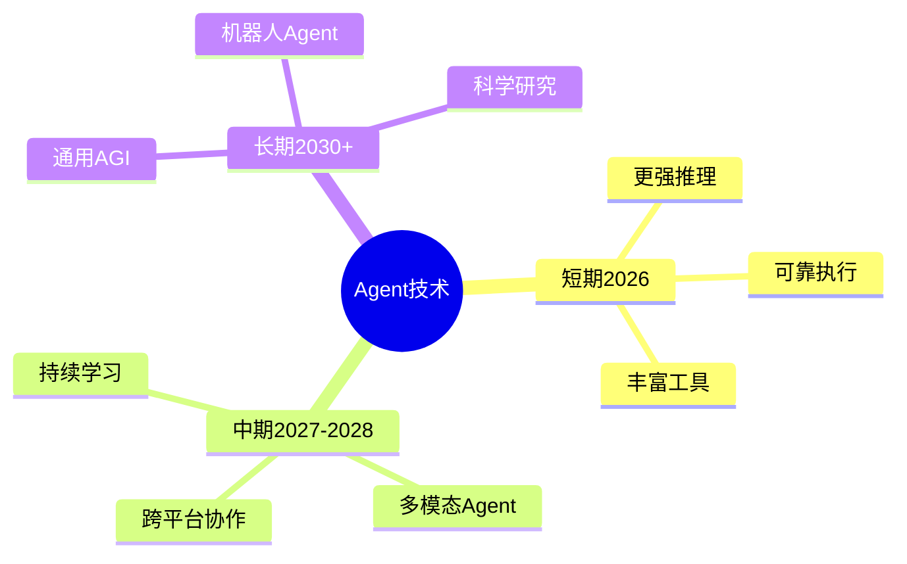

# AI Agent 2.0：自主智能体的架构设计与实践

## 引言

AI Agent（智能体）是2025-2026年AI领域最热门的研究方向之一。从AutoGPT到Manus，从单Agent到多Agent协作，AI Agent正在重新定义人机交互方式。

## AI Agent 核心概念

### 什么是AI Agent

AI Agent是一种能够自主理解目标、规划行动、执行任务并自我反思的智能系统：



### Agent能力矩阵

| 能力维度 | 描述 | 技术实现 |
|---------|------|---------|
| 感知 | 环境信息理解 | 多模态大模型 |
| 规划 | 任务分解与路径规划 | CoT/ToT推理 |
| 行动 | 调用工具执行 | Function Calling |
| 记忆 | 知识存储与检索 | Vector DB |
| 反思 | 结果评估与优化 | Self-Reflection |

## AI Agent 2.0 架构设计

### 核心组件

```python
# AI Agent 2.0 核心架构
class AIAgent2:
    def __init__(self):
        self.llm = "大语言模型核心"
        self.planner = "任务规划器"
        self.memory = "记忆系统"
        self.tools = "工具库"
        self.executor = "执行器"
        self.reflector = "反思评估器"
```

### Agent工作流程



## 关键技术详解

### 1. 任务规划

```python
# 任务规划器实现
class TaskPlanner:
    def decompose(self, task):
        """任务分解"""
        prompt = f"请将任务分解为可执行子任务：{task}"
        return self.llm.generate(prompt).split('\n')
```

### 2. 工具调用

```python
# 工具调用系统
class ToolSystem:
    tools = {
        "search": self.web_search,
        "code": self.execute_code,
        "file": self.read_write_file,
        "api": self.call_api,
        "browser": self.browser_control
    }
```

### 3. 记忆系统



### 4. 自我反思

```python
# 反思评估器
class Reflector:
    def evaluate(self, action, result):
        """评估行动结果"""
        # 判断是否成功
        # 分析错误原因
        # 提出改进建议
        pass
```

## 工程实践

### 多Agent协作系统



### 容错与恢复机制



## 主流Agent框架

| 框架 | 开发公司 | 核心特点 | 适用场景 |
|------|---------|---------|---------|
| LangChain Agents | LangChain | 工具丰富 | 快速开发 |
| AutoGPT | Significant | 自主性强 | 探索性任务 |
| CrewAI | CrewAI | 多Agent协作 | 复杂工作流 |
| AutoGen | Microsoft | 对话协作 | 企业应用 |

## 应用场景

### 1. 自动化编程



### 2. 企业自动化

| RPA增强 | 功能描述 |
|--------|---------|
| 文档处理 | 自动分类、提取、归档 |
| 客户服务 | 智能问答、工单处理 |
| 数据分析 | 自动报表、趋势预测 |

## 未来展望

### 技术发展方向



## 结语

AI Agent 2.0代表了人工智能从"工具"向"助手"的跨越。掌握Agent架构设计与实践，将成为AI工程师的核心能力。

---

**相关阅读：**
- [AutoGPT与AI-Agent自主代理技术原理与实践](/2023/06/18/AutoGPT与AI-Agent自主代理技术原理与实践/)
