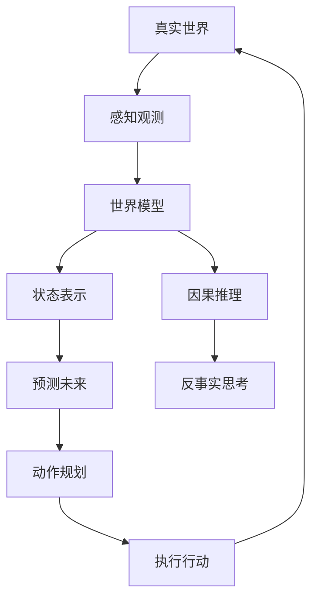
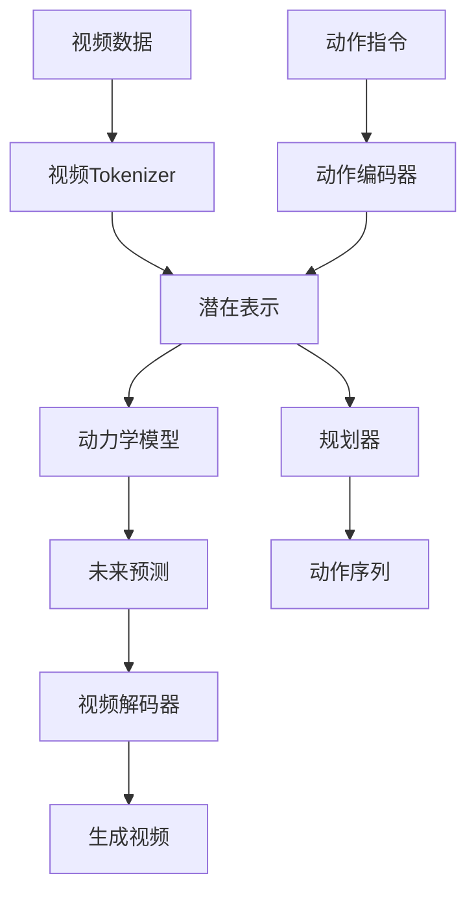
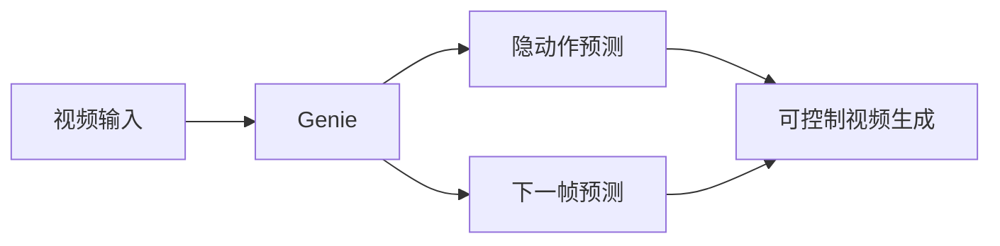
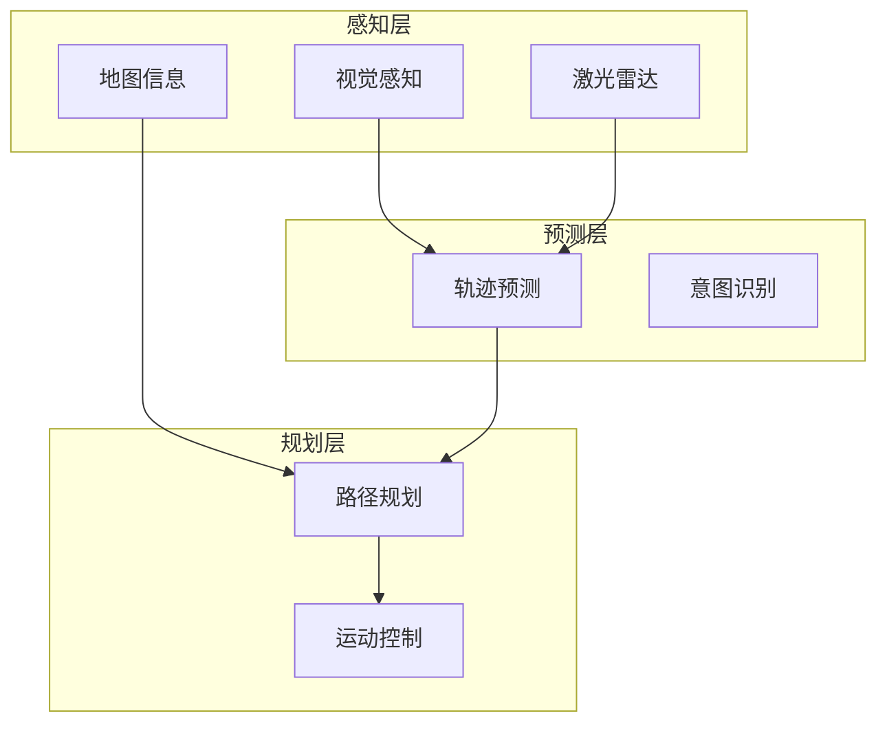
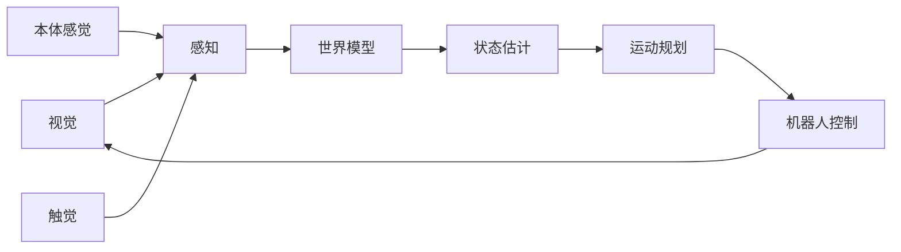
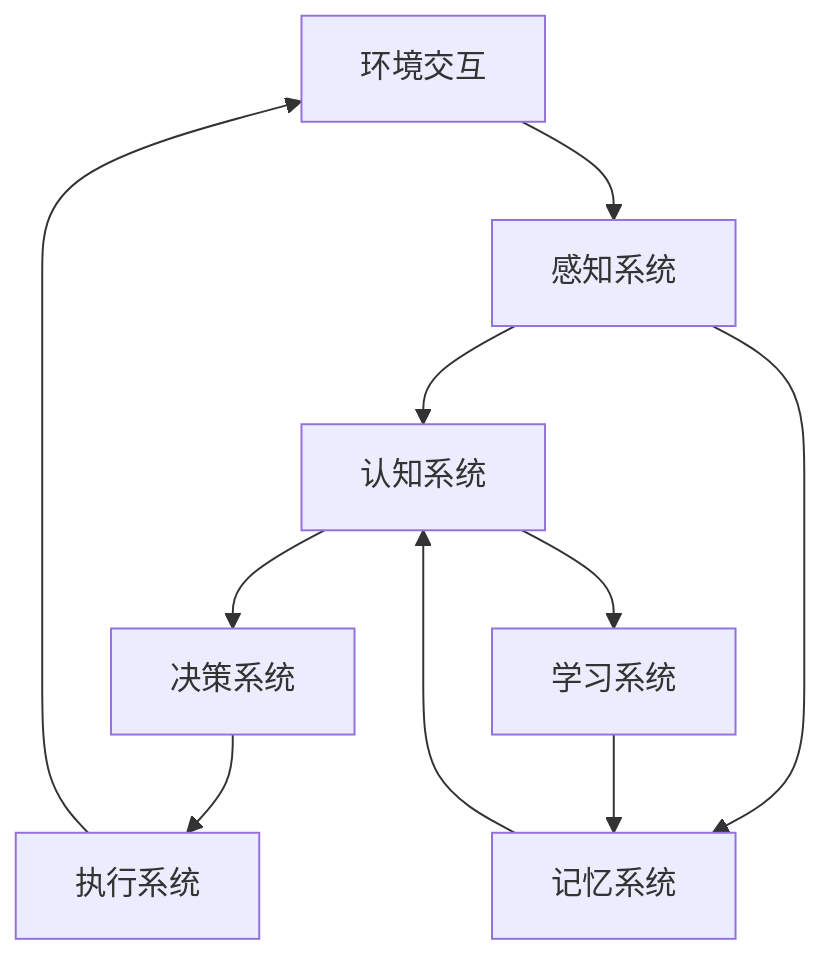
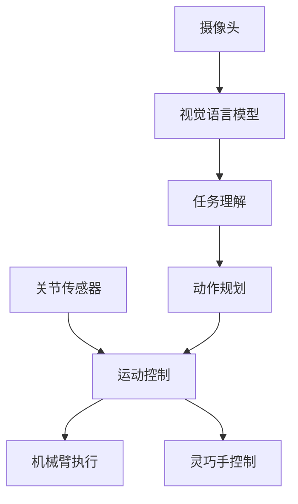
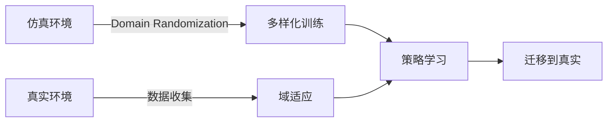
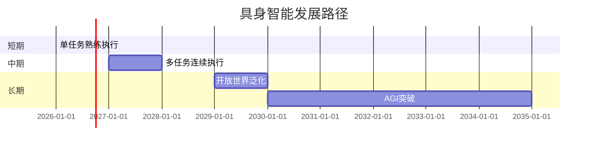

# 世界模型与具身智能：AI理解物理世界的新范式

## 引言

2025-2026年，AI领域最激动人心的突破之一是世界模型与具身智能的深度融合。Google的Genie、OpenAI的物理引擎、Figure和Tesla Optimus的进展，都在指向一个方向：让AI真正"理解"物理世界的运行规律。

## 什么是世界模型

### 核心概念

世界模型是AI系统对环境动态变化规律的内部表示：



### 能力层级

| 层级 | 能力 | 典型任务 |
|------|------|---------|
| L1 | 感知理解 | 物体识别、场景理解 |
| L2 | 状态预测 | 物理模拟、运动预测 |
| L3 | 因果推理 | 反事实思考、干预效果 |
| L4 | 规划决策 | 多步规划、目标达成 |
| L5 | 常识理解 | 日常知识、物理直觉 |

## 世界模型技术架构

### 核心组件

```python
# 世界模型核心架构
class WorldModel:
    def __init__(self):
        self.encoder = "多模态状态编码器"
        self.dynamics = "世界动力学模型"
        self.predictor = "未来状态预测器"
        self.planner = "规划与决策器"
```

### 关键技术



## 典型模型解析

### 1. Google Genie系列



### 2. 自动驾驶世界模型



### 3. 机器人操作世界模型



## 具身智能系统架构

### 核心概念

具身智能强调智能体通过身体与环境交互来学习和理解世界：



### 系统架构

```python
# 具身智能完整架构
class EmbodiedAI:
    def __init__(self):
        self.perception = {
            "vision": VisionModule(),
            "touch": TactileModule(),
            "proprio": ProprioceptionModule(),
        }
        self.cognition = {
            "world_model": WorldModel(),
            "planner": HierarchicalPlanner(),
        }
        self.motor = {
            "low_level": LowLevelController(),
            "high_level": TaskPlanner(),
        }
```

## 前沿进展

### Figure 02 人形机器人

| 组件 | 规格 |
|------|------|
| 自由度 | 全身52个自由度 |
| 手部 | 灵巧双手14自由度 |
| 电池续航 | 5小时 |
| AI能力 | GPT-4o级别视觉语言模型 |



### Tesla Optimus


## 工程实践

### 数据采集与仿真

```python
# 具身智能数据采集
class DataCollection:
    def collect_demos(self, task):
        """采集演示数据"""
        # 遥操作采集
        teleop_data = self.simulation.teleop(task)
        # 仿真数据增强
        sim_data = self.simulation.generate(task)
        return teleop_data + sim_data
```

### sim2real迁移



## 未来展望

### 技术路线图



## 结语

世界模型与具身智能代表了AI从"数字世界"走向"物理世界"的关键跨越。未来十年，具身智能将成为AI领域最重要的研究方向之一。

---

**相关阅读：**
- [具身智能机器人AI核心技术详解](/2025/01/25/具身智能机器人AI核心技术详解/)
