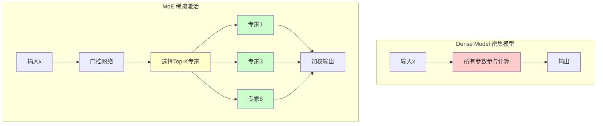
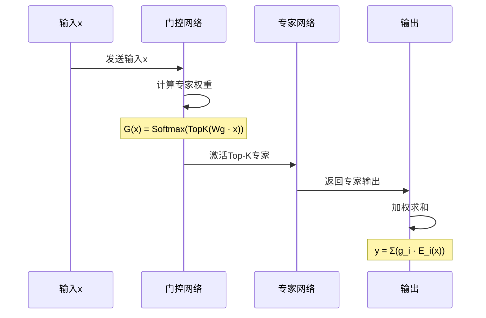
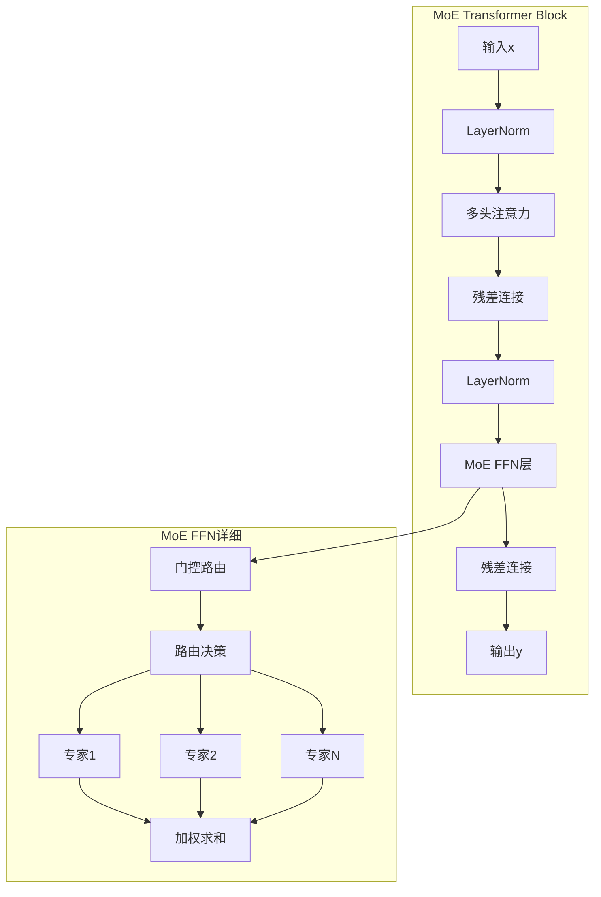
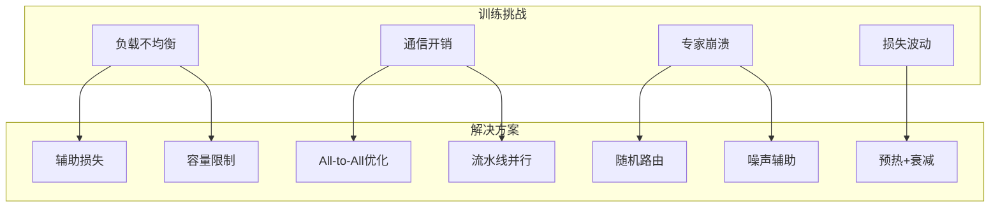
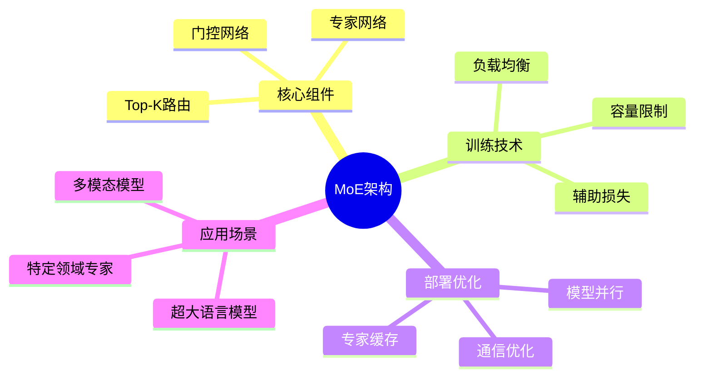

## 概述

Mixture of Experts (MoE) 混合专家模型是一种突破性的模型架构，通过稀疏激活机制实现大规模参数的同时保持高效计算。本文深入解析MoE的原理、实现和应用。

## MoE核心原理

### 密集模型 vs 稀疏模型



### 门控机制详解



## MoE架构实现

### 基础MoE层

```python
import torch
import torch.nn as nn
import torch.nn.functional as F
import math

class MoELayer(nn.Module):
    """Mixture of Experts层实现"""
    
    def __init__(self, d_model, num_experts, top_k=2, dropout=0.0):
        super().__init__()
        self.num_experts = num_experts
        self.top_k = top_k
        
        # 专家网络
        self.experts = nn.ModuleList([
            nn.Sequential(
                nn.Linear(d_model, d_model * 4),
                nn.GELU(),
                nn.Dropout(dropout),
                nn.Linear(d_model * 4, d_model)
            )
            for _ in range(num_experts)
        ])
        
        # 门控网络
        self.gate = nn.Linear(d_model, num_experts, bias=False)
        
        # 辅助损失参数
        self.alpha = 0.01  # 负载均衡损失权重
    
    def forward(self, x):
        """
        Args:
            x: [batch_size, seq_len, d_model]
        Returns:
            output: [batch_size, seq_len, d_model]
            aux_loss: 辅助损失（用于训练）
        """
        batch_size, seq_len, d_model = x.shape
        
        # 重塑为序列形式
        x_flat = x.view(-1, d_model)  # [B*L, D]
        
        # 计算门控权重
        gate_logits = self.gate(x_flat)  # [B*L, num_experts]
        gate_weights = F.softmax(gate_logits, dim=-1)  # [B*L, num_experts]
        
        # 选择Top-K专家
        top_k_weights, top_k_indices = torch.topk(
            gate_weights, self.top_k, dim=-1
        )
        
        # 归一化
        top_k_weights = top_k_weights / top_k_weights.sum(dim=-1, keepdim=True)
        
        # 初始化输出
        output = torch.zeros_like(x_flat)
        
        # 遍历每个token
        for i in range(batch_size * seq_len):
            for j in range(self.top_k):
                expert_idx = top_k_indices[i, j].item()
                expert_weight = top_k_weights[i, j]
                output[i] += expert_weight * self.experts[expert_idx](x_flat[i:i+1])
        
        # 计算辅助损失（负载均衡）
        aux_loss = self._load_balancing_loss(gate_weights, top_k_indices)
        
        return output.view(batch_size, seq_len, d_model), aux_loss
    
    def _load_balancing_loss(self, gate_weights, top_k_indices):
        """
        负载均衡损失：鼓励专家被均匀选择
        """
        # 计算每个专家被选中的频率
        num_tokens = gate_weights.shape[0]
        expert_counts = torch.zeros(self.num_experts, device=x.device)
        
        for i in range(num_tokens):
            for j in range(self.top_k):
                expert_idx = top_k_indices[i, j].item()
                expert_counts[expert_idx] += 1
        
        expert_probs = expert_counts / (num_tokens * self.top_k)
        
        # 计算平均门控权重
        avg_gate_prob = gate_weights.mean(dim=0)
        
        # 辅助损失 = Σ(pi · ai)
        aux_loss = self.num_experts * torch.sum(avg_gate_prob * expert_probs)
        
        return aux_loss
```

### Switch Transformer实现

```python
class SwitchTransformerLayer(nn.Module):
    """Switch Transformer层 - MoE的简化版本"""
    
    def __init__(self, d_model, num_experts=8, capacity_factor=1.25):
        super().__init__()
        self.capacity_factor = capacity_factor
        self.num_experts = num_experts
        
        # Switch层：每个token只路由到一个专家
        self.experts = nn.ModuleList([
            nn.Sequential(
                nn.Linear(d_model, d_model * 2),
                nn.GELU(),
                nn.Linear(d_model * 2, d_model)
            )
            for _ in range(num_experts)
        ])
        
        self.router = nn.Linear(d_model, num_experts)
    
    def forward(self, x):
        batch_size, seq_len, d_model = x.shape
        x_flat = x.reshape(-1, d_model)
        
        # 路由决策
        router_probs = F.softmax(self.router(x_flat), dim=-1)
        routing_weights, expert_indices = torch.max(router_probs, dim=-1)
        
        # 计算容量
        capacity = int(self.capacity_factor * len(x_flat) / self.num_experts)
        
        # 初始化输出
        output = torch.zeros_like(x_flat)
        expert_capacity = {i: 0 for i in range(self.num_experts)}
        
        # 分发到专家
        for i, (expert_idx, weight) in enumerate(zip(expert_indices, routing_weights)):
            if expert_capacity[expert_idx.item()] < capacity:
                output[i] = self.experts[expert_idx](x_flat[i]) * weight
                expert_capacity[expert_idx.item()] += 1
        
        return output.reshape(batch_size, seq_len, d_model)
```

## MoE与Transformer结合

### 完整MoE Transformer架构



```python
class MoETransformerBlock(nn.Module):
    """MoE增强的Transformer块"""
    
    def __init__(self, d_model, num_heads, num_experts, top_k=2):
        super().__init__()
        self.attention = nn.MultiheadAttention(d_model, num_heads)
        self.moe = MoELayer(d_model, num_experts, top_k)
        self.norm1 = nn.LayerNorm(d_model)
        self.norm2 = nn.LayerNorm(d_model)
    
    def forward(self, x):
        # 自注意力
        attn_out, _ = self.attention(x, x, x)
        x = self.norm1(x + attn_out)
        
        # MoE前馈层
        moe_out, aux_loss = self.moe(x)
        x = self.norm2(x + moe_out)
        
        return x, aux_loss
```

## 主流MoE模型对比

| 模型 | 参数量 | 激活参数 | 专家数 | Top-K | 特点 |
|------|--------|----------|--------|-------|------|
| Switch Transformer | 1.6T | 6B | 2048 | 1 | 稀疏路由 |
| GLaM | 1.2T | 97B | 64 | 2 | 双向上下文 |
| ST-MoE | 269B | 12B | 32 | - | 稳定训练 |
| Mixtral 8x7B | 46.7B | 12.9B | 8 | 2 | 开源MoE |
| DBRX | 132B | 36B | 16 | 4 | Transformer-XL |
| GPT-4 | ~1.8T | ~100B | 8 | 2 | MoE架构 |

## MoE训练挑战与解决方案



## 性能对比

| 模型 | 训练FLOPs | 推理FLOPs | 内存占用 | 质量 |
|------|-----------|-----------|----------|------|
| Dense 530B | 1.0x | 1.0x | 1.0x | 1.0x |
| Switch-L | 0.33x | 0.012x | 0.33x | 0.95x |
| GLaM | 0.50x | 0.10x | 0.50x | 1.0x |
| Mixtral 8x7B | 0.28x | 0.12x | 0.28x | 0.98x |

## 总结



MoE架构通过稀疏激活机制，使得训练万亿参数级别的模型成为可能，是大模型时代的关键技术之一。
