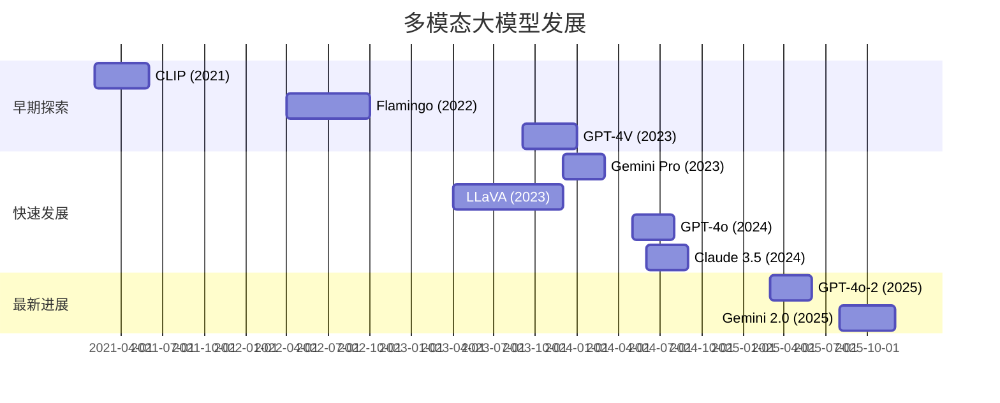
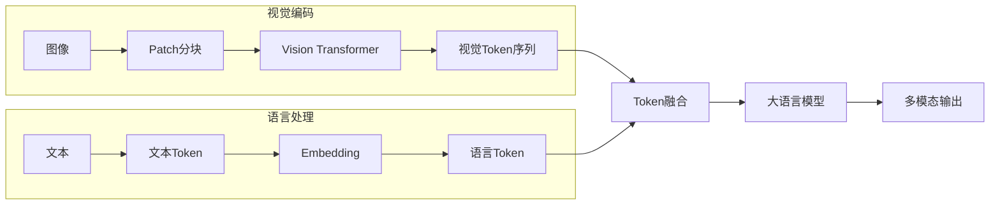
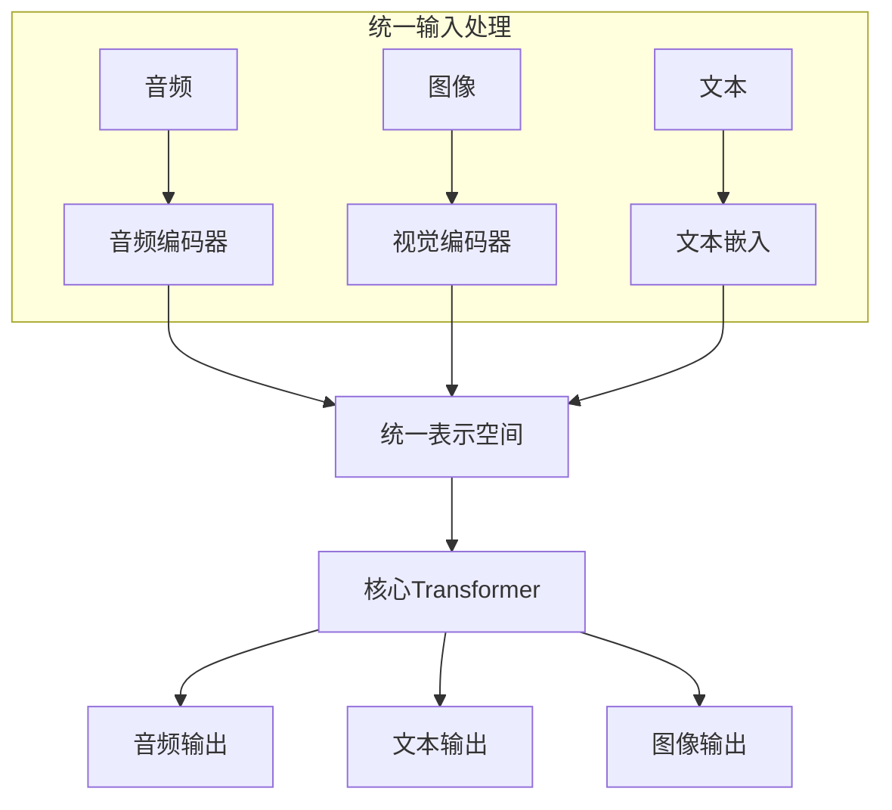
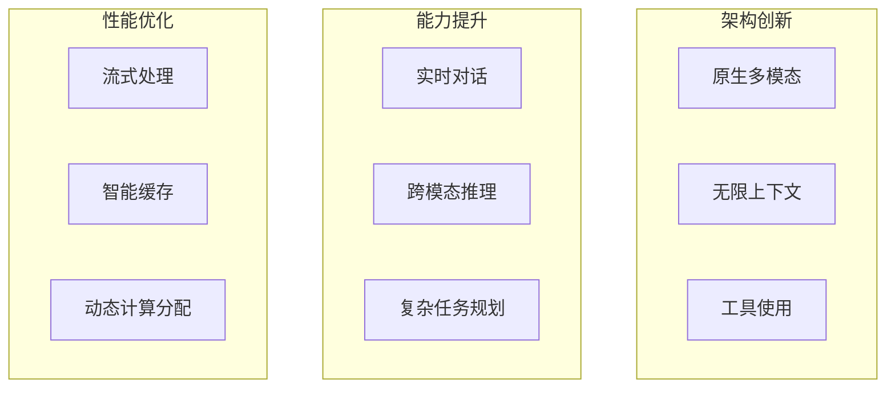
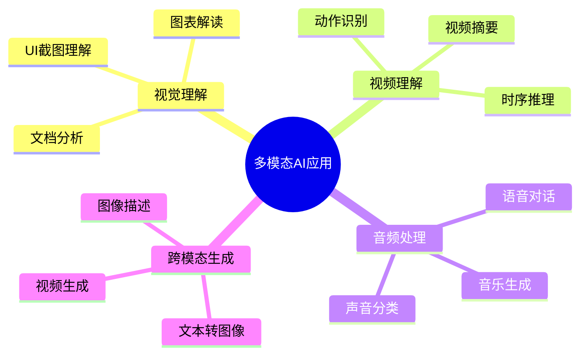

## 概述

多模态大模型是2024-2026年AI领域最热门的研究方向之一。本文系统梳理从GPT-4V到GPT-4o的多模态技术演进路线。

## 多模态模型发展时间线



## 多模态架构对比

### 主要架构类型

```mermaid
flowchart TB
    subgraph 早期架构 (LLM + 视觉编码器)
        IMG[图像]
        IMG --> ENCODER1[视觉编码器]
        ENCODER1 --> PROJ1[投影层]
        PROJ1 --> LLM1[语言大模型]
        
        style ENCODER1 fill:#ffcccc
        style PROJ1 fill:#ffffcc
    end
    
    subgraph 融合架构
        IMG2[图像]
        IMG2 --> ENCODER2[视觉编码器]
        IMG2 --> TOKENS[图像Token]
        ENCODER2 --> TOKENS
        TOKENS --> LLM2[多模态LLM]
        
        style ENCODER2 fill:#ccffcc
    end
    
    subgraph 原生多模态 (GPT-4o)
        MM[多模态输入]
        MM --> NATIVE[原生多模态模型]
        NATIVE --> OUT[统一输出]
        
        style NATIVE fill:#ccffcc
    end
```

### 各架构特点对比

| 架构类型 | 代表模型 | 优点 | 缺点 |
|---------|---------|------|------|
| LLM+视觉编码器 | LLaVA, InstructBLIP | 训练成本低 | 跨模态对齐差 |
| 融合架构 | GPT-4V, Gemini | 性能优秀 | 计算量大 |
| 原生多模态 | GPT-4o, Gemini 2 | 端到端优化 | 训练成本极高 |

## GPT-4V核心技术

### 视觉-语言对齐



### LLaVA实现

```python
import torch
import torch.nn as nn
from transformers import CLIPVisionModel, LlamaForCausalLM

class LLaVA(nn.Module):
    """Large Language and Vision Assistant"""
    
    def __init__(self, config):
        super().__init__()
        vision_hidden_size = config.vision_hidden_size
        llm_hidden_size = config.llm_hidden_size
        
        # 视觉编码器
        self.vision_encoder = CLIPVisionModel.from_pretrained(
            config.vision_model_name
        )
        
        # 投影层：连接视觉和语言
        self.llm_projection = nn.Linear(
            vision_hidden_size, llm_hidden_size
        )
        
        # 语言模型
        self.llm = LlamaForCausalLM.from_pretrained(
            config.llm_model_name
        )
        
        self.config = config
    
    def vision_forward(self, images):
        """视觉编码"""
        vision_outputs = self.vision_encoder(images)
        image_features = vision_outputs.last_hidden_state
        image_features = self.llm_projection(image_features)
        return image_features
    
    def forward(self, input_ids, images, attention_mask=None):
        # 视觉特征
        images_embeds = self.vision_forward(images)
        
        # 文本嵌入
        inputs_embeds = self.llm.get_input_embeddings()(input_ids)
        
        # 替换图像位置的嵌入
        # 假设图像token在输入中标记为某个特殊ID
        inputs_embeds = self._merge_inputs(
            inputs_embeds, images_embeds, input_ids
        )
        
        # LLM前向
        outputs = self.llm(
            inputs_embeds=inputs_embeds,
            attention_mask=attention_mask
        )
        
        return outputs
```

## GPT-4o原生多模态

### 端到端多模态处理



### GPT-4o关键特性

| 特性 | GPT-4V | GPT-4o | 提升 |
|------|--------|--------|------|
| 文本响应 | ~2.8s | ~0.3s | 9x |
| 音频理解 | ❌ | ✅ | 新增 |
| 视觉理解 | ✅ | ✅ | 优化 |
| 端到端延迟 | 500ms+ | 232ms | 2x |
| 多语言支持 | 英文为主 | 20+语言 | 增强 |

## Gemini 2.0多模态

### 原生多模态架构

```python
class GeminiMultiModal(nn.Module):
    """Gemini原生多模态架构"""
    
    def __init__(self, config):
        super().__init__()
        
        # 统一编码器
        self.unified_encoder = UnifiedEncoder(
            modalities=['text', 'image', 'audio', 'video']
        )
        
        # MoE语言模型
        self.language_model = MoELanguageModel(
            hidden_size=config.hidden_size,
            num_experts=config.num_experts
        )
        
        # 输出头
        self.output_heads = nn.ModuleDict({
            'text': TextOutputHead(),
            'image': ImageOutputHead(),
            'audio': AudioOutputHead()
        })
    
    def forward(self, inputs):
        # 统一编码
        encoded = self.unified_encoder(inputs)
        
        # 语言模型处理
        lm_output = self.language_model(encoded)
        
        # 多模态输出
        outputs = {}
        for modality, head in self.output_heads.items():
            outputs[modality] = head(lm_output)
        
        return outputs
```

### 技术创新



## 多模态应用场景



## 未来展望

| 方向 | 当前水平 | 未来目标 |
|------|----------|----------|
| 实时性 | <1s延迟 | <100ms |
| 模态数量 | 3-5种 | 10+种 |
| 推理效率 | 10 tokens/s | 1000+ tokens/s |
| 上下文长度 | 128K | 10M+ |

## 总结

多模态大模型正在从"视觉+语言"的简单组合，向真正的原生多模态演进。GPT-4o代表了当前技术的巅峰，其端到端的处理方式为未来多模态AI的发展指明了方向。
