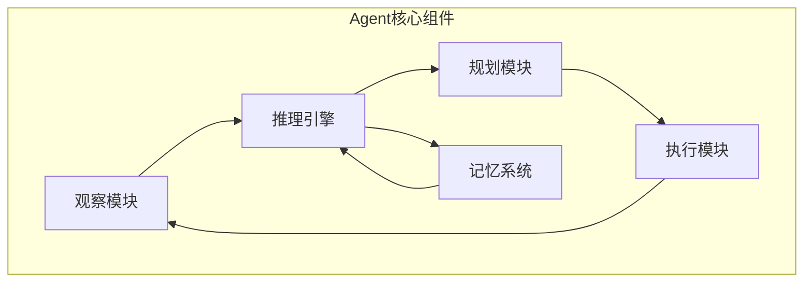
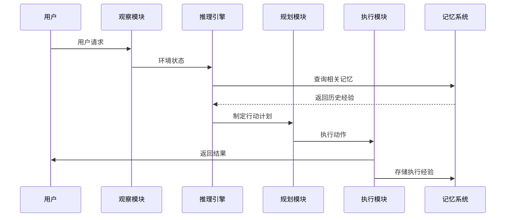
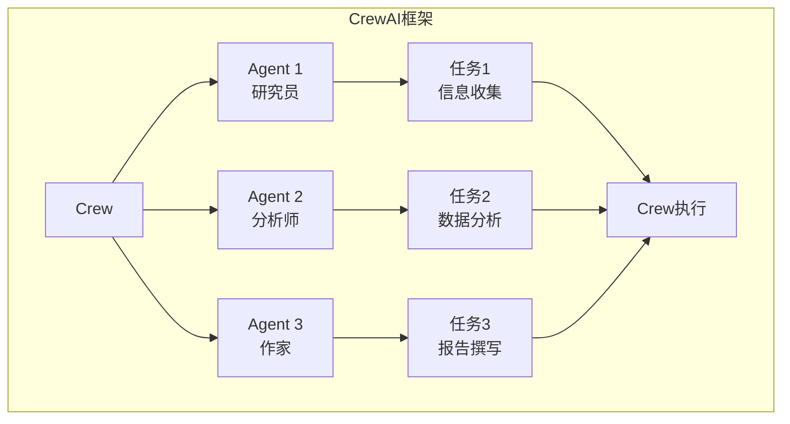
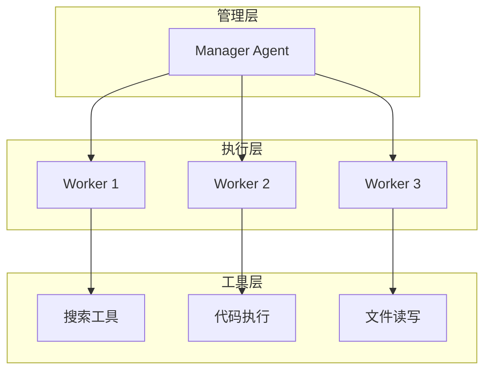
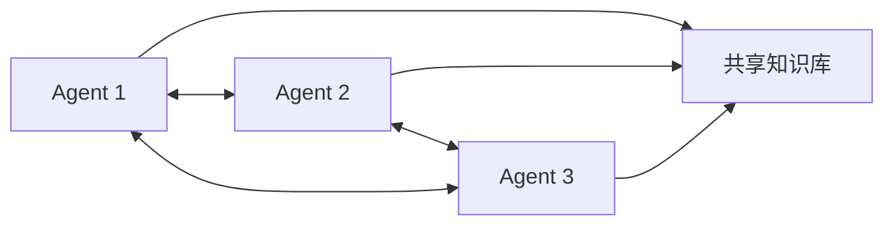
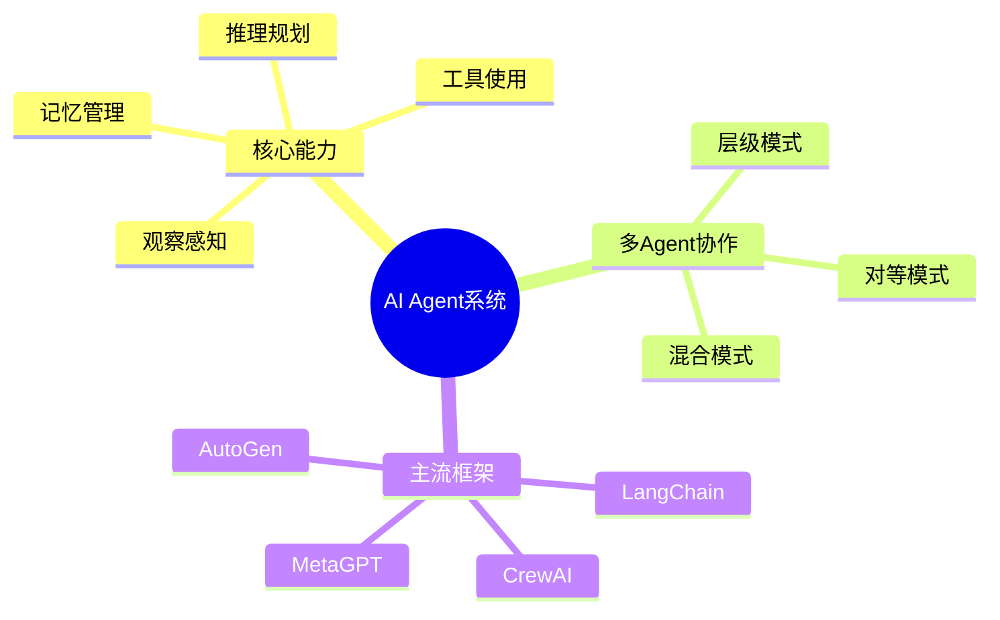

## 概述

AI Agent（智能体）是2025-2026年最热门的技术方向之一。本文深入探讨单Agent架构设计、多Agent协作机制，以及主流协作框架的对比。

## AI Agent核心架构

### 单Agent系统



### Agent决策流程



## ReAct范式

### 思考-行动-观察循环

```python
class ReActAgent:
    """ReAct推理Agent"""
    
    def __init__(self, llm, tools):
        self.llm = llm
        self.tools = tools
    
    def think(self, observation, thought_history):
        """思考：生成下一步推理"""
        prompt = f"""
当前状态: {observation}
历史推理: {thought_history}

请思考下一步应该做什么？
格式: 思考: [你的推理]
"""
        response = self.llm.generate(prompt)
        return response
    
    def act(self, thought):
        """行动：执行工具或回答"""
        if "使用工具" in thought:
            tool_name = extract_tool(thought)
            tool_args = extract_args(thought)
            return self.tools.execute(tool_name, tool_args)
        else:
            return thought
    
    def run(self, initial_obs, max_steps=10):
        """运行Agent"""
        thought_history = []
        observation = initial_obs
        
        for _ in range(max_steps):
            thought = self.think(observation, thought_history)
            thought_history.append(thought)
            
            result = self.act(thought)
            observation = f"观察结果: {result}"
            
            if "最终答案" in thought:
                return extract_answer(thought)
        
        return "任务未完成"
```

## 多Agent协作框架

### CrewAI架构



### CrewAI实现

```python
from crewai import Agent, Task, Crew

# 定义Agent
researcher = Agent(
    role="高级研究员",
    goal="收集并分析最新的AI技术动态",
    backstory="你是一位资深的AI研究员，擅长从多个来源收集信息",
    verbose=True,
    allow_delegation=True
)

analyst = Agent(
    role="数据分析师",
    goal="对收集的信息进行深度分析",
    backstory="你是一位数据分析专家，擅长发现数据中的洞察",
    verbose=True
)

writer = Agent(
    role="技术作家",
    goal="将复杂的技术内容转化为易懂的报告",
    backstory="你是一位专业的技术写作者",
    verbose=True
)

# 定义任务
task1 = Task(
    description="搜索并整理2024年AI领域的最新进展",
    agent=researcher
)

task2 = Task(
    description="分析这些进展对行业的影响",
    agent=analyst,
    context=[task1]
)

task3 = Task(
    description="撰写一份完整的技术报告",
    agent=writer,
    context=[task1, task2]
)

# 创建Crew
crew = Crew(
    agents=[researcher, analyst, writer],
    tasks=[task1, task2, task3],
    verbose=True,
    memory=True
)

# 执行
result = crew.kickoff()
```

## AutoGen多Agent系统

```python
import autogen

# 定义Agent
assistant = autogen.AssistantAgent(
    name="assistant",
    system_message="你是一位有帮助的AI助手",
    llm_config={"model": "gpt-4o"}
)

user_proxy = autogen.UserProxyAgent(
    name="user_proxy",
    human_input_mode="NEVER",
    max_consecutive_auto_reply=10,
    code_execution_config={"work_dir": "coding"}
)

# Agent间对话
chat_result = user_proxy.initiate_chat(
    assistant,
    message="帮我写一个排序算法"
)
```

## Multi-Agent协作模式

### 层级协作



### 对等协作



## 框架对比

| 框架 | 开发者 | Agent类型 | 协作模式 | 适用场景 |
|------|---------|-----------|----------|----------|
| LangChain Agents | LangChain | ReAct/Plan | 单Agent | 通用 |
| CrewAI | CrewAI | Role-based | 层级 | 团队协作 |
| AutoGen | Microsoft | 对话式 | 多Agent | 对话协作 |
| MetaGPT | HKUST | SOP | 层级 | 软件开发 |
| CAMEL | CAMEL | 角色扮演 | 对等 | 复杂任务 |

## 总结



AI Agent代表了AI从被动响应到主动执行的重要转变，多Agent协作是解决复杂任务的有效途径。
