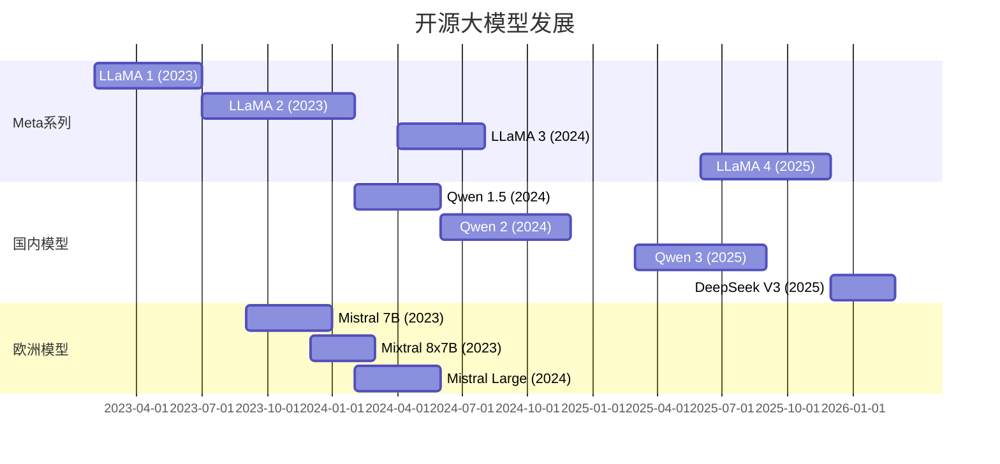
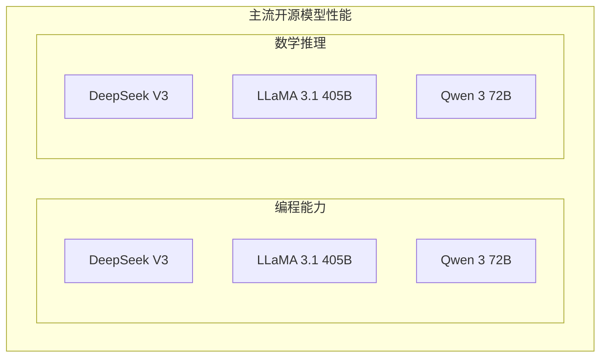
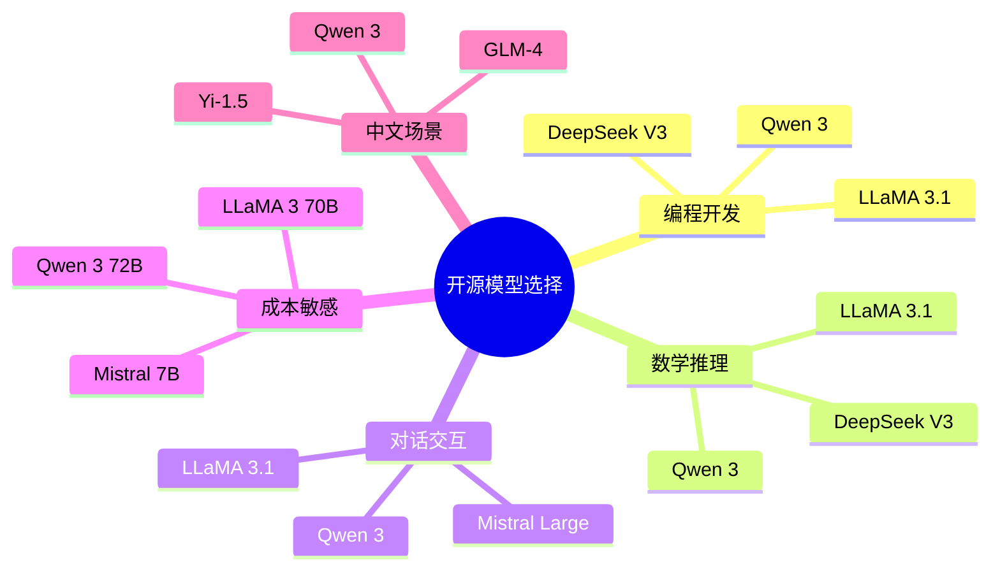
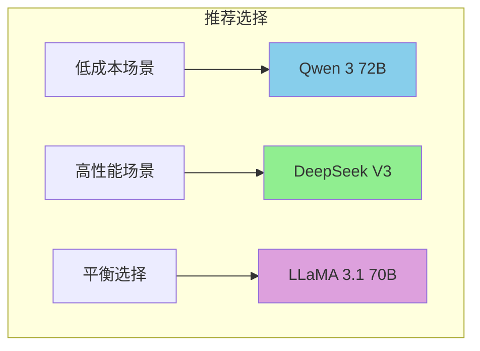

## 概述

2026年开源大模型生态蓬勃发展，本文全面对比主流开源模型，帮助开发者选择最适合的模型。

## 开源模型发展时间线

## 主流开源模型对比

### 模型规格对比

| 模型 | 开发者 | 参数量 | 上下文 | 许可证 |
|------|--------|--------|--------|--------|
| LLaMA 3.1 405B | Meta | 405B | 128K | Llama 3.1 |
| LLaMA 3.1 70B | Meta | 70B | 128K | Llama 3.1 |
| Qwen 3 72B | 阿里 | 72B | 128K | Apache 2.0 |
| DeepSeek V3 | 深度求索 | 236B | 128K | MIT |
| Mistral Large 2 | Mistral | 123B | 128K | Mistral |
| Yi-1.5 34B | 零一万物 | 34B | 200K | Apache 2.0 |
| GLM-4 | 智谱 | 130B | 128K | 商业授权 |

### 性能基准测试

### 详细评测数据

| 评测集 | DeepSeek V3 | LLaMA 3.1 405B | Qwen 3 72B | Mistral Large 2 |
|--------|-------------|-----------------|------------|-----------------|
| MMLU | 87.1% | 88.6% | 86.6% | 85.2% |
| HumanEval | 92.1% | 90.2% | 89.5% | 88.0% |
| MATH | 79.5% | 78.3% | 77.1% | 75.8% |
| GSM8K | 97.8% | 97.2% | 96.8% | 96.0% |
| GPQA | 58.5% | 56.2% | 54.8% | 52.3% |

## 模型架构对比

### 核心技术对比

## 应用场景推荐

## 部署成本对比

| 模型 | 推理精度 | 推理成本(Relative) | 训练成本 |
|------|----------|-------------------|----------|
| LLaMA 3.1 405B | FP16 | 8x | 非常高 |
| LLaMA 3.1 70B | INT4 | 1x | 高 |
| DeepSeek V3 | FP8 | 0.5x | 中 |
| Qwen 3 72B | INT4 | 0.8x | 中 |
| Mistral 7B | INT4 | 0.1x | 低 |

## 总结

2026年开源大模型已经接近甚至超越闭源模型的性能，选择时应综合考虑性能、成本和适用场景。
