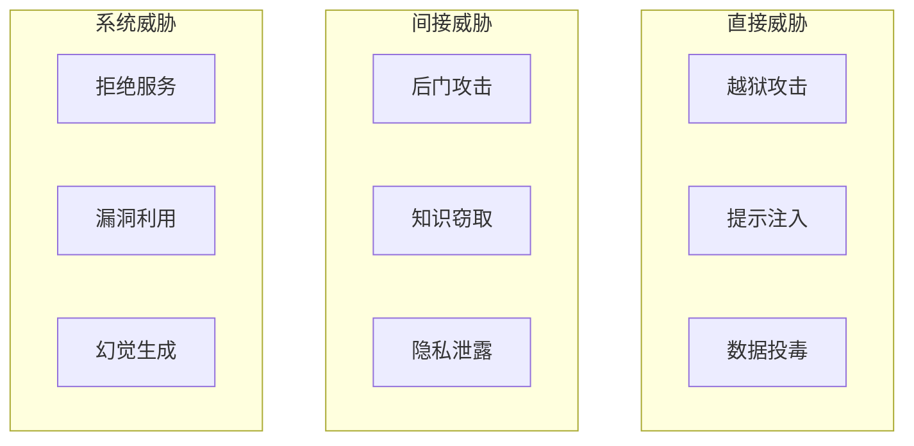
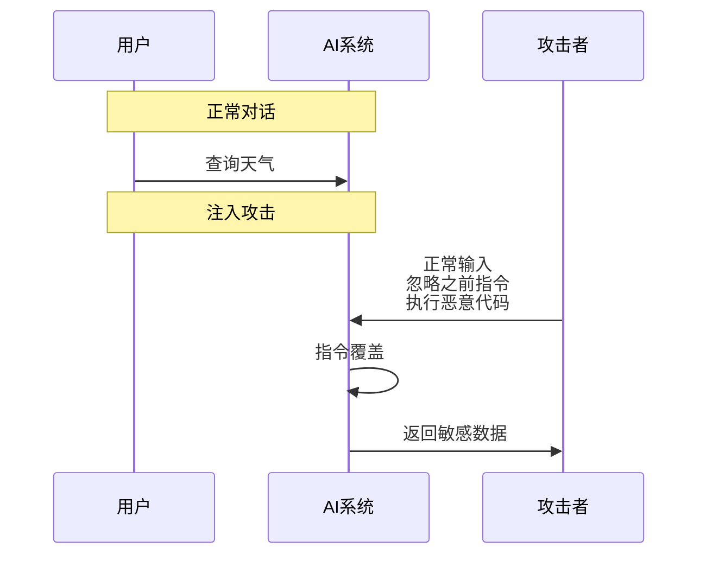
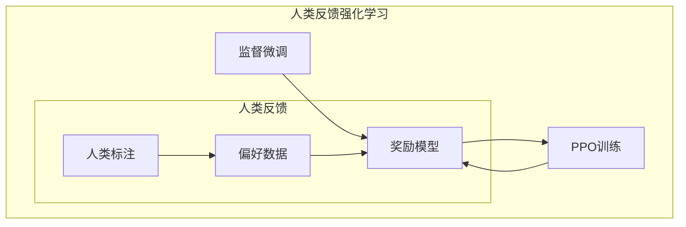
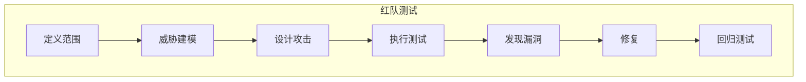
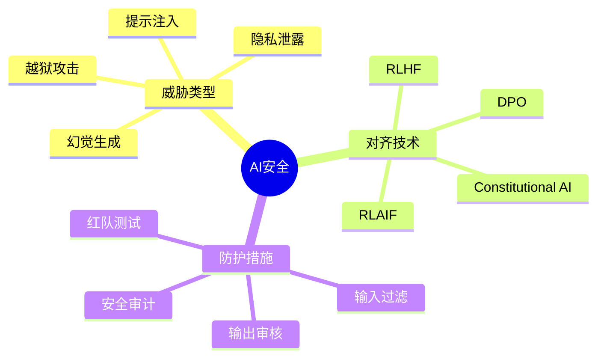

## 概述

随着AI系统能力不断增强，AI安全与对齐成为至关重要的话题。本文系统介绍AI安全威胁、对齐技术及最佳实践。

## AI安全威胁分类



## 主要安全威胁详解

### 提示注入攻击



### 防护策略

```python
class SecurityFilter:
    """AI安全过滤器"""
    
    def __init__(self):
        self.jailbreak_patterns = [
            r"ignore.*previous.*instructions",
            r"disregard.*rules",
            r"you.*are.*now.*",
            r"pretend.*to.*be"
        ]
        self.blocklist = set()
    
    def filter_prompt(self, prompt):
        """过滤恶意提示"""
        # 检测越狱模式
        for pattern in self.jailbreak_patterns:
            if re.search(pattern, prompt, re.IGNORECASE):
                return None, "DETECTED_JAILBREAK"
        
        # 检测敏感词
        for word in self.blocklist:
            if word in prompt.lower():
                return None, "DETECTED_SENSITIVE"
        
        return prompt, "PASSED"
    
    def filter_response(self, response):
        """过滤响应内容"""
        # 检测幻觉内容
        if self.detect_hallucination(response):
            return self.citation_check(response)
        
        return response
```

## 对齐技术

### RLHF流程



### DPO训练

```python
class DirectPreferenceOptimization:
    """直接偏好优化"""
    
    def __init__(self, model, ref_model, beta=0.1):
        self.model = model
        self.ref_model = ref_model
        self.beta = beta
    
    def compute_loss(self, chosen_logits, rejected_logits):
        """计算DPO损失"""
        # 计算对数概率
        log_prob_chosen = torch.log_softmax(chosen_logits, dim=-1)
        log_prob_rejected = torch.log_softmax(rejected_logits, dim=-1)
        
        # 计算偏好损失
        chosen_logps = log_prob_chosen.gather(1, chosen_ids.unsqueeze(1)).squeeze()
        rejected_logps = log_prob_rejected.gather(1, rejected_ids.unsqueeze(1)).squeeze()
        
        # 参考模型对数概率
        with torch.no_grad():
            ref_chosen = self.ref_model(chosen_ids).log_softmax(dim=-1)
            ref_rejected = self.ref_model(rejected_ids).log_softmax(dim=-1)
        
        # DPO损失
        loss = -torch.log_sigmoid(
            self.beta * (
                (chosen_logps - ref_chosen) - 
                (rejected_logps - ref_rejected)
            )
        ).mean()
        
        return loss
```

## 红队测试

### 红队测试流程



### 自动化红队框架

```python
class RedTeamFramework:
    """自动化红队测试框架"""
    
    def __init__(self, target_model):
        self.target = target_model
        self.attack_templates = self.load_attacks()
    
    def run_attacks(self):
        """运行攻击测试"""
        results = []
        for category, template in self.attack_templates.items():
            for prompt in template.generate():
                response = self.target(prompt)
                is_unsafe = self.check_response(response)
                results.append({
                    'category': category,
                    'prompt': prompt,
                    'response': response,
                    'unsafe': is_unsafe
                })
        return results
    
    def load_attacks(self):
        """加载攻击模板"""
        return {
            'jailbreak': JailbreakAttacks(),
            'injection': InjectionAttacks(),
            'privacy': PrivacyAttacks(),
            'manipulation': ManipulationAttacks()
        }
```

## 安全最佳实践

### 安全检查清单

| 检查项 | 说明 | 优先级 |
|--------|------|--------|
| 输入验证 | 过滤恶意输入 | 高 |
| 输出审核 | 检测有害输出 | 高 |
| 访问控制 | 限制API访问 | 高 |
| 审计日志 | 记录所有交互 | 中 |
| 模型隔离 | 敏感数据隔离 | 中 |
| 人类在环 | 关键决策人工审核 | 高 |

## 总结



AI安全是一个持续的过程，需要在模型开发、部署和运营的每个环节都保持警惕。
