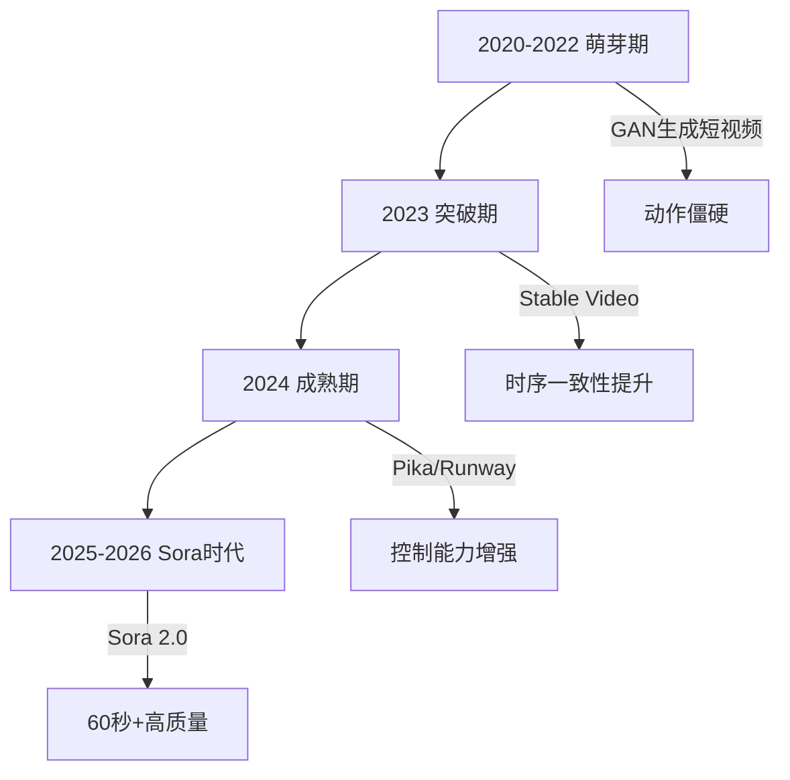
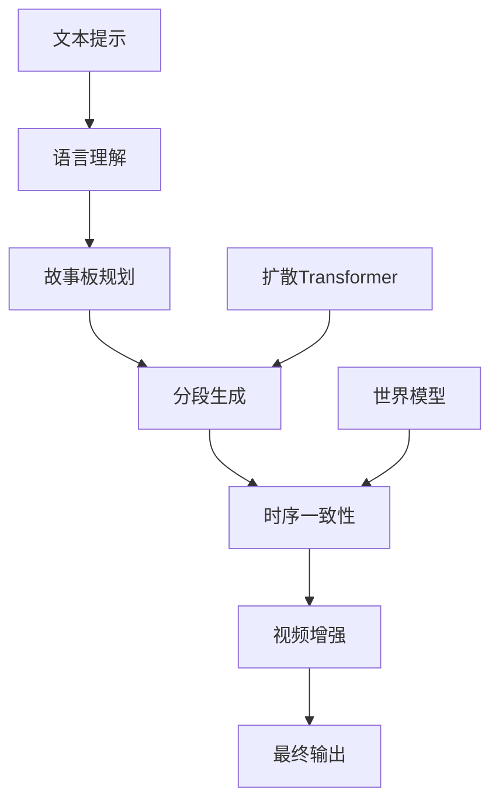
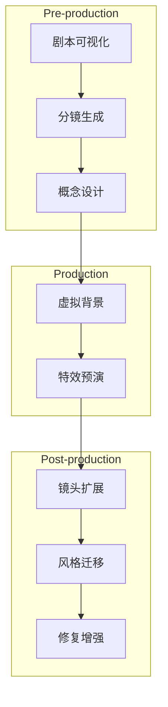
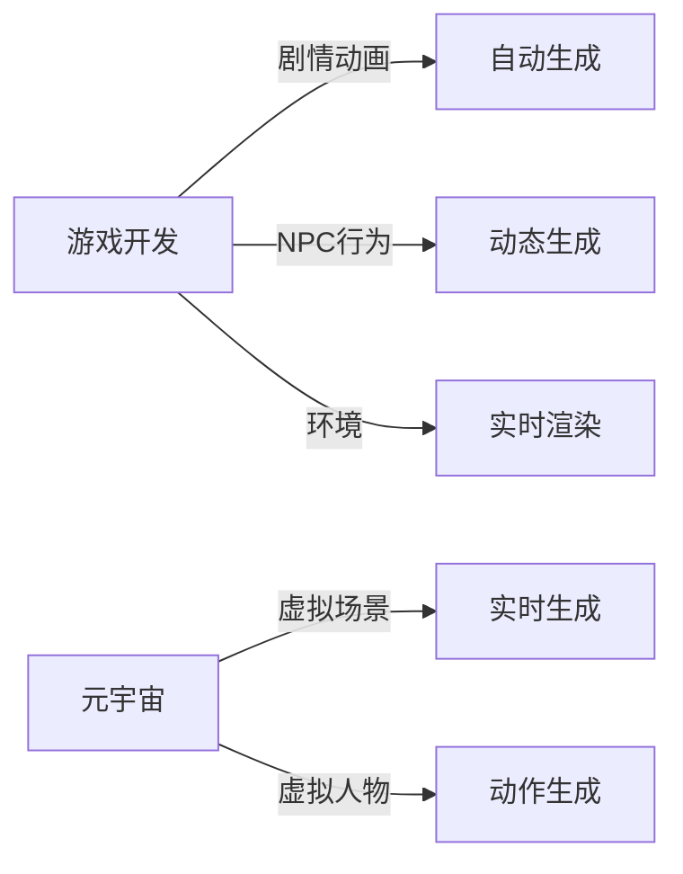
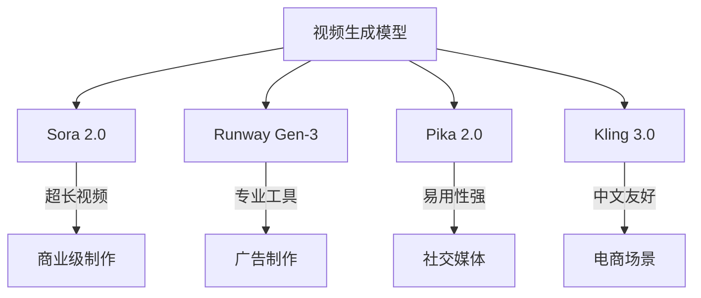
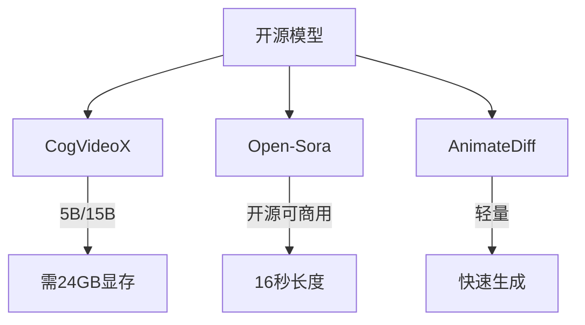
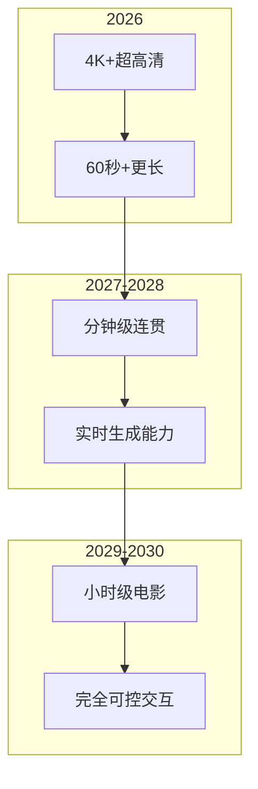
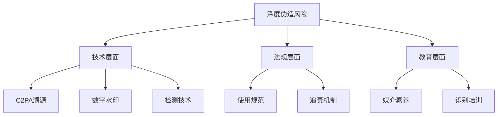

# Sora 2.0与视频生成大模型：从技术突破到产业变革

## 引言

2025年，OpenAI发布的Sora 2.0将视频生成技术推向新高度。从几秒到数分钟，从模糊到逼真，视频生成正在颠覆影视、广告、游戏等内容创作行业。

## 视频生成技术演进

### 技术发展脉络



### 核心能力对比

| 能力维度 | Sora 2.0 | Runway Gen-3 | Pika 2.0 |
|---------|----------|---------------|----------|
| 视频时长 | 60秒+ | 10秒 | 20秒 |
| 分辨率 | 4K | 1080p | 1080p |
| 时序一致性 | 优秀 | 良好 | 良好 |
| 物理模拟 | 强 | 一般 | 一般 |

## Sora 2.0 技术架构

### 核心架构设计

```python
# Sora 2.0 核心架构
class Sora2Architecture:
    def __init__(self):
        self.llm = "GPT-5语言模型核心"
        self.diffusion = "扩散Transformer"
        self.video_encoder = "时空视频编码器"
```

### 关键技术组件



### 训练策略


## 产业应用变革

### 影视制作



### 广告营销

| 场景 | 痛点 | AI解决方案 | 效率提升 |
|------|------|------------|---------|
| 产品展示 | 制作成本高 | AI生成+精修 | 70% |
| 品牌故事 | 周期长 | 多版本快速生成 | 5倍 |
| 本地化 | 翻译困难 | 口型同步 | 10倍 |

### 游戏与元宇宙



## 技术对比与选择

### 主流模型对比



### 选择指南

| 需求场景 | 推荐模型 |
|---------|---------|
| 商业广告/电影级 | Sora 2.0 / Runway Gen-3 |
| 社交媒体/短视频 | Pika / Kling |
| 游戏/元宇宙内容 | Runway / 自部署 |
| 电商/产品展示 | Kling / 国产模型 |

## 工程实践

### API调用示例

```python
# Sora 2.0 API 调用
import openai

client = openai.Client(api_key="your-api-key")

response = client.video.generate(
    model="sora-2.0",
    prompt="A serene sunset over the ocean",
    duration=10,
    resolution="1080p"
)

video_url = response.data[0].url
```

### 本地部署方案



## 未来展望

### 技术发展方向



### 行业影响预测

| 行业 | 短期影响(1-3年) | 长期影响(5年+) |
|------|----------------|----------------|
| 影视制作 | 效率提升50% | 颠覆传统模式 |
| 广告营销 | 10x内容增长 | 个性化原生广告 |
| 游戏 | 开发成本降低 | UGC爆发 |

## 伦理与安全

### 深度伪造治理



## 结语

Sora 2.0代表视频生成技术正式进入产业化阶段。掌握这一技术，将成为内容创作者和工程师的核心竞争力。

---

**相关阅读：**
- [Sora与视频生成模型原理与实践](/2024/01/15/Sora与视频生成模型原理与实践/)
