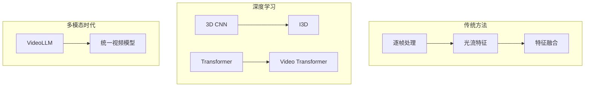

## 概述

视频理解是计算机视觉的下一个前沿，本文系统介绍视频理解的核心技术和视频大模型的发展。

## 视频理解技术发展



## 时序建模方法

### 3D CNN vs Transformer

```python
class VideoClassification:
    """视频分类模型"""
    
    def i3d_model(self):
        """I3D 3D卷积模型"""
        model = InceptionI3d(400, in_channels=3)
        return model
    
    def slowfast_model(self):
        """SlowFast 双路径模型"""
        model = torch.hub.load('facebookresearch/pytorchvideo', 
                              'slowfast_r50', pretrained=True)
        return model
    
    def videomamba_model(self):
        """VideoMamba 时序Mamba"""
        model = VideoMamba(
            spatial_depth=24,
            temporal_depth=24
        )
        return model
```

## 总结

视频理解和视频生成是AI领域的下一个爆发点，视频大模型将改变内容创作、教育、娱乐等多个行业。
