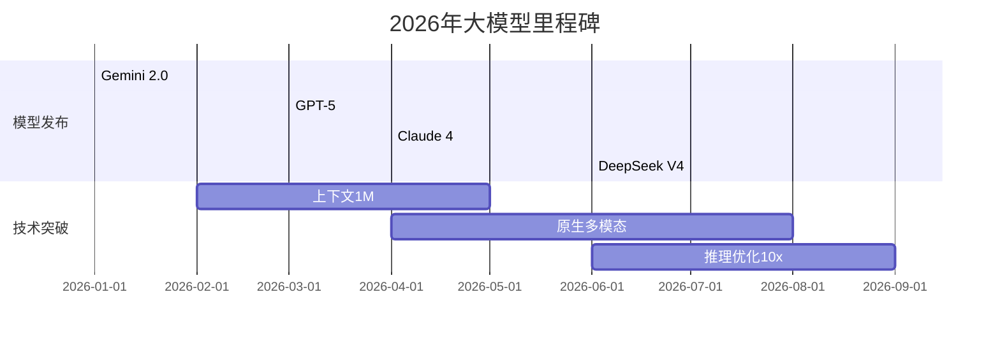
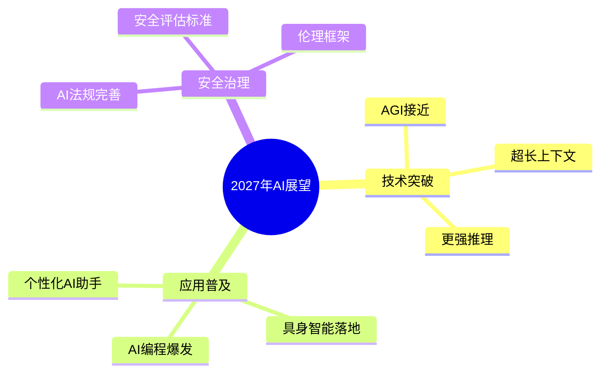

## 概述

2026年AI领域取得了哪些突破？本文回顾关键技术进展并展望2027年的发展方向。

## 2026年技术突破

### 大模型进展

### 各领域突破总结

| 领域 | 2026突破 | 代表工作 |
|------|----------|----------|
| 大模型 | 百万上下文 | Gemini 2.0 |
| 多模态 | 原生融合 | GPT-4o系列 |
| AI Agent | 自主执行 | Claude Agents |
| 视频生成 | 物理一致 | Sora 3 |
| 机器人 | 通用操作 | Figure 02 |

## 2027年技术展望

### 十大预测

## 总结

2026年是AI发展史上重要的一年，大模型能力持续提升，应用场景不断拓展。2027年，我们将见证更多突破性进展。
